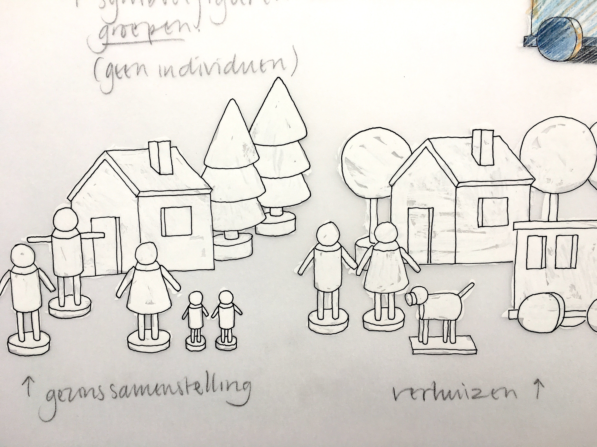
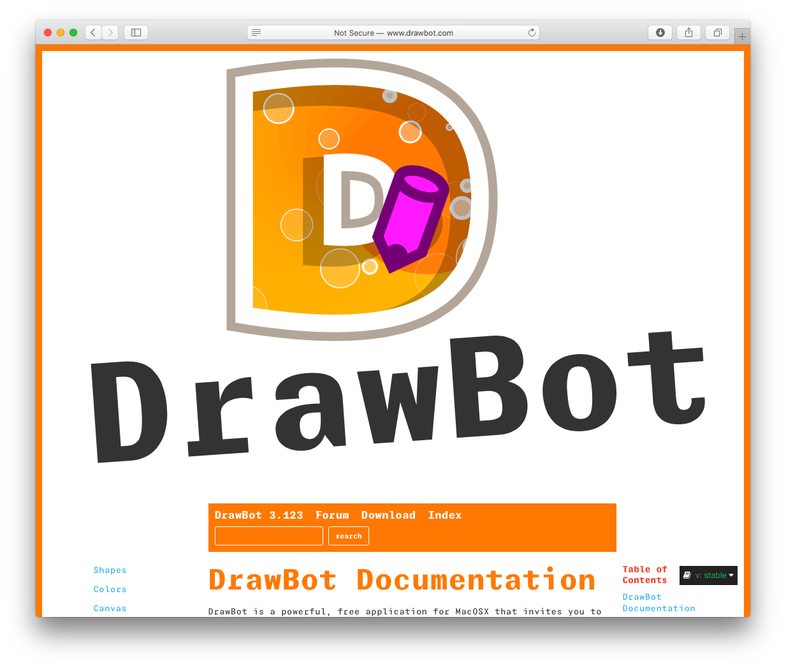
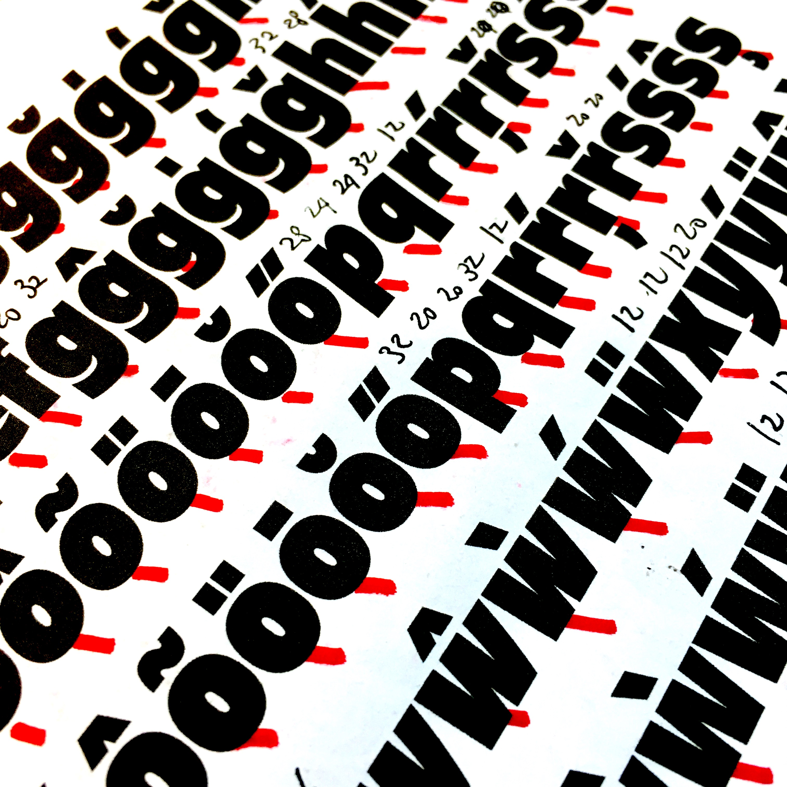

~~~
from pagebot.toolbox.color import color
doc.title = 'Design&nbsp;Design&nbsp;Space'

doc.footerHtml = """Let us know what you think. Do you have any questions for us? <a href="mailto:info@designdesign.space?subject=Tell me more about DesignDesign.Space">info@designdesign.space</a>"""

# Uncomment to see cssId/cssClass markers in the page
#doc.view.showIdClass = True

# Page (Home)
#	Wrapper
#		Header 
#			Logo (+BurgerButton)
#			Navigation/TopMenu/MenuItem(s)
#      Content
#  			Banner
#  			SlideShow (on Home)
#      		Slides
#      		SlideSide
#			Section(s)
#				Introduction
#				Main
#				Mains
#					Main
#				Side
#				Sides
#					Side
#		Footer
#
# ----------------------------------------
# index.html
# ----------------------------------------
page.name = 'Home'
page.url = 'index.html'
content = page.select('Content')
box = content.newBanner()

# Which studies can we offer you in 2020?
~~~

# New workshops in 2020-2021

~~~
section = content.newSection()
box = section.newMain(cssClass='youtubelink')

box = box.newMovie(url='https://player.vimeo.com/video/445611312')

~~~

~~~
box = section.newSide(cssClass='youtubeside')
~~~
# Type: Tricks & Troves

## Watch the new lecture. Any of these subjects can be the topic of your new study.

* 2 weeks online workshop
* Limited to 8 students
* Interactive lessons
* Exercises and feedback
* 4th workshop free

# <a href="https://docs.google.com/forms/d/1vLKGROUx03Sm3QGWEwuP1f7Uo1v4qQCmG1FlaxOT88A" target="external">Subscribe here</a>

# [Contact us](mailto:info@designdesign.space?subject=Subscribing%20for%20the%20free%20DesignDesign.Space%20workshop)

<!--

~~~
from pagebot.constants import *
slideshow = content.newSlideShow(h=300, slideW='100%', slideH=300, startIndex=3, autoHeight=True, carousel=2, dynamicHeight=False, transition='slide', easing=CSS_EASE, frameDuration=4, duration=0.7, pauseOnHit=True, randomPlay=False)
box = slideshow.slides
~~~

~~~ 
box = slideshow.side
~~~

# Develop your process. Expand your skills.

* 2 weeks online
* Limited to 8 students
* Live lectures
* Exercises and feedback
* 4th workshop free

# <a href="https://docs.google.com/forms/d/1vLKGROUx03Sm3QGWEwuP1f7Uo1v4qQCmG1FlaxOT88A" target="external">Subscribe here</a>

# [Contact us](mailto:info@designdesign.space?subject=Subscribing%20for%20the%20free%20DesignDesign.Space%20workshop)
-->

~~~
box = content.newIntroduction()
~~~

# Working from home? Studying online in the Corona world? Select the workshops you like. Develop your profession. <a href="https://docs.google.com/forms/d/1vLKGROUx03Sm3QGWEwuP1f7Uo1v4qQCmG1FlaxOT88A" target="external">Subscribe here</a>
~~~ 
#box = section.newCropped()
## 
#
~~~

~~~
section = content.newSection()
box = section.newMain()
~~~
## Workshops: what is it like?

Each online workshop runs for 2 weeks, including live lectures, addressing theory, showing examples and giving feedback on the exercises that you do.

* 2 weeks, from Monday to Sunday;
* Over 12 hours of live interactive hangouts with theory, models, templates and example documents;
* Maximum of 8 participants per workshop;
* Intensive exercises and daily personal feedback;
* The result of the exercises is shared on a closed Slack channel for the duration of the workshop;
* Feedback comes from the educators and the other students;
* DesignDesign.Space offers a safe online study environment, where any question can be asked;
* €290 per workshop;
* Every 4th workshop is free.

Some workshops combine as a sequence. It is recommended to do them in the right order to get the best continuation.

~~~
box = section.newCropped()
~~~

~~~
section = content.newSection()
box = section.newMain()
~~~
<a name="planned-workshops-by-category"/>

## Planned workshops by category

### Programming

<!-- 
##### 2020-08-24 • [Basic coding in Python #1: Design by parameters](#coding-in-python1)
##### 2020-09-07 • [Basic coding in Python #2: Functions, methods & classes](#coding-in-python2)
-->
##### 2020-10-19 • [Coding simple scripted tools (PY3)](#PY3)
##### 2020-11-02 • [Coding tools with a user interface (PY4)](#PY4)
##### 2020-11-16 • [Basic coding in Python #1: Design by parameters (PY1)](#PY1)
##### 2020-11-30 • [Basic coding in Python #2: Functions, methods & classes (PY2)](#PY2)
##### 2021-03-15 • [Scripting for RoboFont (PY5)](#PY5)

### Process 

<!--
##### 2020-09-21 • [Visual grammar #1: The seven parameters of Bertin](#visual-grammar1)
##### 2020-10-05 • [Visual grammar #2: Balance diversity & coherency](#visual-grammar2)
-->
##### 2020-11-16 • [General sketching techniques](#general-sketching-techniques)
##### 2020-11-30 • [Running a studio #1: Moodboards & presentations](#running-a-studio1)
##### 2020-12-14 • [Running a studio #2: Requirements, quotes & plannings](#running-a-studio2)
##### 2021-01-04 • [Teaching online, exercises, feedback & evaluation](#teaching-online)
##### 2021-04-26 • [Visual grammar #1: The seven parameters of Bertin](#visual-grammar1)
##### 2021-05-10 • [Visual grammar #2: Balance diversity & coherency](#visual-grammar2)

### Type design

##### 2021-01-18 • [Basic principles of type design: For graphic designers](#basic-principles-of-type-design)
##### 2021-02-01 • [Basics of logo design](#logo-design)
##### 2021-02-15 • [Coding advanced logo variations](#coding-advanced-logo-variations)
##### 2021-03-01 • [Sketching, feedback & planning in type design](#sketching-feedback-planning)

### Publications for web and print

##### 2021-03-29 • [Basics of typography, grids & layout](#basics-of-typography-grids-and-layout)
##### 2021-04-12 • [Coding advanced typography & layouts for print and web](#basics-of-grid-design)

~~~
box = section.newCropped()
~~~

<!--
### Process

### Programming 

##### [Version management, testing and creation of automated manuals](#version-management)

### Type design

##### [Design the process and tools for Variable Fonts](#design-process-and-tools-for-variable-fonts)
##### [Design design spaces for Variable Fonts](#design-design-spaces-for-variable-fonts)

### Typography

##### [Undated • Typography for web and print, how to select typefaces](#typography-for-web-and-print)
##### [Undated • Coding automated type specimens](#coding-automated-type-specimens)

### Publications for web and print

##### [Undated • Coding grids for print and web](#coding-grids-for-print-and-web)
##### [Undated • Coding publications as website, Sketch and InDesign](#coding-publications-as-website-sketch-indesign)

### Info-graphics

##### [Undated • Basics, models and databases](#basics-models-databases)
##### [Undated • Coding templates and visual grammar](#coding-templates-and-visual-grammar)

### Spacial design

##### [Undated • Floor plan design](#floor-plan-design)
##### [Undated • Workspace design, running a studio from home](#workspace-design)

-->

~~~
section = content.newSection()
box = section.newMain()
~~~

## Planned workshops by date

~~~
box = box.newInfo()
~~~

### 2020

<!-- 
##### 2020-08-24 • [Basic coding in Python #1: Design by parameters](#coding-in-python1)
##### 2020-09-07 • [Basic coding in Python #2: Functions, methods & classes](#coding-in-python2)
##### 2020-09-21 • [Visual grammar #1: The seven parameters of Bertin](#visual-grammar1)
##### 2020-10-05 • [Visual grammar #2: Balance diversity & coherency](#visual-grammar2)
-->
##### 2020-10-19 • [Coding simple scripted tools](#coding-simple-scripted-tools)
##### 2020-11-02 • [Coding tools with a user interface](#coding-simple-ui-tools)
##### 2020-11-16 • [General sketching techniques](#general-sketching-techniques)
##### 2020-11-16 • [Basic coding in Python #1: Design by parameters](#coding-in-python1)
##### 2020-11-30 • [Basic coding in Python #2: Functions, methods & classes](#coding-in-python2)
##### 2020-11-30 • [Running a studio #1: Moodboards & presentations](#running-a-studio1)
##### 2020-12-14 • [Running a studio #2: Requirements, quotes & plannings](#running-a-studio2)

### 2021

##### 2021-01-04 • [Teaching online, exercises, feedback & evaluation](#teaching-online)
##### 2021-01-18 • [Basic principles of type design: For graphic designers](#basic-principles-of-type-design)
##### 2021-02-01 • [Basics of logo design](#logo-design)
##### 2021-02-15 • [Coding advanced logo variations](#coding-advanced-logo-variations)
##### 2021-03-01 • [Sketching, feedback & planning in type design](#sketching-feedback-planning)
##### 2021-03-15 • [Scripting for RoboFont](#scripting-for-robofont)
##### 2021-03-29 • [Basics of typography, grids & layout](#basics-of-typography-grids-and-layout)
##### 2021-04-12 • [Coding advanced typography & layouts for print and web](#basics-of-grid-design)
##### 2021-04-26 • [Visual grammar #1: The seven parameters of Bertin](#visual-grammar1)
##### 2021-05-10 • [Visual grammar #2: Balance diversity & coherency](#visual-grammar2)

~~~
box = section.newCropped()
~~~

~~~
section = content.newSection()
box = section.newMain()
~~~
<a name="coding-simple-scripted-tools"/>
## Coding simple scripted tools

### Automate repeating tasks in the design process

#### Start October 19th 2020 • 2 weeks • €290

~~~
box = box.newInfo()
~~~

After finishing [Basic coding in Python #1](#coding-in-python1), you are equipped with the basic coding skill to automate certain tasks that sometimes make a design process boring and lengthy.

The workshop is focused on very short scripts, only a couple of lines long, that automate repeating tasks in the design process. The result is a set of example scripts that can later be modified to be used in real life projects.

You can make a selection from the following exercises. And it is also possible to bring your own ideas.

#### Example exercises

* Make a script that runs through folders with images and applies Photoshop-like filters on each of them;
* Make a script that draws graphs based on information from a spreadsheet. Save the pages in PDF documents, using your own layout;
* Make a script that generates a simple website, based on content in a Markdown file.
* Make a script that checks a font for mistakes in spacing and kerning;
* Make a script that generates TTF and OTF fonts, after doing some automated operations on the outlines.

The use of <a href="http://drawbot.com" target="external">DrawBot</a> in this workshop requires a MacOS computer.

Completion of workshops [Basic coding in Python #1](#coding-in-python1) and [Basic coding in Python #1](#coding-in-python2) is recommended.

<a href="https://docs.google.com/forms/d/1vLKGROUx03Sm3QGWEwuP1f7Uo1v4qQCmG1FlaxOT88A" target="external">Subscribe here</a>

~~~
box = section.newCropped()
~~~

~~~
section = content.newSection()
box = section.newMain()
~~~
<a name="coding-simple-ui-tools"/>
## Coding tools with a user interface

### Make your scripted tools more user-friendly

#### Start November 11th 2020 • 2 weeks • €290

~~~
box = box.newInfo()
~~~

The focus of this workshop is on how to program user interaction. Extract the various options into menus, popups and checkboxes.

You can select several from the following exercises. And it is also possible to bring your own ideas.

#### Example exercises

* Make an interface that allows users to choose from the available image filters, before it runs through the entire set of image files.
* Make an interface that helps to choose from templates of graphs;
* Make an interface that shows the available color themes, before generating a website;
* Make an interface to show the various testing schemes on a font.

The use of <a href="http://drawbot.com" target="external">DrawBot</a> in this workshop requires a MacOS computer.

Completion of workshops [Basic coding in Python #1](#coding-in-python1) and [Basic coding in Python #1](#coding-in-python2) and [Coding simple scripted tools](#coding-simple-scripted-tools) is recommended.

<a href="https://docs.google.com/forms/d/1vLKGROUx03Sm3QGWEwuP1f7Uo1v4qQCmG1FlaxOT88A" target="external">Subscribe here</a>

~~~
box = section.newCropped()
~~~

~~~
section = content.newSection()
box = section.newMain()
~~~
<a name="general-sketching-techniques"/>
## General sketching techniques

### Learn the basic skills to visualise your ideas

#### Start November 16th 2020 • 2 weeks • €290

~~~
box = box.newInfo()
~~~

Sketching is the basis of every design process. Scribble early ideas to communicate with yourself and others. It is the ideal method for rapid prototyping, without spending much time on presentations. 

The workshop gives insight in various sketching techniques, using pen on paper as well as digital tools.

#### Example exercises

* Sketch the pages of some future publications;
* Sketch typefaces, using TypeCooker recipes;
* Sketch a series of info-graphics, visualizing narrative and data;
* Sketch abstract processes, such as a website design.

<a href="https://docs.google.com/forms/d/1vLKGROUx03Sm3QGWEwuP1f7Uo1v4qQCmG1FlaxOT88A" target="external">Subscribe here</a>

~~~
box = section.newCropped()
~~~

~~~
section = content.newSection()
box = section.newMain()
~~~
<a name="coding-in-python1"/>
## Basic coding in Python #1

### Design by parameters

#### Start November 16th 2020 • 2 weeks • €290

~~~
box = box.newInfo()
~~~

Take one of your designs and try to find the rules that are behind the composition. Learn to express that information in Python code. Then discover how the program can generate alternative versions of your original design, by the use of color themes, different page sizes and other parameters.

The workshop assumes no prior knowledge of programming. Existing Open Source libraries are used, such as DrawBot and PageBotNano. Exercises take you step by step through the process of coding your graphic design.

#### Example exercises 

* Select a publication and analyze the (typographic) proportions that it contains. 
* Find out how these measures relate to each other.
* Sketch the relations between the extracted values, e.g. what are the possibilities for various page sizes?
* Learn the basics of generating pages by code.
* Automate the generation of equivalent color themes and alternative layouts.

The use of <a href="http://drawbot.com" target="external">DrawBot</a> in this workshop requires a MacOS computer.

This workshop is followed up by [Basic coding in Python #2](#coding-in-python2).

<a href="https://docs.google.com/forms/d/1vLKGROUx03Sm3QGWEwuP1f7Uo1v4qQCmG1FlaxOT88A" target="external">Subscribe here</a>

~~~
box = section.newCropped()
#box = section.newSide()

~~~

<!--

-->

~~~
section = content.newSection()
box = section.newMain()
~~~
<a name="coding-in-python2"/>
## Basic coding in Python #2

### Functions, methods and classes

#### Start November 30th 2020 • 2 weeks • €290

~~~
box = box.newInfo() # No popup-arrow for running and upcoming workshops
~~~

After finishing [Basic coding in Python #1](#coding-in-python1), you have made a program that is doing one specific task. Great as that may be, it is hard to reuse that code for other projects. How nice would it be, to create a **“library”** with knowledge, that can be called for similar designs, without writing everything from scratch again?

The focus of this workshop is in making code more sustainable, using **functions, methods and classes**. Existing Open Source libraries are used, such as **DrawBot** and **PageBotNano**. Exercises take you step by step through the process of coding your graphic design. Instead of manually building a metaforical car, it may be more profitable to build a factory for cars. 

#### Example exercises

* Make a selection of different publications and analyze the variety of (typographic) proportions that they share;
* Sketch the relations between the extracted values and write them as coded rules;
* Store these rules as a library of Python classes;
* Learn to use this library in future design projects.

The use of <a href="http://drawbot.com" target="external">DrawBot</a> in this workshop requires a MacOS computer.

Completion of workshop [Basic coding in Python #1](#coding-in-python1) is recommended.

<a href="https://docs.google.com/forms/d/1vLKGROUx03Sm3QGWEwuP1f7Uo1v4qQCmG1FlaxOT88A" target="external">Subscribe here</a>

~~~
box = section.newCropped()
#box = section.newSide() # Full visible image, not as cropped background

~~~

<!--

## <a href="https://docs.google.com/forms/d/1vLKGROUx03Sm3QGWEwuP1f7Uo1v4qQCmG1FlaxOT88A" style="color:#F54C0A" target="external">Subscribe here</a>

-->

~~~
section = content.newSection()
box = section.newMain()
~~~
<a name="running-a-studio1"/>
## Running a studio #1

### Experience the making of moodboards and presentations

#### Start November 30th 2020 • 2 weeks • €290

~~~
box = box.newInfo()
~~~

Adding the process of sketching, presentation techniques help to get ideas come across. Convince yourself and others about the values of your design. Making moodboards and presentations is just another form of rapid prototyping.

The workshop gives an overview of making a presentation, using materials, 3D and digital tools.

#### Example exercises

* Choose a topic or select one of your former projects. Visualize the design decisions in 3 moodboards.
* Sketch presentations in a small scale. What do you want to show in such a storyboard?
* Present an existing design project in no more than 5 slides. Pay attention to consistency of layout, typegraphy and the use of color.
* Can you present what makes your design so unique?

<a href="https://docs.google.com/forms/d/1vLKGROUx03Sm3QGWEwuP1f7Uo1v4qQCmG1FlaxOT88A" target="external">Subscribe here</a>

~~~
box = section.newCropped()
~~~

~~~
section = content.newSection()
box = section.newMain()
~~~
<a name="running-a-studio2"/>
## Running a studio #2

### The making of quotes, briefings, plannings and requirement lists

#### Start December 14th 2020 • 2 weeks • €290

~~~
box = box.newInfo()
~~~

Doing administration work is often seen as a boring by-product of running a studio. Planning projects is vital, but is often ignored. Learn to look at these processes as if they were regular design jobs. Doing them can be fun. And they can even become one of your products. 

The workshop shows methods to design the process of administration, as if it was an interesting graphic design project.

#### Example exercises

* Design templates for quotes and invoices, using spreadsheet applications and Google Docs.
* Learn to distinguish between the “go” and “no-go” requirements of a design;
* Sketch info-graphics that show the iterations of a design process. Visualise the planning for your customer;
* Automate the generation of progress reports.

<a href="https://docs.google.com/forms/d/1vLKGROUx03Sm3QGWEwuP1f7Uo1v4qQCmG1FlaxOT88A" target="external">Subscribe here</a>

~~~
box = section.newCropped()
~~~

~~~
section = content.newSection()
box = section.newMain()
~~~
<a name="scripting-for-robofont"/>
## Teaching online

### The making of exercises, methods for feedback and evaluation

#### Start January 4th 2021 • 2 weeks • €290

~~~
box = box.newInfo()
~~~

The world has suddenly changed. Teaching in class rooms is no longer possible. As experienced as you are, educating designers, the new skills are required for online teaching. 

This workshop shares our experience of teaching online with DesignDesign.Space workshops for 4 years now. And also, we love to show how we organized the latest TypeLab.

#### Example exercises

* Learn to write exercises that can be done through digital media;
* Develop methods for feedback, evaluation and validation of student work;
* An introduction on simulation games, that can be played with students in an online environment.

<a href="https://docs.google.com/forms/d/1vLKGROUx03Sm3QGWEwuP1f7Uo1v4qQCmG1FlaxOT88A" target="external">Subscribe here</a>

~~~
box = section.newCropped()
~~~

<!--

~~~
section = content.newSection()
box = section.newMain()
~~~
<a name="version-management"/>
## Version management

### Using Githib, consistency testing and the creation of automated manuals

#### Undated • 2 weeks • €290

~~~
box = box.newInfo()
~~~

After finishing [Coding simple scripted tools](#coding-simple-scripted-tools), it is time to concentrate more on the user interface. If scripts are used by other designers than yourself, it is more user-friendly to offer a window with checkboxes and buttons, than altering the options directly in the code.

Once a project grows larger, it may become necessary to get other developers involved. This workshop addresses the use of Github for version management. 

* Set up your existing (type design) projects as a Github repository, so you can share changes and updates with the other designers, who work on the same project;
* Add tests inside your sources to ensure the validity of the code;
* Write scripts that generate automated manuals from the projects that you made.

The use of <a href="http://drawbot.com" target="external">DrawBot</a> in this workshop requires a MacOS computer.

Completion of workshop [Coding simple scripted tools](#simple-scripted-tools) is recommended.

~~~
box = section.newCropped()
~~~

-->

~~~
section = content.newSection()
box = section.newMain()
~~~
<a name="basic-principles-of-type-design"/>
## Basic principles of type design

### For graphic designers: how to select a typeface. Understanding contrast by writing. Experiment with weight and width variations.

#### Start January 18th 2021 • 2 weeks • €290

~~~
box = box.newInfo()
~~~

Graphic designers work with type all day. It is one of their most important tools. Yet, it may not be obvious to select an appreciate the differences between existing typefaces. Which one to select for a certain task? Which type works best in logos? How to write a brief that communcates with typographers and type designers?

#### Example exercises

* Write alphabets with a broad nib pencil to experience the construction of **“translation”** contrast;
* Write with sharp pencils to experience the construction of **“expansion”** contrast;
* Learn the behaviour of glyph shapes, varying weight and width 
* Study variantions by <a href="http://www.typecooker.com" target="external">Type Cooker</a>;
* Learn the basics about capitals, roman, italic, spacing and kerning.
* Digitize your writings into outlines, using your favourite type editor;

<a href="https://docs.google.com/forms/d/1vLKGROUx03Sm3QGWEwuP1f7Uo1v4qQCmG1FlaxOT88A" target="external">Subscribe here</a>

~~~
box = section.newCropped()
~~~

~~~
section = content.newSection()
box = section.newMain()
~~~
<a name="logo-design"/>
## Basics of logo design

### Learn the essentials of branding, visual grammar and logo oriented type design.

#### Start Februari 1st 2021 • 2 weeks • €290

~~~
box = box.newInfo()
~~~

The design of visual identities is often confused with the drawing a logo. What more is needed to create a visual grammar that people will recognize? What are the parameters that lead to remembering a name or a brand? 

This workshop shows different types of processes to design a logo. Match the list of requirements with the intended function. Various methods for sketching, design, testing and feedback are topic of the two weeks. Also it is part of the exercises to see how  different techniques and medium influence the shape and meaning of logos.

#### Example exercises

* Learn about sketching techniques, in combination with methods of feedback. How to test different versions?
* Practice some essentials of type design;
* Study the effects of size and resolution on logos;
* How to extract the visual grammar of a logo, to be applied separately in publications and manuals.

<a href="https://docs.google.com/forms/d/1vLKGROUx03Sm3QGWEwuP1f7Uo1v4qQCmG1FlaxOT88A" target="external">Subscribe here</a>

~~~
box = section.newCropped()
~~~

~~~
section = content.newSection()
box = section.newMain()
~~~
<a name="sketching-feedback-planning"/>
## Sketching, feedback and planning in type design

### Designing the process

#### Start Januari 25th 2021 • 2 weeks • €290

~~~
box = box.newInfo()
~~~

Working on type projects can take a long time. It is not always easy to keep the track of progress and quality, if zoomed into so many details.

This workshop shows methods to get through lengthy projects, staying focused while keeping an eye on the horizon. Also we’ll look at version management and how to cooperate on the same project with multiple designers and developers.

#### Example exercises

* Learn about sketching techniques, in combination with methods of feedback;
* Make templates for planning;
* Automate ongoing checks on the validity of your font sources;
* Develop testing methods for QA and proofing;
* Online storage and versioning;
* Developing code for automoated production of font files.

<a href="https://docs.google.com/forms/d/1vLKGROUx03Sm3QGWEwuP1f7Uo1v4qQCmG1FlaxOT88A" target="external">Subscribe here</a>

~~~
box = section.newCropped()
~~~

<!--

~~~
section = content.newSection()
box = section.newMain()
~~~
<a name="designing-design-spaces-for-variable-fonts"/>
## Design design spaces for Variable Fonts

### Sketching, design and implementation of variable axes

#### Undated • 2 weeks • €290

~~~
box = box.newInfo()
~~~

Making Variable Fonts beyond the standard **width** and **weight** axis can easily become a project of exponential complexity. What is the best approach to solve that problem? Which techniques can be used to keep the amount of work within realistic proportions?

This workshop shows methods to visualize the complexity, including strategies for sketching and design.

* Sketching various forms of design spaces;
* Adapt your design process to what is needed for Variable Fonts;
* Develop design strategies, using regular type design tools;

~~~
box = section.newCropped()
~~~

~~~
section = content.newSection()
box = section.newMain()
~~~
<a name="design-process-and-tools-for-variable-fonts"/>
## Design the process and tools for Variable Fonts

### Tools to support design and production

#### Undated • 2 weeks • €290

~~~
box = box.newInfo()
~~~

Taking the design and production of Variable Fonts outside the scope of your type design application allows more automation. Create scripts that run in the background on your computer to take the production of your TTF/OTF file to an industrial level.
Automate the creation of proofing documents, output both on web and as PDF.

This workshop shows methods to develop and run scripts for font production.

* Learn to use the supplied scripts;
* Make yourself accustomed with some dedicated Python libraries;
* Find ways to adapt the optional parameters to your own project.

~~~
box = section.newCropped()
~~~

-->

~~~
section = content.newSection()
box = section.newMain()
~~~
<a name="scripting-for-robofont"/>
## Scripting for RoboFont

### Methods, scripts and templates

#### Start March 15th 2021 • 2 weeks • €290

~~~
box = box.newInfo()
~~~

This workshop offers two weeks of writing scripts that support your type design process. Many time consuming tasks can be automated. Even a script of 10 lines, that costs 2 days to script is profitable if it saves 2 weeks of repeatative work.

#### Example exercises

* Learn to use the supplied example scripts;
* Analyse your current way of working. Which parts of that could be automated?
* Write some scripts for those tasks by adapting the example scripts;
* Learn to generalize code to be useful for future projects.

Completion of workshops [Basic coding in Python #1](#coding-in-python1), [Basic coding in Python #1](#coding-in-python2) and [Coding simple scripted tools](#simple-scripted-tools) is recommended.

<a href="https://docs.google.com/forms/d/1vLKGROUx03Sm3QGWEwuP1f7Uo1v4qQCmG1FlaxOT88A" target="external">Subscribe here</a>

~~~
box = section.newCropped()
~~~

~~~
section = content.newSection()
box = section.newMain()
~~~
<a name="basics-of-typography-grid-and-layout"/>
## Basics of typography, grids and layout

### Parametric design for print and web

#### Start March 29th 2021 • 2 weeks • €290

~~~
box = box.newInfo()
~~~

This workshop offers two weeks of analysing typography and layours in existing publications. Then take the resulting rules into possible variantions. Study the basics of responsive layouts and generative design. What makes good typography? What is influence of various media on text?

#### Example exercises

* Collect representative publications and analyse the structure of their content and measurements;
* Define rules and visual dependencies;
* Design variations, e.g. what happens if the page size changes?
* Learn the behaviour of grids in relation to typography.

Completion of workshops [Basic coding in Python #1](#coding-in-python1), [Basic coding in Python #1](#coding-in-python2) and [Coding simple scripted tools](#simple-scripted-tools) is recommended.

<a href="https://docs.google.com/forms/d/1vLKGROUx03Sm3QGWEwuP1f7Uo1v4qQCmG1FlaxOT88A" target="external">Subscribe here</a>

~~~
box = section.newCropped()
~~~

~~~
section = content.newSection()
box = section.newMain()
~~~
<a name="scripting-for-robofont"/>
## Coding advanced typography and layouts for print and web

### Parametric design with PageBot for print and web

#### Start April 12th 2021 • 2 weeks • €290

~~~
box = box.newInfo()
~~~

This workshop dpes focus on the coding the [Basics of typography, grids and layout](basics-of-typography-grid-and-layout) workshop results. Automate the production of documents for print and convert them into websites. A good understanding of coding in Python is recommended.

#### Example exercises

* Experiment with the Element classes in PageBot;
* Convert the results of earliers workshops into working code;
* Design and write the code for new types of page elements, such as the proofing of Variable Fonts and live info-graphics that depend on web-data;
* Generate the functionality of your code as automated generative manuals for print and web.

The use of <a href="http://drawbot.com" target="external">DrawBot</a> in this workshop requires a MacOS computer.

Completion of workshops [Basic coding in Python #1](#coding-in-python1) and [Basic coding in Python #1](#coding-in-python2) and [Basics of typography, grids and layout](#basics-of-typography-grid-and-layout) is recommended.

<a href="https://docs.google.com/forms/d/1vLKGROUx03Sm3QGWEwuP1f7Uo1v4qQCmG1FlaxOT88A" target="external">Subscribe here</a>

~~~
box = section.newCropped()
~~~

~~~
section = content.newSection()
box = section.newMain()
~~~
<a name="visual-grammar1"/>
## Visual grammar #1

### Using the seven parameters of Bertin: position, size, shape, texture, value, orientation and color.

#### Start April 26th 2021 • 2 weeks • €290

~~~
#box = box.newInfo()
~~~

Disassemble your graphic design into basic parameters. Why do you choose a color or a typeface? What other options do you have, other than choosing a color by number? How to define the visual grammar of a corporate identity?

In this workshop Jacques Bertin’s model of seven visual parameters (**color, contrast, texture, angle, position, size and shape**) is used as starting point for a number of exercises.

#### Example exercises

* Design simple pages to examine the relation between the seven parameters, such as color, contrast and size.
* Make gray scales and color circles, using paint and digital tools; 
* Understand the difference between additive and subtractive colors;
* Make the darkest black on Earth.

This workshop is followed up by [Visual grammar #2](#visual-grammar2).

<a href="https://docs.google.com/forms/d/1vLKGROUx03Sm3QGWEwuP1f7Uo1v4qQCmG1FlaxOT88A" target="external">Subscribe here</a>

~~~
#box = section.newCropped()
box = section.newSide() # Full visible image, not as cropped background

~~~

<!--

-->

## <a href="https://docs.google.com/forms/d/1vLKGROUx03Sm3QGWEwuP1f7Uo1v4qQCmG1FlaxOT88A" style="color:#F54C0A" target="external">Subscribe here</a>

~~~
section = content.newSection()
box = section.newMain()
~~~
<a name="visual-grammar2"/>
## Visual grammar #2

### Study the balance between diversity and coherency

#### Start May 10th 2021 • 2 weeks • €290

~~~
box = box.newInfo()
~~~

Learn methods to distinguish between **this one** and **this kind of**. What makes different letters belong to the same typeface? How to make coherent color palettes? How to balance typographic elements on the same page? 

The excercises of this workshop give insight in the various methods to balance visual grammar.

#### Example exercises

* Solve typographic puzzles. Which letters belong to the same typeface and which are too different?
* What is the size of circles to appear having the same size as squares?
* Design a series of different covers. Why do they visually belong to the same group?
* Organize a number of objects in a given space. What are your options to make a composition? How to create a structure?

Completion of workshop [(V1) Visual grammar #1](#visual-grammar1) is recommended.

<a href="https://docs.google.com/forms/d/1vLKGROUx03Sm3QGWEwuP1f7Uo1v4qQCmG1FlaxOT88A" target="external">Subscribe here</a>

~~~
box = section.newCropped()
~~~

~~~
section = content.newSection()
box = section.newMain()
~~~
## €290 per workshop

### Get one free for every three

* 1st workshop €290 (±$340)
* 2nd workshop €290 (±$340)
* 3rd workshop €290 (±$340)
* 4th workshop Free

You can subscribe and pay for the workshops one by one. DesignDesign.Space keeps track of the total amount of workshops that you did. 

All payments in Euro's.
Inside The Netherlands 21% VAT is added.
Inside the rest of Europe no VAT is added, if you have a VAT registration number.
Outside Europe no VAT is added.
We send an invoice over the total amount.

Your place in a workshop is confirmed, once the payment is received.

This pricing is for students, single designers and small studios. Pricing for corporate usage and custom made workshops is upon request.

<a href="https://docs.google.com/forms/d/1vLKGROUx03Sm3QGWEwuP1f7Uo1v4qQCmG1FlaxOT88A" target="external">Subscribe here</a>

~~~
box = section.newCropped()
~~~

~~~
section = content.newSection()
box = section.newMain()
~~~

### More examples of exercises

* [Type design](studies-type_design.html)
* [Typography](studies-typography.html)
* [Graphic design](studies-graphic_design.html)
* [Design spaces](studies-design_spaces.html)
* [Design practice](studies-design_practice.html)

### [Workshops by category](#workshops-by-category)

---

#### Typeface of this website: <a href="http://upgrade.typenetwork.com" target="external">TYPETR Upgrade</a>

~~~
box = section.newCropped()
~~~

