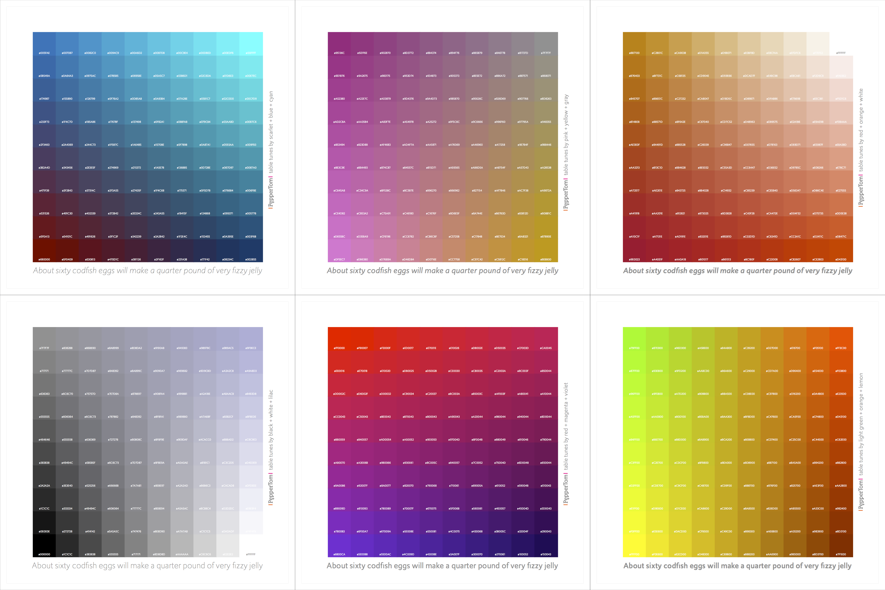
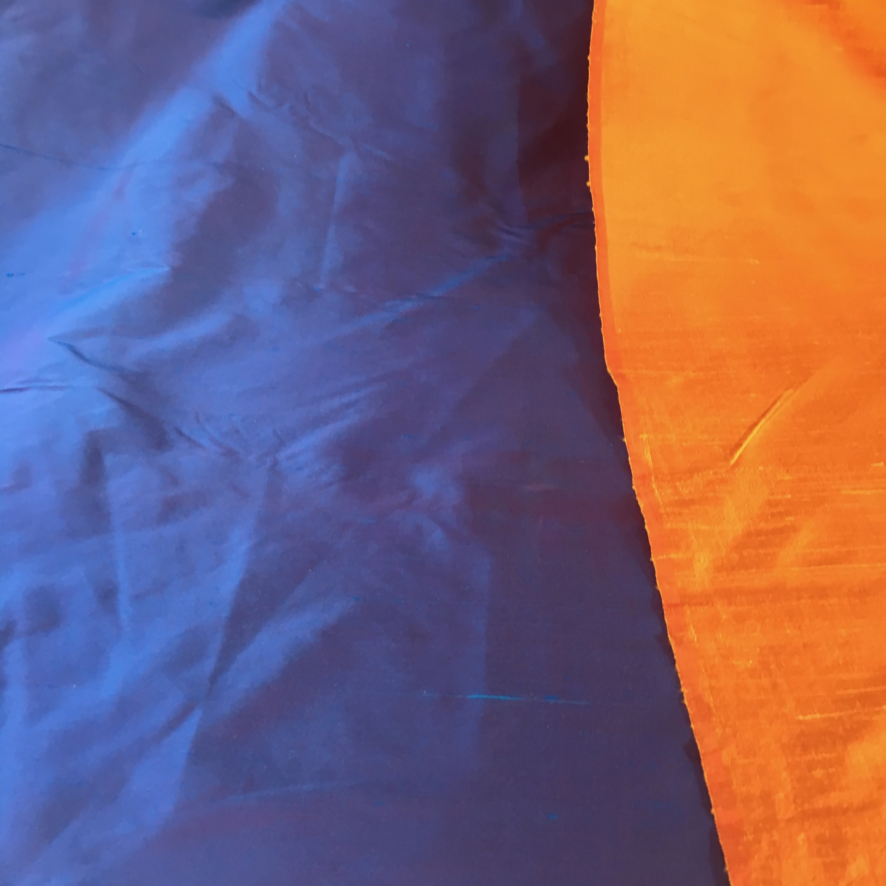
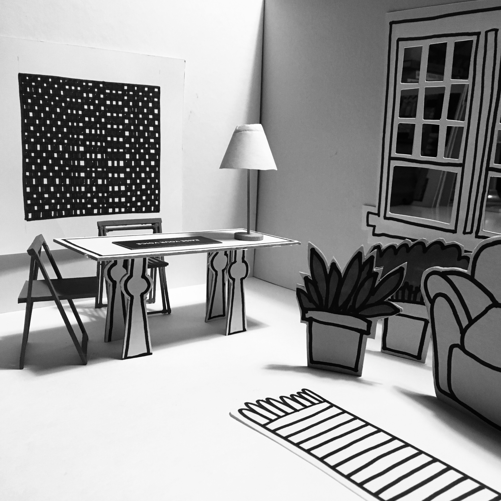

~~~
from pagebot.toolbox.color import color
doc.title = 'Design&nbsp;Design&nbsp;Space'

doc.footerHtml = """Let us know what you think. Do you have any questions for us? <a href="mailto:info@designdesign.space?subject=Tell me more about DesignDesign.Space">info@designdesign.space</a>"""

# Uncomment to see cssId/cssClass markers in the page
#doc.view.showIdClass = True

# Page (Home)
#	Wrapper
#		Header 
#			Logo (+BurgerButton)
#			Navigation/TopMenu/MenuItem(s)
#      Content
#  			Banner
#  			SlideShow (on Home)
#      		Slides
#      		SlideSide
#			Section(s)
#				Introduction
#				Main
#				Mains
#					Main
#				Side
#				Sides
#					Side
#		Footer
#
# ----------------------------------------
# index.html
# ----------------------------------------
page.name = 'Home'
page.url = 'index.html'
content = page.select('Content')
box = content.newBanner()

# Which studies can we offer you in 2020?
~~~

# Masterclasses in 2020-2021

~~~
box = content.newIntroduction()
~~~

# TypeLab 2021 (June 17-19) is about to happen. And still open for contributions. This year focus is on workspaces. What does yours look like? Give us a tour. What are those interesting books on your shelf? Share them with us. Submitting is easy, just tell us what you would like to do. TypeLab is informal among friends. No need to be shy.

~~~
section = content.newSection()
box = section.newMain()
~~~

## <a href="https://2021.typographics.com/typelab/" target="external">Read more here.</a> <a href="https://docs.google.com/forms/d/e/1FAIpQLSdd8rMhZB3dLn5yd7tjCy0Hc1mJoHYSDLdsdzMwRYuvtB6lsQ/viewform" target="external">Subscribe here.</a>

<!--
~~~
section = content.newSection()
box = section.newMain(cssClass='youtubelink')

box = box.newMovie(url='https://player.vimeo.com/video/445611312')

~~~

~~~
box = section.newSide(cssClass='youtubeside')
~~~
# Type: Tricks & Troves

## Watch the new lecture. Any of these subjects can be the topic of your new study.

* 2 weeks online workshop
* Limited to 8 students
* Interactive lessons
* Exercises and feedback
* 4th workshop free

# <a href="https://www.eventbrite.com/d/online/designdesign/?q=designdesign" target="external">Subscribe here</a>

# [Contact us](mailto:info@designdesign.space?subject=Subscribing%20for%20the%20free%20DesignDesign.Space%20workshop)

-->

~~~
from pagebot.constants import *
slideshow = content.newSlideShow(h=300, slideW='100%', slideH=300, startIndex=3, autoHeight=True, carousel=2, dynamicHeight=False, transition='slide', easing=CSS_EASE, frameDuration=4, duration=0.7, pauseOnHit=True, randomPlay=False)
box = slideshow.slides
~~~

~~~ 
box = slideshow.side
~~~

# Develop your process. Expand your skills.

* One week with 3 online masterclasses
* Exercises and feedback
* $120

# Stay tuned for the new 2021-2022 program.
<!--# <a href="https://www.eventbrite.com/d/online/designdesign/?q=designdesign" target="external">Subscribe here</a>-->

# [Contact us](mailto:info@designdesign.space?subject=Subscribing%20for%20the%20free%20DesignDesign.Space%20workshop)

~~~
box = content.newIntroduction()
~~~

# Working from home? Studying online in the Corona world? Select the masterclasses you like. Develop your profession. Stay tuned for the new 2021-2022 program to be published soon.
~~~ 
#<a href="https://www.eventbrite.com/d/online/designdesign/?q=designdesign" target="external">Subscribe here</a>
#box = section.newCropped()
## 
#
~~~

~~~
section = content.newSection()
box = section.newMain()
~~~
## Masterclasses: what is it like?

Each online masterclass runs for one week, including 3 live lectures, addressing theory, showing examples and giving feedback on the exercises that you do.

* One week, from Monday to Sunday;
* Over 6 hours of live interactive hangouts with theory, models, templates and example documents;
* Intensive exercises and daily personal feedback;
* The result of the exercises is shared on a closed Slack channel for the duration of the workshop;
* Feedback comes from the educators and the other students;
* DesignDesign.Space offers a safe online study environment, where any question can be asked;
* $120;

Some masterclasses combine as a sequence. It is recommended to do them in the right order to get the best continuation.

~~~
box = section.newCropped()
~~~

~~~
section = content.newSection()
box = section.newMain()
~~~
<a name="planned-workshops-by-category"/>

## 2021-2022 masterclasses by category

### Stay tuned! More soon here.

<!--

### Programming

##### 2020-08-24 • [Basic coding in Python #1: Design by parameters (PY1)](#PY1)
##### 2020-09-07 • [Basic coding in Python #2: Functions, methods & classes (PY2)](#PY2)
##### 2020-10-19 • [Coding simple scripted tools (PY3)](#PY3)
##### 2020-11-02 • [== NOW RUNNING == Coding tools with a user interface (PY4)](#PY4)
##### 2020-11-16 • [== Few spaces left == Basic coding in Python #1: Design by parameters (PY1)](#PY1)
##### 2020-11-30 • [== Few spaces left ==Basic coding in Python #2: Functions, methods & classes (PY2)](#PY2)
##### 2021-01-04 • [Coding simple scripted tools (PY3)](#PY3)
##### 2021-01-18 • [Coding tools with a user interface (PY4)](#PY4)
##### 2021-02-15 • [Basic coding in Python #1: Design by parameters (PY1)](#PY1)
##### 2021-03-01 • [Basic coding in Python #2: Functions, methods & classes (PY2)](#PY2)
##### 2021-03-15 • [Scripting for RoboFont (PY5)](#PY5)
##### 2021-03-29 • [Coding simple scripted tools (PY3)](#PY3)
##### 2021-04-12 • [Coding tools with a user interface (PY4)](#PY4)

### Process 

##### 2020-09-21 • [Visual grammar #1: The seven parameters of Bertin](#visual-grammar1)
##### 2020-10-05 • [Visual grammar #2: Balance diversity & coherency](#visual-grammar2)
##### 2020-11-16 • [== Few spaces left == General sketching techniques (SK1)](#SK1)
##### 2020-11-30 • [== Few spaces left == Running a studio #1: Moodboards & presentations (ST1)](#ST1)
##### 2020-12-14 • [== Running == Running a studio #2: Requirements, quotes & plannings (ST2)](#ST2)
##### 2021-04-26 • [Visual grammar #1: The seven parameters of Bertin (VG1)](#VG1)
##### 2021-05-10 • [Visual grammar #2: Balance diversity & coherency (VG2)](#VG2)

### Type design

##### 2020-12-14 • [== Running == Coaching Type Projects (TY5)](#TY5)
##### 2021-01-18 • [== Running == Basic principles of type design: For graphic designers (TY1)](#TY1)
##### 2021-02-01 • [== Running == Contrast principles of type design (TY2)](#TY2)
##### 2021-02-15 • [Coaching Type Projects (TY5)](#TY5)
##### 2021-03-01 • [Sketching, feedback & planning in type design (TY4)](#TY4)
##### 2021-04-26 • [Design design spaces for Variable Fonts (TY6)](#TY6)
##### 2021-05-10 • [Design the process and tools for Variable Fonts (TY7)](#TY7)
##### 2021-06-07 • [Sketching type (TY3)](#TY3)
##### 2021-06-21 • [Coaching Type Projects (TY5)](#TY5)
##### 2021-07-05 • [Designing a script (TY8](#TY8)
##### 2021-07-19 • [Coding your spacing/kerning assistant (TY9)](#TY9)

### Graphic design

##### 2021-02-01 • [Basics of logo design (LO1)](#LO1)
##### 2021-03-15 • [Coding advanced logo variations (LO2)](#LO2)
##### 2021-03-29 • [Basics of typography, grids & layout (GD1)](#GD1)
##### 2021-04-12 • [Coding advanced typography & layouts for print and web (GD2)](#GD2)
##### 2021-05-24 • [Selecting typefaces (GD3)](#GD3)
##### 2021-06-07 • [Coding type specimens (GD4)](#GD4)
##### 2021-06-21 • [Design and code info-graphics with databases (IG1)](#IG1)

### Design education

##### 2021-01-04 • [Teaching Design: online, exercises, feedback & evaluation (DE1)](#DE1)
##### 2021-05-24 • [Teaching simulations and design games (DE2)](#DE2)

### Design Game

##### 2020-12-29/30 • [== Free workshop == Design Game Pentathlon 5 Rounds (DG1)](#DG1)
##### 2021-03-09/10 • [== Free workshop == Design Game Pentathlon 5 Rounds (DG1)](#DG1)

### Spacial design

##### 2021-07-05 • [Basic exhibition design (SD1)](#SD1)
##### 2021-07-19 • [Workspace design (SD2)](#SD2)
-->

~~~
box = section.newCropped()
~~~

~~~
section = content.newSection()
box = section.newMain()
~~~

## 2021-2022 masterclasses by date

### Stay tuned! More soon here.

~~~
box = box.newInfo()
~~~

<!--
### 2020

##### 2020-08-24 • [Basic coding in Python #1: Design by parameters (PY1)](#PY1)
##### 2020-09-07 • [Basic coding in Python #2: Functions, methods & classes (PY2)](#PY2)
##### 2020-09-21 • [Visual grammar #1: The seven parameters of Bertin](#visual-grammar1)
##### 2020-10-05 • [Visual grammar #2: Balance diversity & coherency](#visual-grammar2)
##### 2020-10-19 • [Coding simple scripted tools (PY3)](#PY3)
##### 2020-11-02 • [== NOW RUNNING == Coding tools with a user interface (PY4)](#PY4)
##### 2020-11-16 • [== Few spaces left == General sketching techniques (SK1)](#SK1)
##### 2020-11-16 • [== Few spaces left == Basic coding in Python #1: Design by parameters (PY1)](#PY1)
#### November
##### 2020-11-30 • [== Few spaces left == Basic coding in Python #2: Functions, methods & classes (PY2)](#PY2)
##### 2020-11-30 • [== Few spaces left == Running a small studio #1: Moodboards & presentations (ST1)](#ST1)

#### December
##### 2020-12-14 • [== Running == Running a small studio #2: Requirements, quotes & plannings (ST2)](#ST2)
##### 2020-12-14 • [== Running == Coaching Type Projects (TY5)](#TY5)
##### 2020-12-29/30 • [==Free workshop== Design Game Pentathlon 5 Rounds (DG1)](#DG1)

### 2021

#### January
##### 2021-01-04 • [Teaching Design: online, exercises, feedback & evaluation (DE1)](#DE1)
##### 2021-01-04 • [Coding simple scripted tools (PY3)](#PY3)
##### 2021-01-18 • [Coding tools with a user interface (PY4)](#PY4)
##### 2021-01-18 • [Basic principles of type design: For graphic designers (TY1)](#TY1)

#### February
##### 2021-02-01 • [Basics of logo design (LO1)](#LO1)
##### 2021-02-01 • [== Running == Contrast principles of type design (TY2)](#TY2)
##### 2021-02-15 • [Coaching Type Projects (TY5)](#TY5)
##### 2021-02-15 • [Basic coding in Python #1: Design by parameters (PY1)](#PY1)

#### March
##### 2021-03-01 • [Basic coding in Python #2: Functions, methods & classes (PY2)](#PY2)
##### 2021-03-01 • [Sketching, feedback & planning in type design (TY4)](#TY4)
##### 2021-03-09/10 • [== Free workshop == Design Game Pentathlon 5 Rounds (DG1)](#DG1)
##### 2021-03-15 • [Coding advanced logo variations (LO2)](#LO2)
##### 2021-03-15 • [Scripting for RoboFont (PY5)](#PY5)
##### 2021-03-29 • [Basics of typography, grids & layout (GD1)](#GD1)
##### 2021-03-29 • [Coding simple scripted tools (PY3)](#PY3)

#### April
##### 2021-04-12 • [Coding tools with a user interface (PY4)](#PY4)
##### 2021-04-12 • [Coding advanced typography & layouts for print and web (GD2)](#GD2)
##### 2021-04-26 • [Design design spaces for Variable Fonts (TY6)](#TY6)
##### 2021-04-26 • [Visual grammar #1: The seven parameters of Bertin (VG1)](#VG1)

#### May
##### 2021-05-10 • [Visual grammar #2: Balance diversity & coherency (VG2)](#VG2)
##### 2021-05-10 • [Design the process and tools for Variable Fonts (TY7)](#TY7)
##### 2021-05-24 • [Selecting typefaces (GD3)](#GD3)
##### 2021-05-24 • [Teaching simulations and design games (DE2)](#DE2)

#### June
##### 2021-06-07 • [Coding type specimens (GD4)](#GD4)
##### 2021-06-07 • [Sketching type (TY3)](#TY3)
##### 2021-06-21 • [Coaching Type Projects (TY5)](#TY5)
##### 2021-06-21 • [Design and code info-graphics (IG1)](#IG1)

#### July
##### 2021-07-05 • [Designing a script (TY8)](#TY8)
##### 2021-07-05 • [Basic exhibition design (SD1)](#SD1)
##### 2021-07-19 • [Coding your spacing/kerning tool (TY9)](#TY9)
##### 2021-07-19 • [Workspace design (SD2)](#SD2)
-->

~~~
box = section.newCropped()
~~~

<-- W O R K S H O P  D E S C R I P T I O N S  -->

