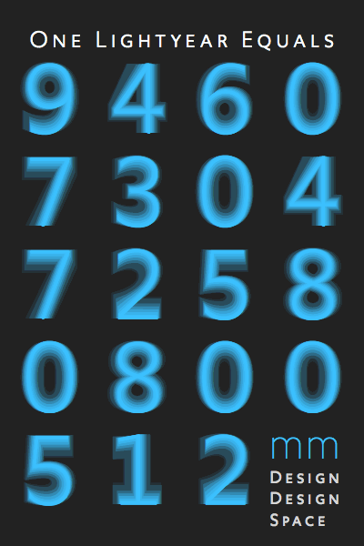

~~~
section = content.newSection()
box = section.newMain()
~~~
## €290 per workshop

### Get one free for every three

* 1st workshop €290 (±$340)
* 2nd workshop €290 (±$340)
* 3rd workshop €290 (±$340)
* 4th workshop Free

You can subscribe and pay for the workshops one by one. DesignDesign.Space keeps track of the total amount of workshops that you did. 

All payments in Euro's.
Inside The Netherlands 21% VAT is added.
Inside the rest of Europe no VAT is added, if you have a VAT registration number.
Outside Europe no VAT is added.
We send an invoice over the total amount.

Your place in a workshop is confirmed, once the payment is received.

This pricing is for students, single designers and small studios. Pricing for corporate usage and custom made workshops is upon request.

<a href="https://docs.google.com/forms/d/1vLKGROUx03Sm3QGWEwuP1f7Uo1v4qQCmG1FlaxOT88A" target="external">Subscribe here</a>

~~~
box = section.newCropped()
~~~

~~~
section = content.newSection()
box = section.newMain()
~~~

### More examples of exercises

* [Type design](studies-type_design.html)
* [Typography](studies-typography.html)
* [Graphic design](studies-graphic_design.html)
* [Design spaces](studies-design_spaces.html)
* [Design practice](studies-design_practice.html)

---

#### Typeface of this website: <a href="http://upgrade.typenetwork.com" target="external">TYPETR Upgrade</a>

~~~
box = section.newCropped()
~~~

