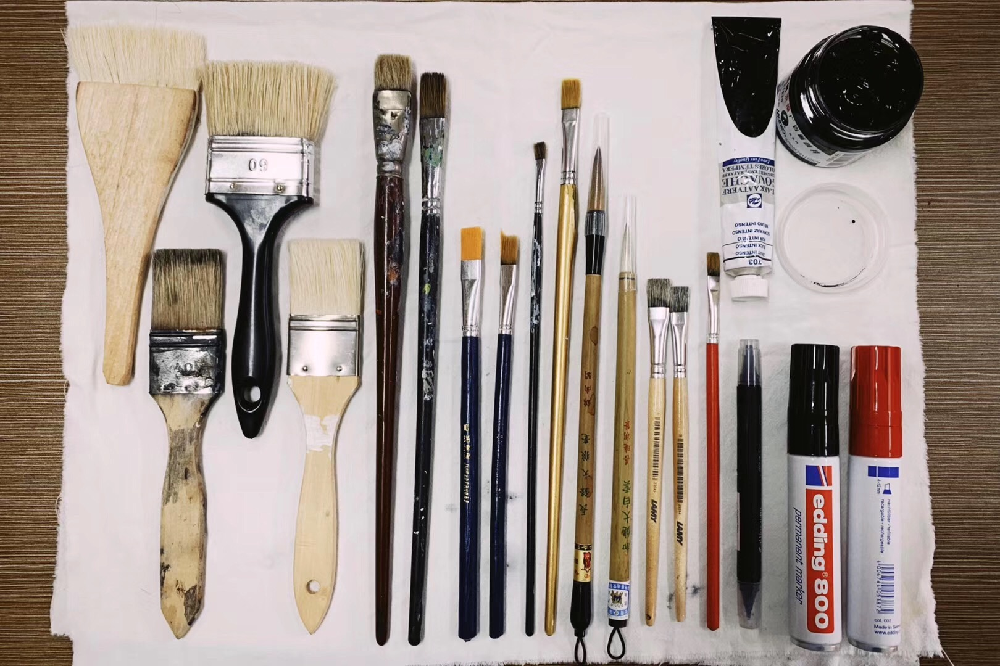
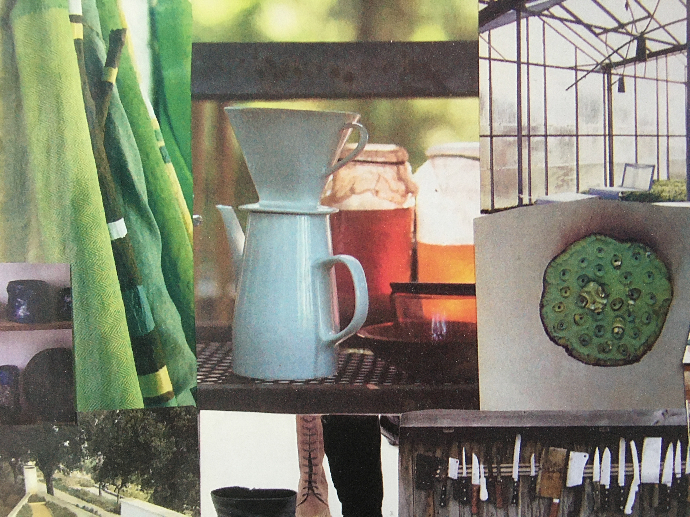
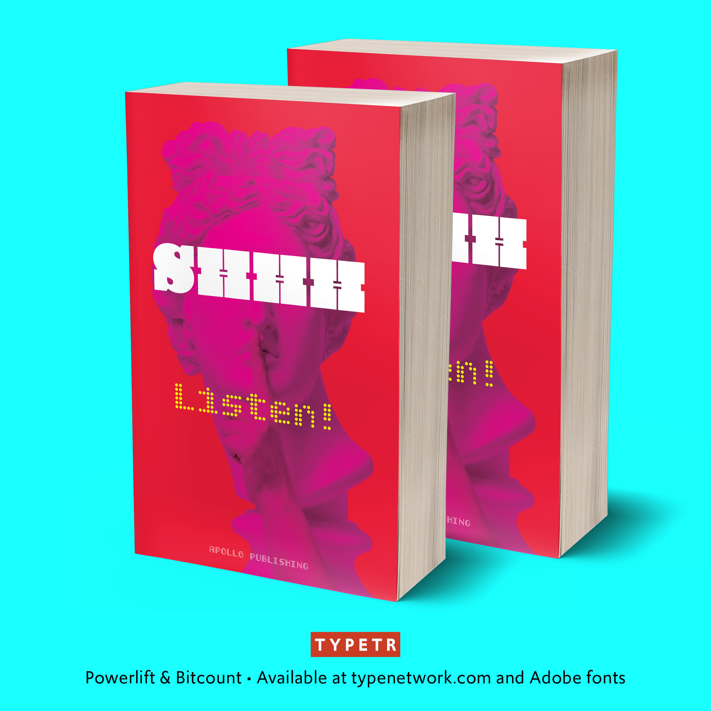
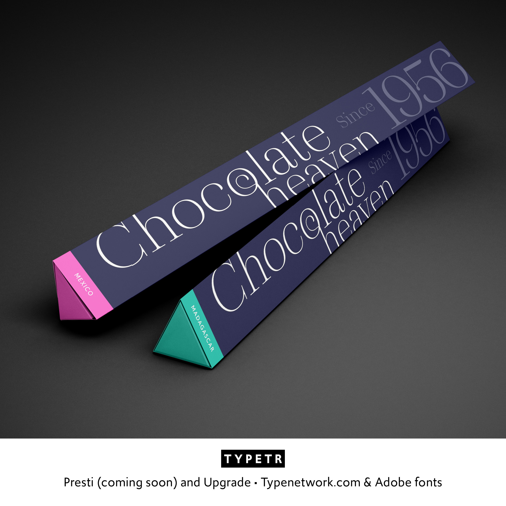
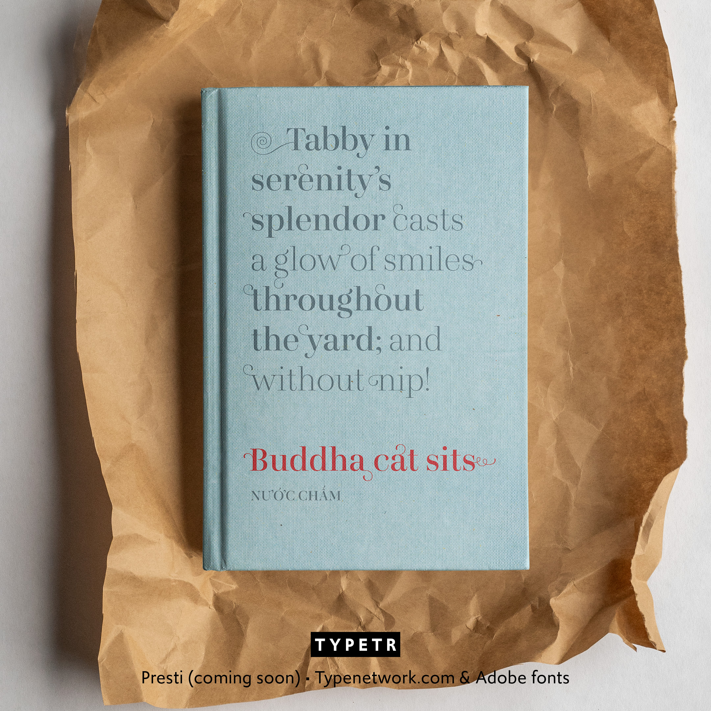
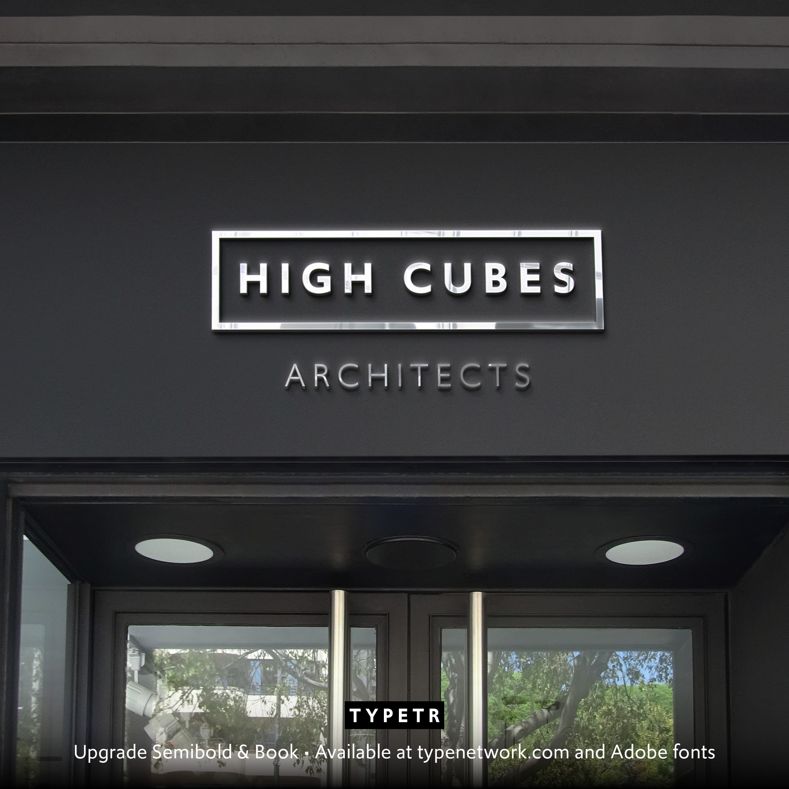

~~~
from pagebot.toolbox.color import color
doc.title = 'Design&nbsp;Design&nbsp;Space'

doc.footerHtml = """Let us know what you think. Do you have any questions for us? <a href="mailto:info@designdesign.space?subject=Tell me more about DesignDesign.Space">info@designdesign.space</a>"""

# Uncomment to see cssId/cssClass markers in the page
#doc.view.showIdClass = True

# Page (Home)
#	Wrapper
#		Header 
#			Logo (+BurgerButton)
#			Navigation/TopMenu/MenuItem(s)
#      Content
#  			Banner
#  			SlideShow (on Home)
#      		Slides
#      		SlideSide
#			Section(s)
#				Introduction
#				Main
#				Mains
#					Main
#				Side
#				Sides
#					Side
#		Footer
#
# ----------------------------------------
# index.html
# ----------------------------------------
page.name = 'Home'
page.url = 'index.html'
content = page.select('Content')
box = content.newBanner()

# Which studies can we offer you in 2020?
~~~

# Start your study project in 2025 (or maybe this year)

~~~
from pagebot.constants import *
slideshow = content.newSlideShow(h=300, slideW='100%', slideH=300, startIndex=3, autoHeight=True, carousel=2, dynamicHeight=False, transition='slide', easing=CSS_EASE, frameDuration=4, duration=0.7, pauseOnHit=True, randomPlay=False)
box = slideshow.slides
~~~

~~~ 
box = slideshow.side
~~~

# Develop your process. Expand your skills.

* Projects on “Master” level
* Tell us your interests
* Define your own tempo
* What fits your budget?
* Exercises and feedback

# [Contact us](mailto:info@designdesign.space?subject=Subscribing%20for%20the%20free%20DesignDesign.Space%20workshop)

~~~
box = content.newIntroduction()
~~~

# Working from home? Studying online in post-Corona world? Define a project you would like to do, but cannot find a way to start. Develop your profession. 

~~~ 
#box = section.newCropped()
## 
#
~~~

~~~
section = content.newSection()
box = section.newMain()
~~~
## Studying at DD.S: what is it like?

* Intensive exercises and daily personal feedback;
* The result of the exercises is shared on a closed Slack channel for the duration of the study;
* Feedback comes from the educators and the other students;
* DesignDesign.Space offers a safe online study environment, where any question can be asked;
* Tell us what your budget is.

~~~
box = section.newCropped()
~~~

