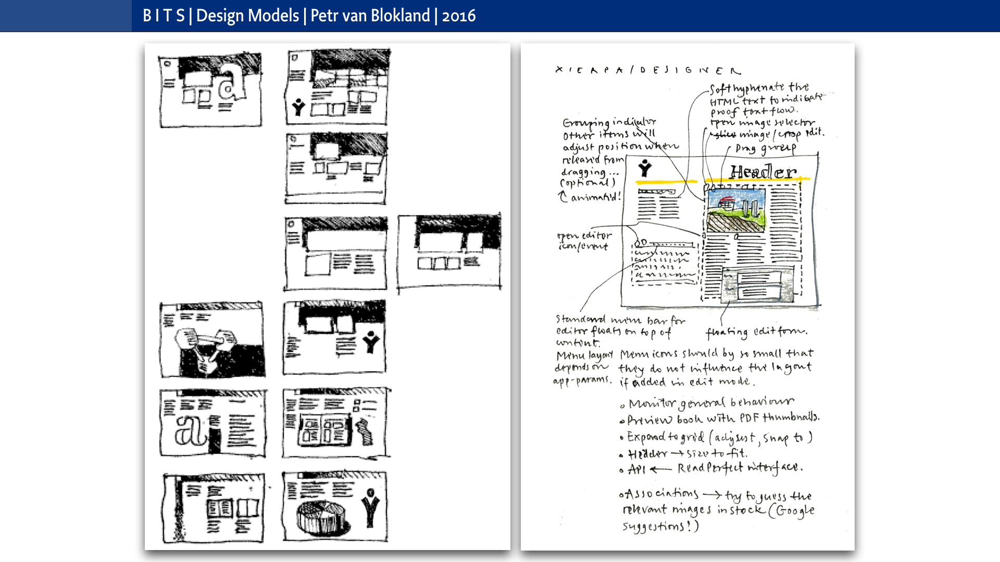
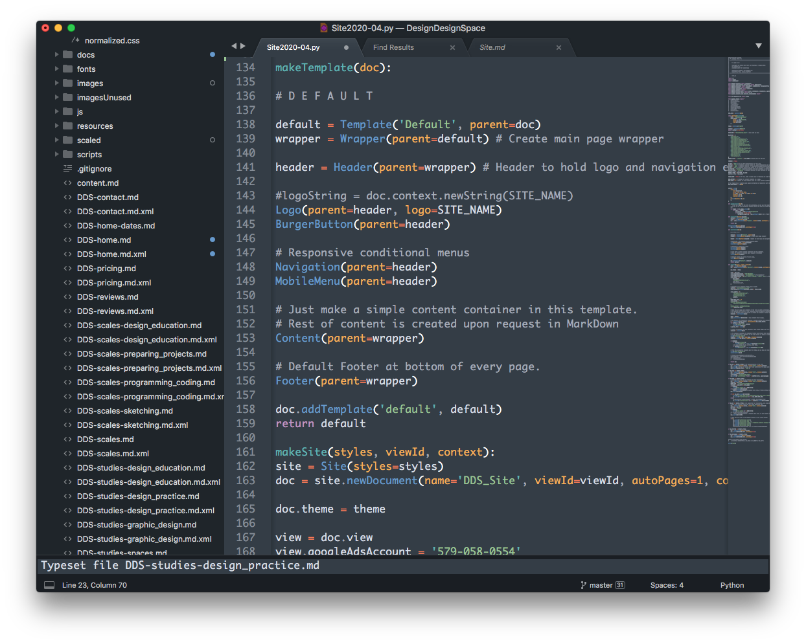
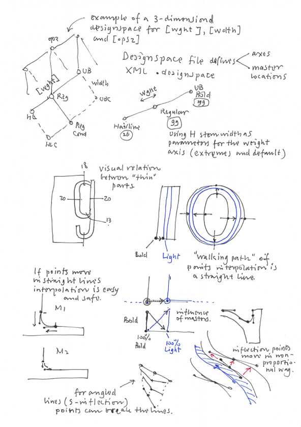

~~~
doc.title = 'Design&nbsp;Design&nbsp;Space'

doc.footerHtml = """Let us know what you think. Do you have any questions for us? <a href="mailto:info@designdesign.space?subject=Tell me more about DesignDesign.Space">info@designdesign.space</a>"""

# Uncomment to see cssId/cssClass markers in the page
#doc.view.showIdClass = True

# Page (Home)
#	Wrapper
#		Header 
#			Logo (+BurgerButton)
#			Navigation/TopMenu/MenuItem(s)
#      Content
#  			Banner
#  			SlideShow (on Home)
#      		Slides
#      		SlideSide
#			Section(s)
#				Introduction
#				Main
#				Mains
#					Main
#				Side
#				Sides
#					Side
#		Footer
#
# ----------------------------------------
# index.html
# ----------------------------------------
page.name = 'Home'
page.url = 'index.html'
content = page.select('Content')
box = content.newBanner()

# Which studies can we offer you in 2020?
~~~
# New workshops in 2020-2021
~~~
from pagebot.constants import *
slideshow = content.newSlideShow(h=300, slideW='100%', slideH=300, startIndex=3, autoHeight=True, carousel=2, dynamicHeight=False, transition='slide', easing=CSS_EASE, frameDuration=4, duration=0.7, pauseOnHit=True, randomPlay=False)
box = slideshow.slides
~~~

~~~ 
box = slideshow.side
~~~

# Develop your process. Expand your skills.

* 2 weeks
* Limited to 8 students
* Live lectures
* Exercises and feedback

# <a href="https://docs.google.com/forms/d/1vLKGROUx03Sm3QGWEwuP1f7Uo1v4qQCmG1FlaxOT88A" target="external">Subscribe here</a>

# [Contact us](mailto:info@designdesign.space?subject=Subscribing%20for%20the%20free%20DesignDesign.Space%20workshop)

~~~
box = content.newIntroduction()

~~~

# Working from home? Studying online in Corona world? Select the workshops that you like. Develop your profession. <a href="https://docs.google.com/forms/d/1vLKGROUx03Sm3QGWEwuP1f7Uo1v4qQCmG1FlaxOT88A" target="external">Subscribe here</a>
~~~ 
#box = section.newCropped()
## 
#
~~~

~~~
section = content.newSection()
box = section.newMain()
~~~
## DesignDesign.Space workshops: what are they like?

Each workshop runs for 2 weeks, including live lectures, addressing theory, showing examples and give feedback on the exercises that you do.

* 2 weeks, from Monday to Sunday
* 4 hangouts with theory, models, templates and example documents. 
* Maximal 8 participants per workshop
* Intensive exercises and daily personal feedback
* The result of the exercises is shared on a closed Slack channel for the duration of the workshop. 
* Feedback comes from the educators and the other students.
* DesignDesign.Space offers a safe online study environment, where any question can be asked. 

Some workshops combine as a sequence. It is recommended to do them in the right order. Every 4th workshop is free of charge.

~~~
box = section.newCropped()
~~~

~~~
section = content.newSection()
box = section.newMain()
~~~
## €290 per workshop

### Get one free for every three

* 1st workshop €290 ($330)
* 2nd workshop €290 ($330)
* 3rd workshop €290 ($330)
* 4th workshop Free

You can subscribe and pay for the workshops one by one.

DesignDesign.Space keeps track of the total amount of workshops that you did. 

Pricing is for students, single designers and small studios.

Your place in a workshop is confirmed, once the payment is received.

Pricing for corporate usage and custom made workshops is upon request.

<a href="https://docs.google.com/forms/d/1vLKGROUx03Sm3QGWEwuP1f7Uo1v4qQCmG1FlaxOT88A" target="external">Subscribe here</a>

~~~
box = section.newCropped()
~~~

~~~
section = content.newSection()
box = section.newMain()
~~~

## Planned workshops by category

~~~
box = box.newInfo()
~~~

### Process 

##### 2020-09-21 • [(V1) Visual grammar #1: The seven parameters of Bertin](#visual-grammar1)
##### 2020-10-05 • [Visual grammar #2: Balance diversity and coherency](#visual-grammar2)
##### 2020-11-16 • [(S1) General sketching techniques](#general-sketching-techniques)
##### 2020-11-30 • [Running a studio #1: Moodboards and presentations](#running-a-studio1)
##### 2020-12-14 • [Running a studio #2: Requirements, quotes and plannings](#running-a-studio2)
##### 2021-01-04 • [Teaching online, making exercises, methods for feedback and evaluation](#teaching-online)

### Programming

##### 2020-08-24 • [(P1) Basic coding in Python #1: Design by parameters](#coding-in-python1)
##### 2020-09-07 • [(P2) Basic coding in Python #2: Functions, methods and classes](#coding-in-python2)
##### 2020-10-19 • [(T1) Coding simple scripted tools](#coding-simple-scripted-tools)
##### 2020-11-02 •  Coding tools with a user interface](#coding-simple-ui-tools)
##### 2021-03-15 • [Scripting for RoboFont](#scripting-for-robofont)

### Type design

##### 2021-01-18 • [Basic principles of type design: For graphic designers](#basic-principles-of-type-design)
##### 2021-02-01 • [(L1) Basics of logo design](#logo-design)
##### 2021-02-15 • [Coding advanced logo variations](#coding-advanced-logo-variations)
##### 2021-03-01 • [Sketching, feedback and planning in type design](#sketching-feedback-planning)

### Publications for web and print

##### 2021-03-29 • [Basics of typography, grids and layout](#basics-of-typography-grids-and-layout)
##### 2021-04-12 • [Coding advanced typography and layouts for print and web](#basics-of-grid-design)

~~~
box = section.newCropped()
~~~

<!--
### Process

### Programming 

##### [Version management, testing and the creation of automated manuals](#version-management)

### Type design

##### [Design the process and tools for Variable Fonts](#design-process-and-tools-for-variable-fonts)
##### [Design design spaces for Variable Fonts](#design-design-spaces-for-variable-fonts)

### Typography

##### [Undated • Typography for web and print, how to select typefaces](#typography-for-web-and-print)
##### [Undated • Coding automated type specimens](#coding-automated-type-specimens)

### Publications for web and print

##### [Undated • Coding grids for print and web](#coding-grids-for-print-and-web)
##### [Undated • Coding publications as website, Sketch and InDesign](#coding-publications-as-website-sketch-indesign)

### Info-graphics

##### [Undated • Basics, models and databases](#basics-models-databases)
##### [Undated • Coding templates and visual grammar](#coding-templates-and-visual-grammar)

### Spacial design

##### [Undated • Floor plan design](#floor-plan-design)
##### [Undated • Workspace design, running a studio from home](#workspace-design)

-->

~~~
section = content.newSection()
box = section.newMain()
~~~

## Planned workshops by date

~~~
box = box.newInfo()
~~~

### 2020

##### 2020-08-24 • [(P1) Basic coding in Python #1: Design by parameters](#coding-in-python1)
##### 2020-09-07 • [(P2) Basic coding in Python #2: Functions, methods and classes](#coding-in-python2)
##### 2020-09-21 • [(V1) Visual grammar #1: The seven parameters of Bertin](#visual-grammar1)
##### 2020-10-05 • [Visual grammar #2: Balance diversity and coherency](#visual-grammar2)
##### 2020-10-19 • [(P3) Coding simple scripted tools](#coding-simple-scripted-tools)
##### 2020-11-02 • [Coding tools with a user interface](#coding-simple-ui-tools)
##### 2020-11-16 • [General sketching techniques](#general-sketching-techniques)
##### 2020-11-30 • [Running a studio #1: Moodboards and presentations](#running-a-studio1)
##### 2020-12-14 • [Running a studio #2: Requirements, quotes and plannings](#running-a-studio2)

### 2021

##### 2021-01-04 • [Teaching online, making exercises, methods for feedback and evaluation](#teaching-online)
##### 2021-01-18 • [(T3) Basic principles of type design: For graphic designers](#basic-principles-of-type-design)
##### 2021-02-01 • [(L1) Basics of logo design](#logo-design)
##### 2021-02-15 • [Coding advanced logo variations](#coding-advanced-logo-variations)
##### 2021-03-01 • [Sketching, feedback and planning in type design](#sketching-feedback-planning)
##### 2021-03-15 • [Scripting for RoboFont](#scripting-for-robofont)
##### 2021-03-29 • [(L3) Basics of typography, grids and layout](#basics-of-typography-grids-and-layout)
##### 2021-04-12 • [Coding advanced typography and layouts for print and web](#basics-of-grid-design)

~~~
box = section.newCropped()
~~~

~~~
section = content.newSection()
box = section.newMain()
~~~
<a name="coding-in-python1"/>
## (P1) Basic coding in Python #1

### Design by parameters

#### Start August 24th 2020 • 2 weeks • €290

~~~
box = box.newInfo()
~~~

Take one if your designs and try to find the numbers and rules that are behind the composition. Learn to express that information in Python code. Then discover how the program can generate alternative versions of your original design, by using color themes and different page sizes.

The workshop assumes no prior knowledge of programming and Python coding. Existing Open Source libraries are used, such as DrawBot and PageBotNano. Exercises take you step by step through the process of coding your graphic design.

* Select a publication and analyze the (typographic) proportions that it contains.
* Sketch the relations between the extracted values, e.g. what are the possibilities for various page sizes?
* Learn the basics of generating pages by code.
* Automate the generation of equivalent color themes and alternative layouts.

The use of DrawBot in this workshop requires a MacOS computer.

This workshop is followed up by [(P2) Basic coding in Python #2](#coding-in-python2).

~~~
box = section.newCropped()
~~~

~~~
section = content.newSection()
box = section.newMain()
~~~
<a name="coding-in-python2"/>
## Basic coding in Python #2

### Functions, methods and classes

#### (P2) Start September 7th 2020 • 2 weeks • €290

~~~
box = box.newInfo()
~~~

After finishing [Basic coding in Python #1](#coding-in-python1), you have a program that is doing one specific task. Great as that may be, it is hard to reuse the code for other projects. How nice would it be, to create a **“library”** of code that can be called for similar designs, without writing it all from scratch?

The focus of this workshop is in making code more sustainable, using **functions, methods and classes**. Existing Open Source libraries are used, such as **DrawBot** and **PageBotNano**. Exercises take you step by step through the process of coding your graphic design. Instead of manually building a car, it may be more profitable to build a factory for cars. 

* Make a selection of different publications and analyze the variety of (typographic) proportions that they share;
* Sketch the relations between the extracted values and write them as coded rules;
* Store these rules as a library of Python classes;
* Learn to use this library in future design project.

The use of DrawBot in this workshop requires a MacOS computer.

Completion of workshop [(P1) Basic coding in Python #1](#coding-in-python1) is recommended.

~~~
box = section.newCropped()
~~~

~~~
section = content.newSection()
box = section.newMain()
~~~
<a name="visual-grammar1"/>
## Visual grammar #1

### Learn to use the seven parameters of Bertin

#### (V1) Start September 21st 2020 • 2 weeks • €290

~~~
box = box.newInfo()
~~~

Disassemble your graphic design into basic parameters. Why do you choose a color or a typeface? What other options do you have, other than choosing a color by number? How to define the visual grammar of a corporate identity?

In this workshop Jacques Bertin’s model of seven visual parameters (**color, contrast, texture, angle, position, size and shape**) is used as starting point for a number of exercises.

* Design simple pages to examine the relation between the seven parameters, such as color, contrast and size.
* Make gray scales and color circles, using paint and digital tools; 
* Understand the difference between additive and subtractive colors;
* Make the darkest black on earth.

This workshop is followed up by [Visual grammar #2](#"visual-grammar2).

~~~
box = section.newCropped()
~~~

~~~
section = content.newSection()
box = section.newMain()
~~~
<a name="visual-grammar2"/>
## Visual grammar #2

### Learn to balance diversity and coherency

#### (V2) Start October 5th 2020 • 2 weeks • €290

~~~
box = box.newInfo()
~~~

Learn methods to distinguish between **this one** and **this kind of**. What makes different letters belong to the same typeface? How to make coherent color palettes? How to balance typographic elements on the same page? 

The excercises of this workshop give insight in the various methods to balance visual grammar.

* Solve typographic puzzles. Which letters belong to the same typeface and which are too different?
* Design a series of different covers. Why do they visually belong to the same group?
* Organize a number of objects in a given space. What are your options to make a composition. How to create a structure?

Completion of workshop [(V1) Visual grammar #1](#visual-grammar1) is recommended.

~~~
box = section.newCropped()
~~~

~~~
section = content.newSection()
box = section.newMain()
~~~
<a name="coding-simple-scripted-tools"/>
## Coding simple scripted tools

### Automate repeating tasks in the design process

#### Start October 19th 2020 • 2 weeks • €290

~~~
box = box.newInfo()
~~~

After finishing [Basic coding in Python #1](#coding-in-python1), you are equiped with the basic coding skill to automate certain tasks that sometimes make a design process boring and lengthy.

Focus of the workshop is on very short script, only a couple of lines long, that aautomat repeating tasks in the design process. The result is a set of example scripts that can later be modified to be used in real life projects.

You can make a selection from the following exercises. And it is also possible to bring your own ideas.

* Make a script that runs through folders with images and applies Photoshop-like filters on each of them;
* Make a script that draws graphs based on information from a spreadsheet. Save the pages in PDF documents using your own layout;
* Make a script that generates a simple website, based on content in a Markdown file.
* Make a script that checks a font on mistakes in spacing and kerning;
* Make a script that generates TTF and OTF fonts, after doing some automated operations on the outlines.

The use of DrawBot in this workshop requires a MacOS computer.

Completion of workshops [Basic coding in Python #1](#coding-in-python1) and [Basic coding in Python #1](#coding-in-python2) is recommended.

~~~
box = section.newCropped()
~~~

~~~
section = content.newSection()
box = section.newMain()
~~~
<a name="coding-simple-ui-tools"/>
## Coding simple tools with a user interface

### Make scripted tools more user friendly

#### Start November 11th 2020 • 2 weeks • €290

~~~
box = box.newInfo()
~~~

Once project grow larger, it may become necessary to get other developers involved. This workshop addresses the use of Github for version management. 

Focus of the workshop is on how to program user interaction. Extract the various options into popups and menus.

You can make a selection from the following exercises. And it is also possible to bring your own ideas.

* Make an interface that allows the user to choose from the avaible image filter, before it runs through the entire set of image files.
* Make an interface that allows to choose from templates of graphs;
* Make an interface that shows the available color themes, before generating a website;
* Make an interface to show the various testing schemes on a font;

The use of DrawBot in this workshop requires a MacOS computer.

Completion of workshops [Basic coding in Python #1](#coding-in-python1) and [Basic coding in Python #1](#coding-in-python2) is recommended.

Completion of workshop [Coding simple scripted tools](#simple-scripted-tools) is recommended.

~~~
box = section.newCropped()
~~~

~~~
section = content.newSection()
box = section.newMain()
~~~
<a name="general-sketching-techniques"/>
## General sketching techniques

### Learn the basic skills to visualise your ideas

#### Start November 16th 2020 • 2 weeks • €290

~~~
box = box.newInfo()
~~~

Sketching is the basis of every design process. Scribble early ideas to communicate with yourself and others. It is the ideal method for rapid prototyping, without spending much time on presentations. 

The workshop gives insight in various sketching techniques, using pen on paper as well as digital tools.

* Sketch the pages of some future publications;
* Sketch typefaces, using TypeCooker recipes;
* Sketch a series of info-graphics, visualizing narrative and data;
* Sketch abstract processes, such a the design of a website.

~~~
box = section.newCropped()
~~~

~~~
section = content.newSection()
box = section.newMain()
~~~
<a name="running-a-studio1"/>
## Running a studio #1

### Experience the making of mood boards and presentations

#### Start November 30th 2020 • 2 weeks • €290

~~~
box = box.newInfo()
~~~

Adding the process of sketching, presentation techniques help to get ideas come across. Convince yourself and others about the values of your design. Making mood boards an presentations is just another form of rapid prototyping.

The workshop gives an overview of making presentation, using materials, 3D and digital tools.

* Choose a topic or select one of your former projects. Visualize the design decisions in 3 mood boards.
* Sketch presentations in a small scale. What do you want to show in such a story board?
* Present a existing design project in no more than 5 slides. Pay attention to consistency of layout, typegraphy and the use of color.
* Can you present what makes your design so unique?

~~~
box = section.newCropped()
~~~

~~~
section = content.newSection()
box = section.newMain()
~~~
<a name="running-a-studio2"/>
## Running a studio #2

### Learn the making of quotes, briefings, plannings and requirement lists

#### Start December 14th 2020 • 2 weeks • €290

~~~
box = box.newInfo()
~~~

Doing administration work is often seen as a boring by-product of running a studio. Planning projects is vital, but often ignored. Learn to look at these processes as if they were regular design jobs. Doing them can be fun. And they can even become one of your products. 

The workshop shows methods to design the process of administration, as if it was an interesting graphic design project.

* Design templates for quotes and invoices, using spreadsheet applications and Google Docs.
* Learn to distinguish between the “go” and “no-go” requirements of a design;
* Sketch info-graphics that show the iterations of a design process. Visualise the planning for your customer;
* Automate the generation of progress reports.

~~~
box = section.newCropped()
~~~

<!--

~~~
section = content.newSection()
box = section.newMain()
~~~
<a name="version-management"/>
## Version management

### Using Githib, consistency testing and the creation of automated manuals

#### Undated • 2 weeks • €290

~~~
box = box.newInfo()
~~~

After finishing [Coding simple scripted tools](#coding-simple-scripted-tools), it is time to concentrate more on the user interface. If scripts are used by other designers than yourself, it is more user friendly to offer a window with checkboxes and buttons, than altering the options directly in the code.

* Set up your existing (typedesign) projects as Github repository, so you can share changes are update with other designers, who work on the same project;
* Add tests inside your sources to ensure the validity of the code;
* Write scripts that generate automated manuals from the projects that you made.

The use of DrawBot in this workshop requires a MacOS computer.

Completion of workshop [Coding simple scripted tools](#simple-scripted-tools) is recommended.

~~~
box = section.newCropped()
~~~

-->

<!-- T Y P E  D E S I G N -->

~~~
section = content.newSection()
box = section.newMain()
~~~
<a name="basic-principles-of-type-design"/>
## Basic principles of type design

### Understanding contrast by writing. Experiment with width and weight alterations

#### Start January 18th 2021 • 2 weeks • €290

~~~
box = box.newInfo()
~~~

After finishing [Coding simple scripted tools](#coding-simple-scripted-tools), it is time to concetrate more on the user interface. If scripts are used by other designers than yourself, it is more user friendly to offer a window with checkboxes and buttons, than altering the options directly in the code.

* Write alphabets with the broad nib pencil to experience the construction of “translation” contrast;
* Write with sharp pencils to experience the construction of “expansion” contrast;
* Learn the behaviour of letter shapes, varying weight and width 
* Digitize your writings into outlines, using your favourite type editor;
* Learn the basics about capitals, roman, italic, spacing and kerning.

~~~
box = section.newCropped()
~~~

~~~
section = content.newSection()
box = section.newMain()
~~~
<a name="sketching-feedback-planning"/>
## Sketching, feedback and planning in type design

### Smoothing the process

#### Start Januari 25th 2021 • 2 weeks • €290

~~~
box = box.newInfo()
~~~

Working on type projects can take a long time. It is not always easy to keep track of progress and quality, if zoomed into so many details.

This workshop shows methods to get through lengthy projects, staying focussed while keeping an eye on the horizon.

* Learn about sketching techniques, in combination with methods of feedback;
* Make templates for planning;
* Automate ongoing checks on the validity of your font sources;
* Develop testing methods for QA and proofing.

~~~
box = section.newCropped()
~~~

<!--

~~~
section = content.newSection()
box = section.newMain()
~~~
<a name="designing-design-spaces-for-variable-fonts"/>
## Design design spaces for Variable Fonts

### Sketching, design and implementation of variable axes

#### Undated • 2 weeks • €290

~~~
box = box.newInfo()
~~~

Making Variable Fonts beyond the standard **width** and **weight** axis can easily become a project of exponential complexity. What is the best approach to solve that problem? Which techniques can be used to keep the amount of work within realistic proportions?

This workshop shows methods to visualize the complexity, including strategies for sketching and design.

* Sketching various forms of design spaces;
* Adapt your design process to what is needed for Variable Fonts;
* Develop design strategies, using regular type design tools;

~~~
box = section.newCropped()
~~~

~~~
section = content.newSection()
box = section.newMain()
~~~
<a name="design-process-and-tools-for-variable-fonts"/>
## Design the process and tools for Variable Fonts

### Tools to support design and production

#### Undated • 2 weeks • €290

~~~
box = box.newInfo()
~~~

Taking the design and production of Variable Fonts outside the scope of your type design application allows for more automation. Create scripts the run in the background on your computer take the production of your TTF/OTF file to an industrial level.
Automate the creation of proofing documents, output both on web and as PDF.

This workshop shows methods develop and run scripts for font production.

* Learn to use the supplied scripts;
* Make yourself accustomed with some dedicated Python libraries;
* Find ways to adapt the optional parameters to your own project.

~~~
box = section.newCropped()
~~~

-->

~~~
section = content.newSection()
box = section.newMain()
~~~
<a name="scripting-for-robofont"/>
## Scripting for RoboFont

### Methods, scripts and templates

#### Start March 15th 2021 • 2 weeks • €290

~~~
box = box.newInfo()
~~~

This workshop offers two weeks of writing scripts that support your type design process. Many time consuming tasks can be automated. Even a script of 10 lines, that costs 2 days to script is profitable if is saved 2 weeks of repeatative work.

* Learn to use the supplied example scripts;
* Analyse your current way of working. Which parts of that could be automated?
* Write the some scripts for those tasks by adapting the example scripts;
* Learn to generalize to code to be useful for future projects.

Completion of the workshops [Coding simple scripted tools](#simple-scripted-tools) and [Basic coding in Python #1](#coding-in-python1) is recommended.

~~~
box = section.newCropped()
~~~

<!-- D E S I G N  E D U C A T I O N -->

~~~
section = content.newSection()
box = section.newMain()
~~~
<a name="scripting-for-robofont"/>
## Teaching online

### Making exercises, methods for feedback and evaluation

#### Start Januari 4th 2021 • 2 weeks • €290

~~~
box = box.newInfo()
~~~

The world suddenly changed. Teaching in class rooms no longer is possible. Experienced as you are educating designers, new skills are required for teaching online. 

This workshop shares our experience of teaching online with DesignDesign.Space workshops for 4 years now. And also we love to show how we organized the latest TypeLab.

* Learn to write exercises that can be done through digital media;
* Develop methods for feedback, evaluation and validation of student work;
* An introduction on simulation games, that can be played with students in an online environment.

~~~
box = section.newCropped()
~~~

~~~
section = content.newSection()
box = section.newMain()
~~~

### Examples of exercises

* [Type design](studies-type_design.html)
* [Typography](studies-typography.html)
* [Graphic design](studies-graphic_design.html)
* [Design spaces](studies-design_spaces.html)
* [Design practice](studies-design_practice.html)

---

#### Typeface of this website: [TYPETR Upgrade](http://upgrade.typenetwork.com)

~~~
box = section.newCropped()
~~~

