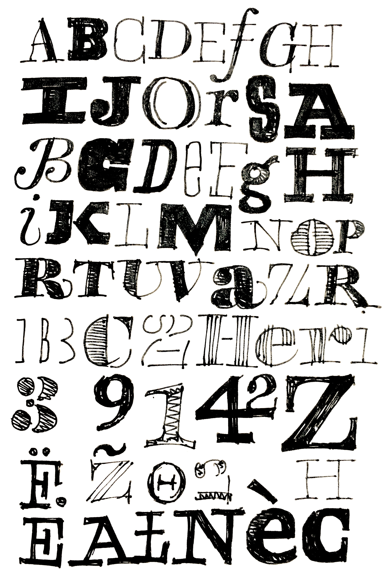

~~~
doc.title = 'Design&nbsp;Design&nbsp;Space'

doc.footerHtml = """Let us know what you think. Do you have any questions for us? <a href="mailto:info@designdesign.space?subject=Tell me more about DesignDesign.Space">info@designdesign.space</a>"""

# Uncomment to see cssId/cssClass markers in the page
#doc.view.showIdClass = True

# Page (Home)
#	Wrapper
#		Header 
#			Logo (+BurgerButton)
#			Navigation/TopMenu/MenuItem(s)
#      Content
#  			Banner
#  			SlideShow (on Home)
#      		Slides
#      		SlideSide
#			Section(s)
#				Introduction
#				Main
#				Mains
#					Main
#				Side
#				Sides
#					Side
#		Footer
#
# ----------------------------------------
# index.html
# ----------------------------------------
page.name = 'Home'
page.url = 'index.html'
content = page.select('Content')
box = content.newBanner()

# Which studies can we offer you in 2020?
~~~
# Free workshops in 2020
~~~
from pagebot.constants import *
slideshow = content.newSlideShow(h=300, slideW='100%', slideH=300, startIndex=3, autoHeight=True, carousel=2, dynamicHeight=False, transition='slide', easing=CSS_EASE, frameDuration=4, duration=0.7, pauseOnHit=True, randomPlay=False)
box = slideshow.slides
~~~

~~~ 
box = slideshow.side
~~~

### Develop your process. Expand your skills.

## Temporary free workshops

In Corona world, life has changed. Working and studying from home is the new reality for many. To distract yourself a bit from this new parallel universe, the question is: **What to do?** DesignDesign.Space offers you a series of **free workshops** in the upcoming months. Check them out.

# [Contact us](mailto:info@designdesign.space?subject=Subscribing%20for%20the%20free%20DesignDesign.Space%20workshop)

~~~
box = content.newIntroduction()
~~~

# Working from home? Studying online in Corona world? DesignDesign.Space offers a series of **free workshops**. Check the dates and topics. Subscribe by [e-mail](mailto:info@designdesign.space?subject=Subscribing%20for%20the%20free%20DesignDesign.Space%20workshop). Limited places. First come, first served.

~~~ 
#box = section.newCropped()
## 
#
~~~

~~~
section = content.newSection()
box = section.newMain()
~~~
### Wednesday hangouts 19:00–22:00 Central European Time

You are kindly requested to join from start to end, following all sessions, not occupying the space for another designer.

Other times are possible, depending on where you live. 

~~~
box = section.newCropped()
~~~

~~~
section = content.newSection()
box = section.newMain()
~~~
## Coding your designs in [DrawBot](http://www.drawbot.com) 

### March 25th + April 1st + April 8th

* Start with one of your designs, or select a favourite publication.
* Analyze the existing layout and prepare measurements to be coded.
* Learn to write a program that generates a similar PDF document.
* Design methods to generalize your code for other publications.
* Use the coding in your daily sketching process.

The workshop assumes no experience with programming in Python. An Apple computer is required to run the DrawBot application. 

~~~
box = section.newCropped()
~~~

~~~
section = content.newSection()
box = section.newMain()
~~~
## What does your design space look like? 

### April 15th + April 22th + April 29th

* Take your current workspace as a start to analyse.
* Learn to look at the space from different points of view.
* What do you want to keep? And what could be improved?
* Develop sketching techniques to design your environment.

The workshop assumes no experience with 3D design.

~~~
box = section.newCropped()
~~~

~~~
section = content.newSection()
box = section.newMain()
~~~
## Type design crits 

### May 6th + May 13th + May 20th

* Start with one of your type designs that is being developed. Or take one of your favourite existing typefaces.
* We ask questions, you do the work, getting valuable feedback and directions.
* Develop some proofing tools, using Python and DrawBot.
* Addressing topics, such as process, methods, variable design spaces, features and tools.

The workshop assumes no experience with programming in Python. An Apple computer is required to run the DrawBot application. 

~~~
box = section.newCropped()
~~~

~~~
section = content.newSection()
box = section.newMain()
~~~
## Coding typography in Python and CSS 

### May 27th + June 3rd + June 10th

* The workshop dives into the most important parameters, that make good typography. 
* Learn about the difference between Python parameters (e.g. generating PDF documents) and CSS (used in websites).
* Investigate methods to connect this knowledge with your daily design practice.

~~~
box = section.newCropped()
~~~

~~~
section = content.newSection()
box = section.newMain()
~~~
## Simple sketching techniques

### June 17th + June 24th + July 1st

* What is your design process like, before you open InDesign or a font editor?
* We will look into exercises by sketching paper, as well as connecting them to your digital tools. 
* Learn to appreciate short design cycles and mixed techniques.

~~~
box = section.newCropped()
~~~

~~~
section = content.newSection()
box = section.newMain()
~~~
## Running a small studio

### July 8th + July 15th + July 22nd

* Tips and tricks on how to deal with customers.
* Methods for planning and pricing. 
* Design your process. Small iterations. Testing and feedback.

~~~
box = section.newCropped()
~~~

~~~
section = content.newSection()
box = section.newMain()
~~~
## How free workshops work: some rules

* Subscribe for a workshop of your choice, by sending an e-mail to [info@designdesign.space](mailto:info@designdesign.space?subject=Subscribing%20for%20the%20free%20DesignDesign.Space%20workshop)
* Describe your daily profession and how that relates to the topic of the workshop. Add some samples of your work.
* Workshops are limited to a maximum 10 students. First come, first served. 
* Using some small assignments, we challenge you to sketch, think, design and give feedback to others.
* Each workshop spans several sessions. There is enough time between them, to give you the opportunity to process the questions of one session into the next one.
* We create an online platform, accessible for all students of the workshop, to share work, questions, comments and documents.
* You are kindly requested to join from start to end, following all sessions, not occupying the space for another designer.
* DesignDesign.Space would appreciate to publish some of your work on this website.
* Successfully finishing one of the free workshops gives the right to **20% reduction** on one of the other DesignDesign.Space studies.

---
## Why we offer this for free

We like to share and express our solidatiry with you.

Also, we are educators and we are designers, too. That means, we are curious how others design their design processes. We are open for suggestions about the workshops and about how you perceive the way we teach. For us, educating other designers is as much of a challenge as any design process.

[Send us your request](mailto:info@designdesign.space?subject=Subscribing%20for%20the%20free%20DesignDesign.Space%20workshop) for topics that we never thought about. Or ideas about how the workshops can be improved. Lure us into teaching you in a different way than what we suggest here. We’ll likely take the challenge.

If you tell us what you want to study by mail or in a first free online hangout, we are happy to make suggestions. What would you like to achieve? Seeking a sparring partner for an interesting new design project? Improving your latent skills, while training your self-discipline? Or simply needing a refreshing break from your normal design practice? 

---

## Other study suggestions

* [Type design](studies-type_design.html)
* [Typography](studies-typography.html)
* [Graphic design](studies-graphic_design.html)
* [Design spaces](studies-design_spaces.html)
* [Design practice](studies-design_practice.html)
* [Design education](studies-design_education.html)

These studies are regular DesignDesign.Space products. Check [here](pricing.html) for prices.
~~~
box = section.newCropped()
~~~

