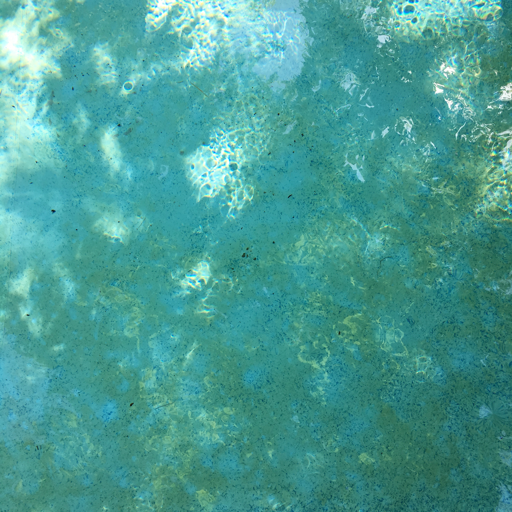

~~~
doc.title = 'Design&nbsp;Design&nbsp;Space'

doc.footerHtml = """Let us know what you think. Do you have any questions for us? <a href="mailto:info@designdesign.space?subject=Tell me more about DesignDesign.Space">info@designdesign.space</a>"""

# Uncomment to see cssId/cssClass markers in the page
#doc.view.showIdClass = True

# Page (Home)
#	Wrapper
#		Header 
#			Logo (+BurgerButton)
#			Navigation/TopMenu/MenuItem(s)
#      Content
#  			Banner
#  			SlideShow (on Home)
#      		Slides
#      		SlideSide
#			Section(s)
#				Introduction
#				Main
#				Mains
#					Main
#				Side
#				Sides
#					Side
#		Footer
#
# ----------------------------------------
# index.html
# ----------------------------------------
page.name = 'Home'
page.url = 'index.html'
content = page.select('Content')
box = content.newBanner()
~~~
# Which studies can we offer you in 2019?
~~~
from pagebot.constants import *
slideshow = content.newSlideShow(h=300, slideW='100%', slideH=300, startIndex=3, autoHeight=True, carousel=2, dynamicHeight=False, transition='slide', easing=CSS_EASE, frameDuration=4, duration=0.7, pauseOnHit=True, randomPlay=False)
box = slideshow.slides
~~~

~~~ 
box = slideshow.side
~~~
### Example studies

## Develop your process. Expand your skills.

Design studies come in many different forms. There is never a single solution. It is the role of designers: search and select. Which type of study fits you best? What kind of topic, medium or intensity appeals to your way of learning? Let us know, we might have some challenging exercises for you.

# [Contact us](mailto:info@designdesign.space?subject=DesignDesign.Space%20Study%20Information)

~~~
box = content.newIntroduction()
~~~

# [Discovering the basics of type design?](studies-type_design.html#discover-the-basics-of-type-design) [Improving your sketching techniques?](studies-design_practice.html#sketching-techniques) [Starting a studio?](studies-design_practice.html#live-coaching-while-starting-your-studio) [Programming pages?](studies-graphic_design.html#scripting-the-design-of-printed-publications) [Learning to code type specimens?](studies-type_design.html#automated-proofing-and-specimens) [Mastering typography?](studies-graphic_design.html#scripting-the-design-of-printed-publications) So are we.

~~~ 
#box = section.newCropped()
## 
#
~~~

~~~
section = content.newSection()
box = section.newMain()
~~~
## It all happens in DesignDesign.Space studies

If you tell us what you want to study by mail or in a first free online hangout, we are happy to make suggestions. What would you like to achieve? Seeking a sparring partner for an interesting new design project? Improving your latent skills, while training your self-discipline? Or simply needing a refreshing break from your normal design practice? 

---
## DesignDesign.Space as your coach

**DesignDesign.Space** can help you to answer these questions and to achieve your goals. Coaching you through your study, the teachers can ask the toughest questions. They are also available to help you answering them: If you are happy with the design you have finished, what exactly are you happy with? How does that fit the expectations of the user? And how would you get there next time?

---
## What is your design space?

**DesignDesign.Space** offers a wide variety of study topics: ranging from graphic design to type design, typography, programming, identities, 3D and education.

---
## How studies work

* In a first free hangout, we will talk about what you want to achieve.
* Together, we will find a way for you to get there. Topics & Tools. By painting, drawing, sketching or by coding. Or by a combination of all.
* In sequences of relative short assignments, online hangouts, personal feedback and reflections, we explore the paths of your study project. And more importantly, we’ll teach you how to do that yourself.
* The journey can take a day. Or a week. A month. A year. Whichever fits your goals, time and resources. We see it as our challenge to customize the study to what is realistic for you. And to make the result match with your daily practice.
* As your plans are likely to change along the way, any change to your study plan can always be discussed.

[More about pricing.](pricing.html)

~~~
box = section.newSide()
~~~

## Challenge us

We are educators and we are designers, too. That means, we are open for suggestions about the program and about the way we teach. For us, educating other designers is as much of a challenge as any design process.

[Send us your request](mailto:info@designdesign.space?subject=What%20I%20would%20like%20to%20%20study%20in%20DesignDesign.Space...) for topics that we never thought about. Or ideas about how this website can be improved. Lure us into teaching you in a different way than what we suggest here. We’ll likely take the challenge.

~~~ 
box = section.newMain()
~~~

## Study suggestions

* [Type design](studies-type_design.html)
* [Typography](studies-typography.html)
* [Graphic design](studies-graphic_design.html)
* [Design spaces](studies-design_spaces.html)
* [Design practice](studies-design_practice.html)
* [Design education](studies-design_education.html)

~~~
box = section.newCropped()
~~~

