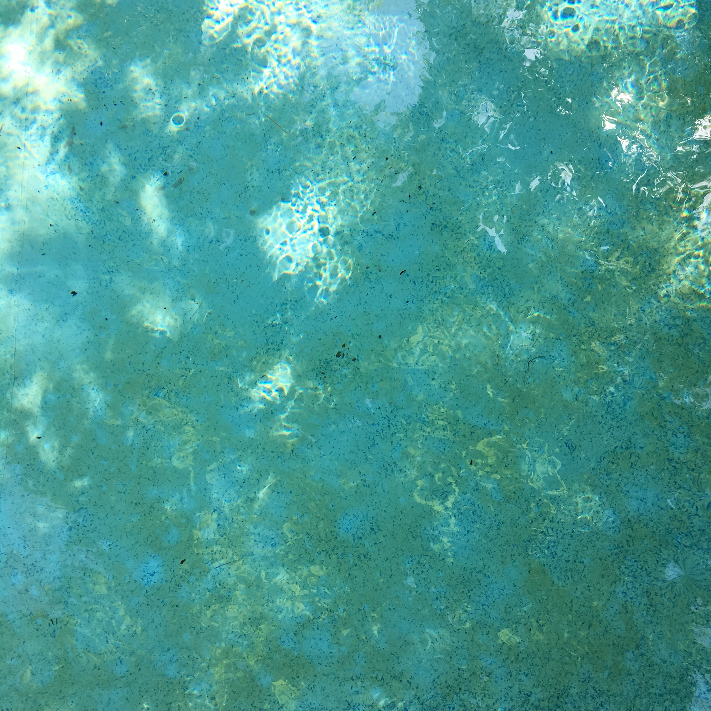

~~~
# ----------------------------------------
# pricing.html
# ----------------------------------------
page = page.next
page.applyTemplate(template)  
page.name = 'Pricing'
page.url = 'pricing.html'

content = page.select('Content')
box = content.newBanner()
~~~
# What does it cost?

~~~
box = content.newIntroduction()
~~~
# The prices of DD.S studies are based on customised design challenges with personal feedback. Combine workshops based on your own preference. Select three to get one for free.
~~~
section = content.newSection()
box = section.newMain()
~~~

## Pricing

Each workshop runs for 2 weeks, including live lectures, addressing theory, showing examples and give feedback on the exercises that you do.

* 2 weeks, from Monday to Sunday;
* Over 12 hours of live interactive hangouts with theory, models, templates and example documents; 
* Maximal 8 participants per workshop;
* Intensive exercises and daily personal feedback;
* The result of the exercises is shared on a closed Slack channel for the duration of the workshop; 
* Feedback comes from the educators and the other students;
* DesignDesign.Space offers a safe online study environment, where any question can be asked. 

Some workshops combine as a sequence. It is recommended to do them in the right order. Every 4th workshop is free of charge.

~~~
box = section.newCropped()
~~~

~~~
section = content.newSection()
box = section.newMain()
~~~
## €290 per workshop

### Get one free for every three

* 1st workshop €290 (±340)
* 2nd workshop €290 (±$340)
* 3rd workshop €290 (±$340)
* Every 4th workshop Free

You can subscribe and pay for the workshops one by one. We send separate invoices for each one..
DesignDesign.Space keeps track of the total amount of workshops that you did. 

All payments in Euro's.
Inside The Netherlands 21% VAT is added.
Inside the rest of Europe no VAT is added, if you have a VAT registration number.
Outside Europe no VAT is added.

Your place in a workshop is confirmed, once the payment for that workshop is received.

This pricing is for students, single designers and small studios.
Pricing for corporate usage and custom made workshops is upon request.

<a href="https://docs.google.com/forms/d/1vLKGROUx03Sm3QGWEwuP1f7Uo1v4qQCmG1FlaxOT88A" target="external">Subscribe here</a>

~~~ 
box = section.newCropped()
~~~

