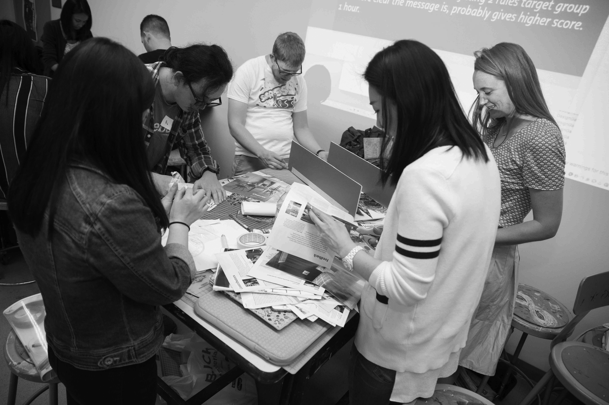
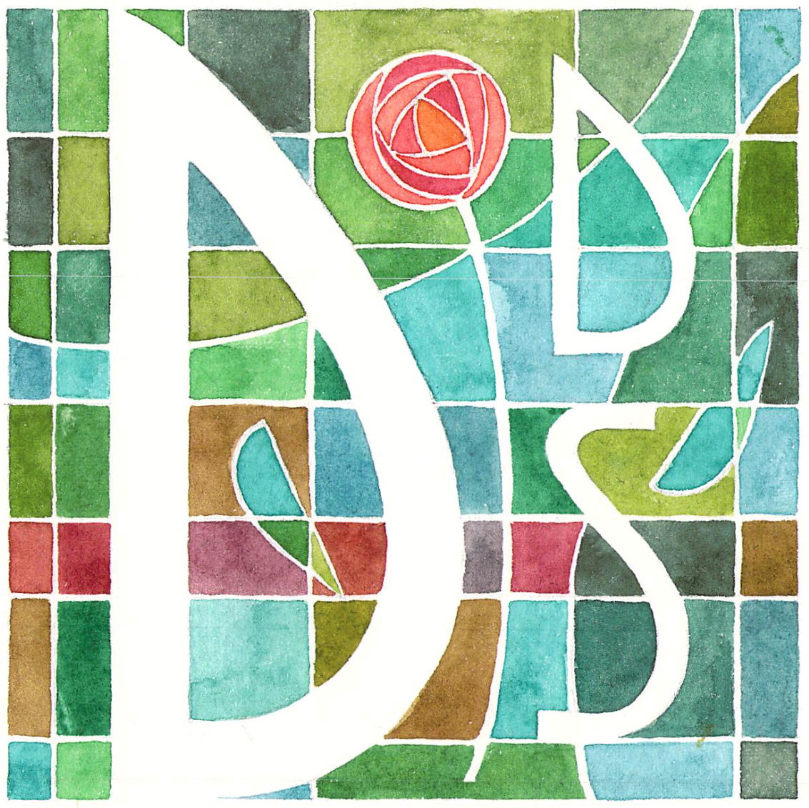

~~~
# ----------------------------------------
# Studies/2018-reviews.html
# ----------------------------------------
page = page.next
page.applyTemplate(template)  
page.name = 'Reviews'
page.url = 'reviews.html'

content = page.select('Content')
box = content.newBanner()
~~~
# What happened in 2018

~~~
box = content.newIntroduction()
~~~
# Around 120 students have joined one or more of the workshops and studies in 2018. Read some of their testimonials. 

~~~
section = content.newSection()
box = section.newMain()
~~~

## What we did…

* Scripting Variable Font specimens for type designers using PageBot (1 day)
* Variable Fonts: design strategies and tool development (3 days)
* Python scripting for graphic designers (4 weeks)
* TypeLab, during Typographics 2018 (3 days)
* Python scripting for graphic designers: public workshop (1 day)
* The design of Latin type, for non-Latin type designers (8 weeks)
* Scripting for non-Latin type (6 weeks)
* Scripting the visual grammar for graphic design (4 weeks)
* Design the design process (10 days)
* Mapping the profession in detail, for type design students (12 days)
* Various individual coaching projects, ranging from type-crit to support at the background of regular design studies

~~~
box = section.newCropped()
~~~

<!---->

~~~ 
box = content.newIntroduction()
~~~

# What students wrote…

~~~
section = content.newSection()
box = mainBox = section.newMain()
~~~ 

### “I appreciated that everyone was able to swim at their own pace.” 

~~~
box = mainBox.newInfo()
~~~

*“This was a unique opportunity in that it wasn’t just a programming class, but one that was specifically catered to type designers to meet their needs. I didn’t know any Python whatsoever prior to this course, so in the beginning, it felt like being thrown into the sea without a life jacket. Petr is not a lifeguard; he is a swimming coach. He won’t rescue you — that’s too easy — but he will throw you a rope. (In fact, many ropes. You ask one question and he gives you five answers.) I appreciated that everyone was able to swim at their own pace. An experienced designer and astonishingly deep thinker, Petr offers far more than just coding knowledge. It was a privilege to be able to learn from him.*
*Again, thank you so much! I learned a ton these four weeks and I'm so grateful.”* **– June Shin**

~~~
box = mainBox
~~~
---

### “The class is not just a skill learning environment as a good portion of the time is dedicated to critical discussions.”

~~~
box = mainBox.newInfo()
~~~

*“The one month course is designed to accommodate type designers with various levels of Python and programming knowledge. The learning environment is set up similarly to a master's class which allows Petr to focus on individual needs. In addition, the course allows students to take their studies towards their personal needs and interests. The class is not just a skill learning environment as a good portion of the time is dedicated to critical discussions, such as designing one's design process or the ways new technologies and developments will effect and change how we design and think about type.”* **– Cem Eskinazi**

~~~
box = mainBox
~~~
---
### “It was a unique opportunity to learn type-related Python in first hand.”

~~~
box = mainBox.newInfo()
~~~

*“For me, the Python scripting for type designers course from Design Design Space was a perfect complement to my formation as a typeface designer. It was a unique opportunity to learn type-related Python in first hand from a competent instructor. Petr doesn’t leave questions open, and the course’s pace flows according to each student’s needs.”* **– Filipe Negrão**

~~~
box = mainBox
~~~
---
### “I can promise that you can get a lot of treasures.”

~~~
box = mainBox.newInfo()
~~~

*“This is my first time to have a formal Latin Design class. I am very lucky that I can learn from Petr because there are only a few Latin design classes in Taiwan.* 
*Petr is always teaching design knowledge enthusiastically, using all he knows, when you have questions. Petr not only taught us how to design Latin fonts, but also how to think about the effect of every design and how to adjust them to become a better one. The most important thing is that you don't have to be afraid, if you are a starter because Petr will give a tailored class for everyone. I can promise that you can get a lot of treasures from Petr. I appreciate a lot that I could gain this experience from DD.S.”* **- Tom Kuo**

~~~
box = mainBox
~~~
---
### “This was a very important foundation for me not only to  […] rethink about my own design approach in a very fundamental way.”

~~~
box = mainBox.newInfo()
~~~

*“The aspect that fascinated me most about this program was the idea of building your own design tools to address design issues/problems. Although coding and programming was something I was always curious about, it was something I imagined to be a very separate and ‘complicated’ activity from my own. But the experience with Petr made me even more curious and eager to learn further. This was a very important foundation for me not only to further learning and integrating programming/coding into my design activities but also and more importantly rethink about my own design approach in a very fundamental way.*
*Thank you so much, Petr, for this amazing experience and I look forward to interacting further”.* **– Andy Naorem**

~~~ 
box = section.newSide()
~~~ 

*[[June Shin’s thank-you card to DesignDesign.Space, very much appreciated.]]*

~~~ 
box = content.newIntroduction()
~~~

# How about yourself?

~~~ 
section = content.newSection()
box = section.newMain()
~~~

## Explore the ideas about what you could study.

* [Type design](studies-type_design.html)
* [Typography](studies-typography.html)
* [Graphic design](studies-graphic_design.html)
* [Design spaces](studies-design_spaces.html)
* [Design practice](studies-design_practice.html)
* [Design education](studies-design_education.html)

~~~
box = section.newCropped()
~~~

