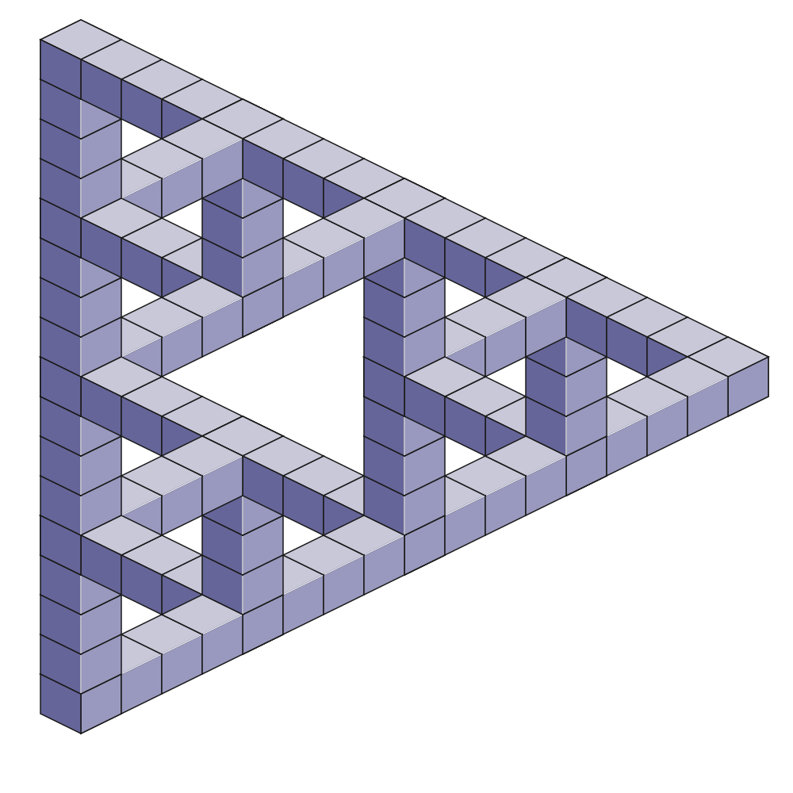

~~~
# ----------------------------------------
# Scales:programming & coding
# ----------------------------------------
template = doc.getTemplate('home')
page = page.next
page.applyTemplate(template)  
page.name = 'Coding'
page.url = 'Scales/programming_coding_400.html'

content = page.select('Content')
box = content.newBanner()
~~~
# [Scales](scales.html): Programming & Coding

~~~
box = content.newIntroduction()
~~~

# Repeating tasks? Understanding how parameters works in your design? Coding your own tools? [Mapping proofs?](scales-programming_coding_400.html#Scale471) [Programming prototypes?](scales-programming_coding_400.html#Scale453) [Automating Corporate Identities?](scales-programming_coding_400.html#Scale490) [Understanding recursive coding?](scales-programming_coding_400.html#Scale432) Making websites?

~~~
section = content.newSection()
box = mainBox = section.newMain()
~~~
<a name="Scale431"/>
## Make a recursive Sierpinski Square^431 

Write a program in **DrawBotApp** that generates a recursive Sierpinski Square. **2 hours**

~~~ 
box = mainBox.newInfo()
~~~

### Challenge
The Droste Effect (Dutch origin), known in art as **mise en abyme,** is the effect of a picture recursively appearing within itself. Recursion is an important tool in parametric design processes. The challenge of this exercise is to get a feeling for what recursive programming is. 

### Hints
Take the supplied code and play around with the parameters. Try to  predict what happens, before you alter a value. 

<a href="code/dds431.zip">

*[[Click to download the code]]*
</a>

~~~ 
box = section.newCropped()
~~~

~~~
section = content.newSection()
box = mainBox = section.newMain()
~~~
<a name="Scale432"/>
## Make a recursive Sierpinski Triangle^432 

Write a program in **DrawBotApp** that generates a recursive Sierpinski Triangle with “Penrose” connections (thanks to a Tweet by @rudytheelder and @davelab6). **2 hours**

~~~ 
box = mainBox.newInfo()
~~~

### Challenge
The Droste Effect (Dutch origin), known in art as **mise en abyme,** is the effect of a picture recursively appearing within itself. Recursion is an important tool in parametric design processes. The challenge of this exercise is to get a feeling for what recursive programming is. 

The challenge making such an “impossible” semi-3D drawing, is that the paths of the cubes need to be sorted independent from the 3D position of the cubes.

### Hints

* Take the supplied code and play around with the parameters. Try to  predict what happens, before you alter a value. 
* Start a new **DrawBotApp** document, and retype the supplied code, while adding comments about what you understand that the code is doing.
* Verify the result with others, who did the same thing. How much of the comments is similar?

<a href="code/dds432.zip">

*[[Click to download the code]]*
</a>

*[[Play with the script parameters to make other sizes and recursive levels.]]*

~~~ 
box = section.newCropped()
~~~

~~~
section = content.newSection()
box = mainBox = section.newMain()
~~~
<a name="Scale453"/>
## Make a color matrix^453 

Write a program in PageBot that generates pages for the standard theme palettes. Show them as translation in RGB, CMYK and spot-colors. **3 hours**

~~~ 
box = mainBox.newInfo()
~~~

### Challenge
In PageBot themes are containers of color palettes and their related functions. The script should write an overview of the existing theme palettes, organized in a matrix. 

### Resources 
Download [DrawBotApp](http://www.drawbot.com) and install [PageBot](https://github.com/PageBot/PageBot/blob/master/README.md).

### Hints
Take the supplied code and play around with the parameters. Try to  predict what happens, before you alter a value. 

<a href="code/dds453.zip">

*[[Click to download the code]]*
</a>

~~~ 
box = section.newCropped()
~~~

~~~
section = content.newSection()
box = mainBox = section.newMain()
~~~
<a name="Scale471"/>
## Revival of Fontographer 3.5 Key map^471 

Write a program in PageBot that generates the good old Fontographer 3.5 Key map from a given font. **5 hours**

~~~ 
box = mainBox.newInfo()
~~~

### Challenge
Take an existing publication and convert it into parameters and algorithms. In this case it is a legacy type specimen. How do you translate the key map of late eighties into a modern glyph set such as **Bungee-Regular** by David Jonathan Ross?

### Resources 
Download [DrawBotApp](http://www.drawbot.com) and install [PageBot](https://github.com/PageBot/PageBot/blob/master/README.md).

### Hints

* Download the code, open in DrawBotApp and try to understand what it does. 
* Play around with the parameters. Try to  predict what happens, before you alter a value. 

<a href="code/dds471.zip">

*[[Click to download the code and the full specimen PDF]]*
</a>

~~~ 
box = section.newCropped()
~~~

~~~
section = content.newSection()
box = mainBox = section.newMain()
~~~
<a name="Scale490"/>
## Make a mini Identity Generator^490 

Write a program in DrawBotApp/PageBot that generates publications, where the “Corporate Identity” is defined by a set of parameters. **1 day**

~~~
box = mainScale = mainBox.newInfo()
~~~
### Challenge
The challenge of this exercise is to design a set of consistent parameters that generates different publications with visual coherency. Some aspects of the publications – such as purpose, size and technique – may change, while they remain in the same group.

### Hints
* Take the list of most common visual parameters and divide them into two groups: which define coherency between publications and which can be divers, differentiating (e.g logo, color and typeface can be fixed, where the use of images and page size can change).
* Choose the parameters that can best defined in code, such as color, typeface and font size.
* Make sketches of what outcome you expect.
* Write the program in “pseudo-code” before you start coding Python.

These hints are by no means a boundary. But they help to focus on what the essential parts of this exercise are. Too many unknowns in the process will confuse. 

### Feedback
Feedback on code is relatively simple. If it runs in **DrawBotApp** without errors, then that is a big first step. 
Check the result to your sketches, is it what you intended as outcome?
Then ask others for feedback and think beforehand what questions you would ask. Instead of **Do you like it?**, you probably get more feedback from **Would you recognize these pages as part of one identity?**. 

---
### Example 490-3
#### The “drawbot-snippet” version illustrating the principle of generative Corporate Identity design.
~~~
box = mainScale.newInfo(infoOpen='?')
~~~
This example was part of the Just van Rossum-challenge to write DrawBot code snippets fitting in a single tweet. The code is a bit “smart-ass”, trying to fill as much functions as possible in the limited space, and as consequence reducing the clarity of the code. 

Due to the limited space of the “drawbot-snippet” the “Corporate Identity” is reduced to positioning a blue rectangle as “logo” on a relative fixed position of variable page sizes.

See example 490-4 for a more extended version of the code.

<a href="code/dds490-3.zip">

*[[Click to download the code]]*
</a>

~~~
box = mainScale
~~~
---
### Example 490-4
#### This extended version of the DDS490-3 code gives more readable comments about how it works. 

~~~
box = mainScale.newInfo(infoOpen='?')
~~~
In pseudo-programming the code reads like this:

* Fill the canvas white
* Define some parameters and the size of the matrix for pages.
* For each page position in the matrix
* Draw the page frame with random size
* Draw the logo as a colored rectangle
* Draw the suggestion of a text column as gray rectangle.
* Save as **PNG** document.

<a href="code/dds490-4.zip">

*[[Click to download the code]]*
</a>

~~~
box = section.newCropped()
~~~

~~~
box = section.newMain()
~~~
<a name="Scale490"/>
## Make a mini Identity Generator for web pages^491 

Write a program in PageBot that generates web publications, where the “Corporate Identity” is defined by a set of parameters. This code can generate the HTML/CSS/JS, using build-in PageBot classes. **2 days**

~~~
box = section.newSide()
~~~
