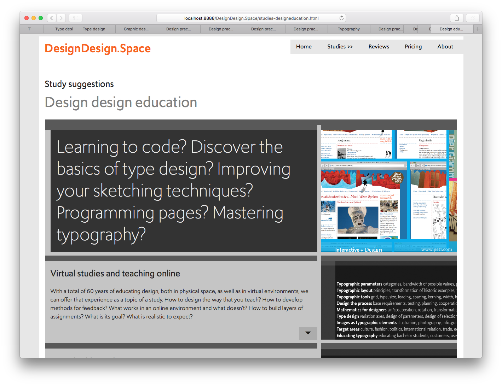
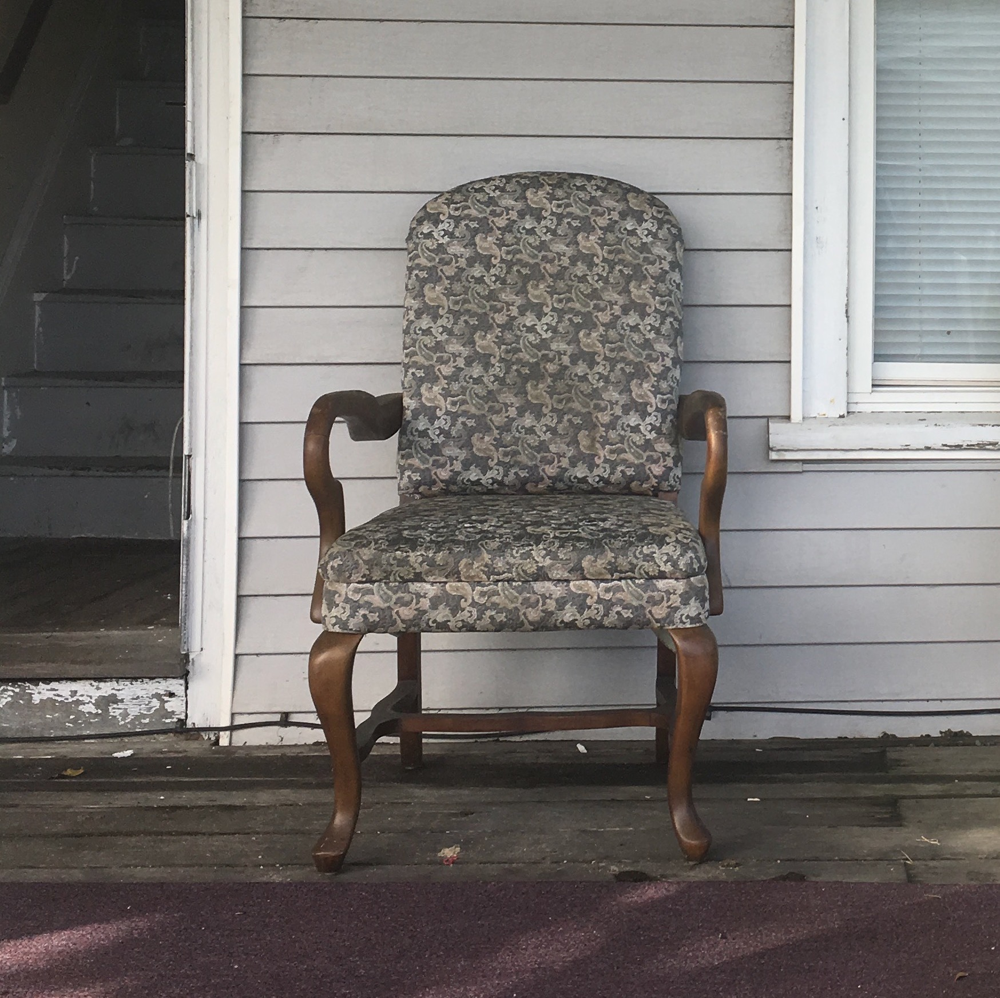

~~~
# ----------------------------------------
# Studies/2020 Studies/design_education.html
# ----------------------------------------
page = page.next
page.applyTemplate(template)  
page.name = 'Design education'
page.url = 'Studies/design_education.html'

content = page.select('Content')
box = content.newBanner()
~~~

## Study suggestions
# Design education

~~~
section = content.newSection()
box = section.newIntroduction()
~~~

# [With your 10+ years of studio experience: what is next?](studies-design_education.html#virtual-sabbatical) [Mastering code?](studies-design_education.html#virtual-sabbatical) [Training new skills?](studies-design_education.html#virtual-sabbatical) [Broadening your scope?](studies-design_education.html#virtual-sabbatical) 

~~~
box = section.newCropped()
~~~

~~~
box = section.newMain()
~~~
<a name="virtual-studies-and-teaching-online"/>
## Virtual studies and teaching online

With a total of 60+ years of educating design, both in physical space, as well as in virtual environments, we can offer the experience itself as a topic of a study. How to design the way that you teach? How to develop methods for feedback? What works in an online environment and what doesn’t? How to build layers in assignments, where student think they learn one thing, while in reality they learn a lot more as well? What is the goal of a study? And what is realistic to expect?

~~~
box = box.newInfo()
~~~
* A week of exercises and 3 lessons, **€450** per student
* A month of exercises, projects and 8 lessons, **€1.700** per student
* Document sharing and versioning through GitHub
* Daily support and feedback on results for the duration of the study
* Design principles for planning, process, methods for feedback and testing criteria 

~~~
box = section.newCropped()
~~~

~~~
box = section.newMain()
~~~
<a name="virtual-sabbatical"/>
## Virtual sabbatical

You have been working as a designer for some years, employed by a studio or running your own. You have been really successful or a bit less, in any case, there is a moment in time to answer the question “What’s next?”. 

At the same time, you don’t think you have the age or freedom or financial resources to take a real sabbatical break and do a Master study abroad for 2 years. DesignDesign.Space offers the opportunity of doing a virtual sabbatical: studying new topics or deepen the ones that you already know in a challenging online environment, together with other students, who are seeking similar extensions to their professional career. How this is organized, depends on your needs and resources. 

~~~
box = box.newInfo()
~~~

* Initial online hangout, free of charge.
* A single lesson with many exercises for a day: **€170** per student
* A week of exercises and 3 lessons, **€450** per student
* A month of projects and 8 lessons, **€1.700** per student
* A season of projects and coaching **€3.400**
* A full year: **Ask about what we can do.**
* Document sharing and versioning through GitHub
* Daily support and feedback on results for the duration of the study
* Design principles for planning, process, methods for feedback and testing criteria 

~~~
box = section.newCropped()
~~~

~~~
box = section.newMain()
~~~

## Other study suggestions

* [Type design](studies-type_design.html)
* [Typography](studies-typography.html)
* [Graphic design](studies-graphic_design.html)
* [Design spaces](studies-design_spaces.html)
* [Design practice](studies-design_practice.html)
* [Design education](studies-design_education.html)

~~~
box = section.newCropped()
~~~

