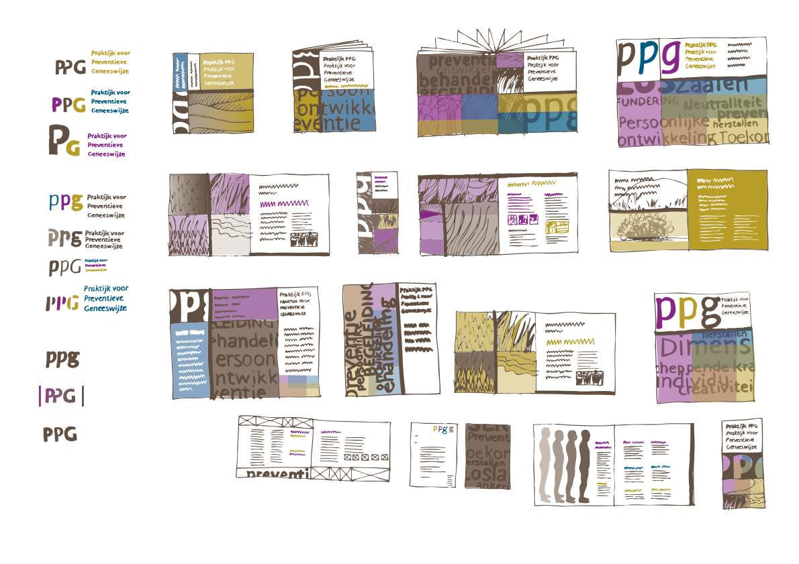
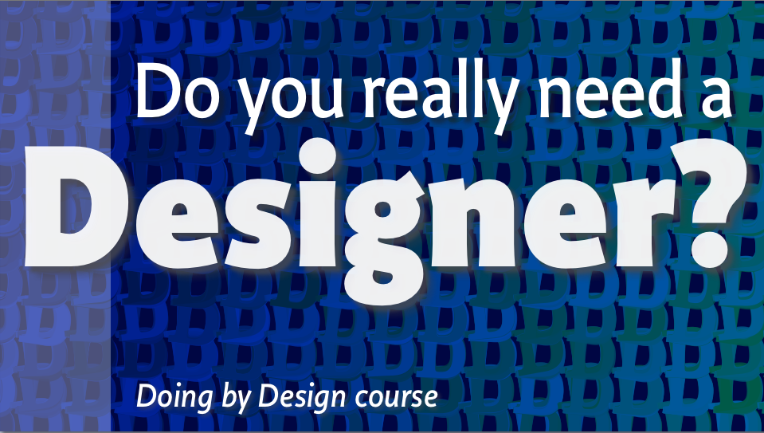

~~~
# ----------------------------------------
# Studies/2019 Studies/design_practice.html
# ----------------------------------------
page = page.next
page.applyTemplate(template)  
page.name = 'Design practice'
page.url = 'Studies/design_practice.html'

content = page.select('Content')
box = content.newBanner()
~~~
## Study suggestions
# Running a design practice

~~~
section = content.newSection()
box = section.newIntroduction()
~~~

# [Starting a studio?](studies-design_practice.html#live-coaching-while-starting-your-studio) [Learning to educate clients?](studies-design_practice.html#how-to-deal-with-clients) [Redesigning your design process?](studies-design_practice.html#design-of-design-models) [Kids around in the studio?](studies-design_practice.html#running-a-home-studio)

~~~
box = section.newCropped()
~~~

~~~
box = section.newMain()
~~~
<a name="design-of-design-models"/>
## Design of design models

Develop and select design methods. What is available beyond “scrum”? Which methods can you design for yourself, by scaling and managing details? Sketching and making of small scale models is such a technique: get an impression about your design choices at an early stage, without making the “real thing”.

~~~
box = box.newInfo()
~~~

* A week of exercises and 3 lessons, **€450** per student
* Daily feedback by e-mail on results for the duration of the study
* Document sharing and versioning through GitHub
* Design principles for planning, process, methods for feedback and testing criteria 

~~~
box = section.newCropped()
~~~

~~~
box = section.newMain()
~~~
<a name="rapid-prototyping-for-graphic-designers"/>
## Rapid prototyping for graphic designers

Learn to develop efficient and powerful prototyping techniques, including manual sketching, digital tools and coding, with the goal of controlling the broadening and narrowing of options and directions a project may take.
Through sketching, hands-on practical exercises and presentations, you explore the process of making prototypes.
This study is a follow up on the **Design of design models**, but can be also joined separately.

~~~
box = box.newInfo()
~~~

* A week of exercises and 3 lessons, **€450** per student
* A month of exercises, projects and 8 lessons, **€1.700** per student
* Daily feedback by e-mail on results for the duration of the study
* Document sharing and versioning through GitHub
* Design principles for planning, process, methods for feedback and testing criteria 

~~~
box = section.newCropped()
~~~

~~~
box = section.newMain()
~~~
<a name="sketching-techniques"/>
## Sketching techniques

Similar to the “Rapid Prototyping” workshop, this study addresses the management of details. The focus on developing sketching skills, experiment with materials in 2D and 3D, drawing with **SketchApp**, coding and exploring the visual language of scaled models with **DrawBot** and **PageBot**.

~~~
box = box.newInfo()
~~~

* A week of exercises and 3 lessons, **€450** per student
* A month of exercises, projects and 8 lessons, **€1.700** per student
* Daily feedback by e-mail on results for the duration of the study
* Document sharing and versioning through GitHub
* Design principles for planning, process, methods for feedback and testing criteria 

~~~
box = section.newCropped()
~~~

~~~
box = section.newMain()
~~~
<a name="live-coaching-while-starting-your-studio"/>
## Live coaching while starting your studio

You are working on starting your own studio. You just graduated or you have been working in a design studio for years, and now it is time to start your own. It seems to be a promising, interesting and rewarding plan. But it is also hard to control planning, budget and clients' fantasies. Especially if projects run over a longer period of time.
Coaching is organized depending on your needs. It varies from a single lesson of support, while writing an initial quote, up to helping you with management and feedback of your entire project.

~~~
box = box.newInfo()
~~~

* A week of exercises and 3 lessons, **€450** per student
* A month of projects, coaching and 8 lessons, **€1.700** per student
* Document sharing and versioning through GitHub
* Daily support and feedback on results for the duration of the study
* Design principles for planning, process, methods for feedback and testing criteria 

~~~
box = section.newCropped()
~~~

~~~
box = section.newMain()
~~~
<a name="how-to-deal-with-clients"/>
## How to deal with clients?

Use of cases, models, simulations, sketching and presentation techniques are the subjects of this 3 lesson workshop on how to deal best with clients. Students are offered to think about planning in relation to what they charge for their designs. The workshop addresses the difference between cost and investment, leisure and learning, with special attention on the success of failure.

~~~
box = box.newInfo()
~~~

* A week of exercises and 3 lessons, **€450** per student
* Document sharing and versioning through GitHub
* Daily support and feedback on results for the duration of the study
* Design principles for planning, process, methods for feedback and testing criteria 

~~~
box = section.newCropped()
~~~

~~~
box = section.newMain()
~~~
<a name="running-a-home-studio"/>
## Running a home studio with employees, while raising a family
 
Examples and cases from our own experience. What worked for us and what didn't. Points of view, excercises and feedback. The dilemma of choosing focus. Roles and rules. The choice of not working overtime. Employer or designer? Friends or families? 
The workshop gives students a wide variety of strategies and scenarios. 

~~~
box = box.newInfo()
~~~

* A week of exercises and 3 lessons, **€450** per student
* Document sharing and versioning through GitHub
* Daily support and feedback on results for the duration of the study
* Design principles for planning, process, methods for feedback and testing criteria 

~~~
box = section.newCropped()
~~~

~~~
box = section.newMain()
~~~

## Ask for info

Let us know by mail at [info@designdesign.space](mailto:info@designdesign.space?subject=Tell%20me%20more%20about%20DesignDesign.Space), if you are interested to study. We can discuss how that would work in a first free online hangout. Or tell us what other wishes related to design or education you have.

*Don't hesitate to contact us, if the indicated price is the only problem that prevents you from studying.*

~~~
box = section.newSide()
~~~

## Other study suggestions

* [Type design](studies-type_design.html)
* [Typography](studies-typography.html)
* [Graphic design](studies-graphic_design.html)
* [Design spaces](studies-design_spaces.html)
* [Design practice](studies-design_practice.html)
* [Design education](studies-design_education.html)
