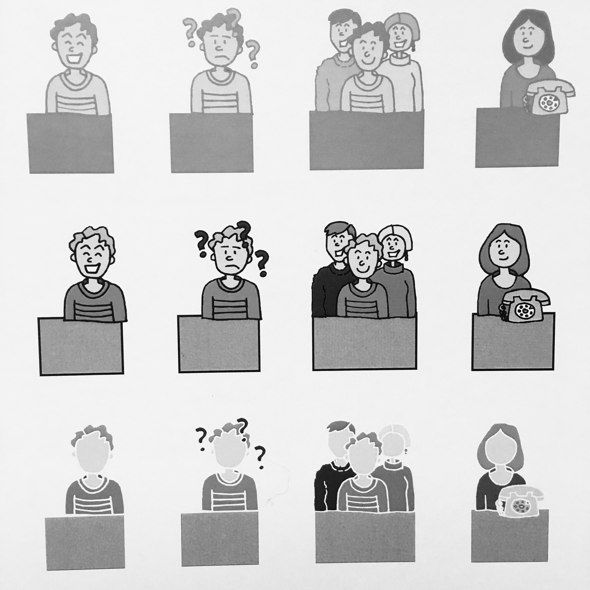
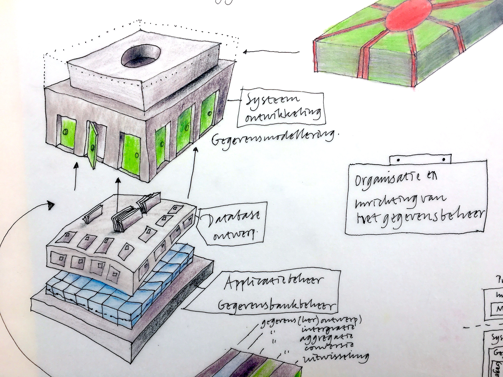
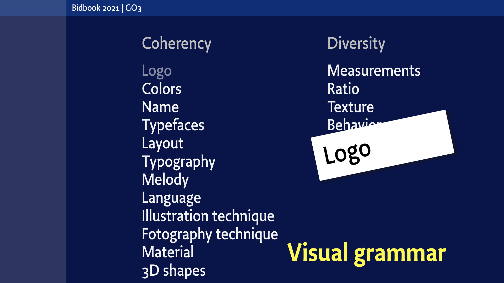
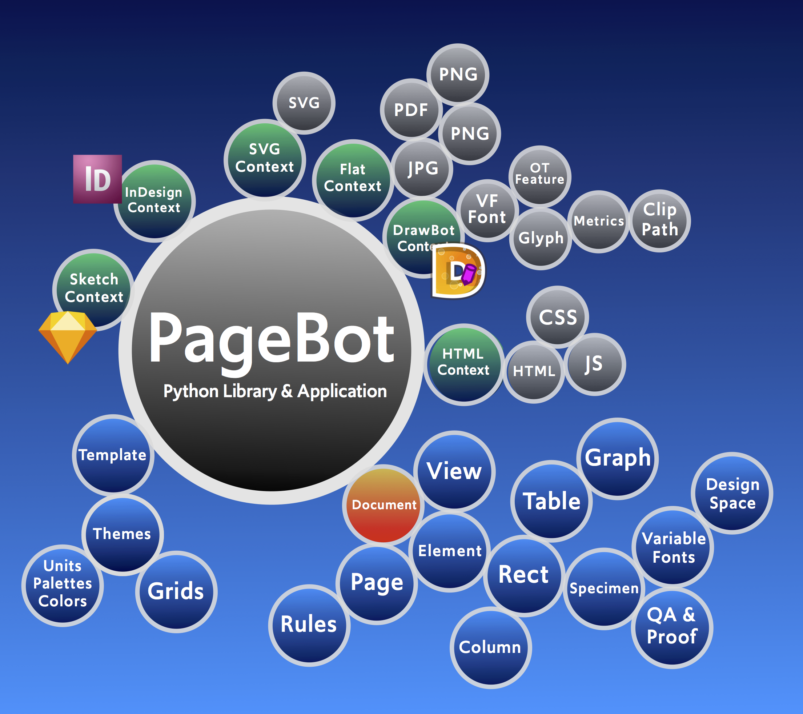

~~~
# ----------------------------------------
# Studies/2020 Studies/graphic_design.html
# ----------------------------------------
page = page.next
page.applyTemplate(template)  
page.name = 'Graphic design'
page.url = 'Studies/graphic_design.html'

content = page.select('Content')
box = content.newBanner()
~~~
## Study suggestions
# Graphic design 
~~~
section = content.newSection()
box = section.newIntroduction()
~~~

# [Researching generative typography?](studies-typography.html#learn-how-to-use-type-and-typography-online) [Designing a series of publications?](studies-design_spaces.html#creating-an-identity) [Discovering the basics of information design?](studies-graphic_design.html#info-graphics-the-design-of-automated-designs) [Improving your sketching techniques?](studies-design_practice.html#sketching-techniques) [Branding a client?](studies-graphic_design.html#identity-design)

~~~
box = section.newCropped()
~~~

~~~
box = section.newMain()
~~~
<a name="visual-grammar-for-graphic-designers"/>
## Visual grammar for graphic designers

Disassemble your graphic design into parameters, models and methods. Why do you choose a color or a typeface? How to separate **this one** from **this kind of**, when making a series of covers, or different types of publications within one identity.

~~~
box = box.newInfo()
~~~

* A month of exercises and personal coaching, **€1.500** per student
* A season of exercises and personal coaching **€2.500** per student
* Daily feedback on Slack for the duration of the study
* Document sharing and versioning through GitHub
* Design principles for planning, process, methods for feedback and testing criteria 

~~~
box = section.newCropped()
~~~

~~~
box = section.newMain()
~~~
<a name="scripting-of-online-publication-design"/>
## Scripting of online publication design
 
Design systems that generate applications, documents and websites, intended for online usage. How to bridge the gap between unpredictable content, sketching design rules, the design of templates that use high level typographic standards, scriptable illustration techniques and applications for automated output, using DrawBot and PageBot, generating HTML/CSS/Javascript (for OSX and Linux platforms).

Any design process benefits from short iterations in a team, automated prototyping and the merging of disciplines. Web design is not different.

Learn to use PageBot to script sites like this one.

~~~
box = box.newInfo()
~~~

* A month of exercises and personal coaching, **€1.500** per student
* A season of exercises and personal coaching **€2.500** per student
* Daily feedback on Slack for the duration of the study
* Document sharing and versioning through GitHub
* Design principles for planning, process, methods for feedback and testing criteria 

~~~
box = section.newCropped()
~~~

~~~
box = section.newMain()
~~~
<a name="info-graphics-the-design-of-automated-designs"/>
## Info-graphics: The design of automated designs

Design systems that generate info-graphics. For online use and for print. How to bridge the gap between (big) databases, the design of templates using high level typographic standards, scriptable illustration techniques and applications for automated output, using DrawBot, PageBot and current web technologies. 

~~~
box = box.newInfo()
~~~

* A month of exercises and personal coaching, **€1.500** per student
* A season of exercises and personal coaching **€2.500** per student
* Daily feedback on Slack for the duration of the study
* Document sharing and versioning through GitHub
* Design principles for planning, process, methods for feedback and testing criteria 

~~~
box = section.newCropped()
~~~

~~~
box = section.newMain()
~~~
<a name="scripting-the-design-of-printed-publications"/>
## Scripting the design of printed publications

Design systems that generate books, magazines, newspapers, brochures, manuals or catalogues, intended for print. How do you bridge the gap between unpredictable content, sketching design rules, the design of templates that use high level typographic standards, scriptable illustration techniques and applications for automated output, using DrawBot and PageBot (for OSX and Linux platforms).

*Bier! design: Grafische Zaken/Wil Schipper*

~~~
box = box.newInfo()
~~~

* A month of exercises and personal coaching, **€1.500** per student
* A season of exercises and personal coaching **€2.500** per student
* Daily feedback on Slack for the duration of the study
* Document sharing and versioning through GitHub
* Design principles for planning, process, methods for feedback and testing criteria 

~~~
box = section.newCropped()
~~~

~~~
box = section.newMain()
~~~
<a name="identity-design"/>
## Identity design: Branding with and without the use of logos

Design parametric models for an identity. Which parameters create the visual coherency? Which parameters are diverse, without the need to specify? Is that always the same list? If not, what is the best selection for a particular brand?
How to write scripts to automate (parts of) the models for your parameters testing.

What is the best usage of graphic elements in a brand? Which are used for recognition and coherency? And which are undefined on purpose, supporting the visual diversity of publications?

~~~
box = box.newInfo()
~~~

* A month of exercises and personal coaching, **€1.500** per student
* A season of exercises and personal coaching **€2.500** per student
* Daily feedback on Slack for the duration of the study
* Document sharing and versioning through GitHub
* Design principles for planning, process, methods for feedback and testing criteria 

~~~
box = section.newCropped()
~~~

~~~
box = section.newMain()
~~~
<a name="choosing-a-type-design"/>
## Choosing a type design

What are the criteria for choosing the best type design for a particular graphic design project? Forget about existing classification, you can make your own, customized to your needs. Build argumentation to support your choice. Learn to make testing material and specimens. 

~~~
box = box.newInfo()
~~~

* A month of exercises and personal coaching, **€1.500** per student
* A season of exercises and personal coaching **€2.500** per student
* Daily feedback on Slack for the duration of the study
* Document sharing and versioning through GitHub
* Design principles for planning, process, methods for feedback and testing criteria 

~~~
box = section.newCropped()
~~~

~~~
box = section.newMain()
~~~
<a name="python-scripting-for-graphic-designers"/>
## Python scripting for graphic designers

Learn the basics of scripting your graphic design process. Sketching techniques. Decide what can be automated and what not. Patterns of Python code, using DrawBot and PageBot. Connect to InDesign. Parameters for magazines, websites, exhibition spaces and corporate identities.  Develop models to differentiate between best practice and arbitrary design choices. 

We are interested in your opinion.

~~~
box = box.newInfo()
~~~

* A month of exercises and personal coaching, **€1.500** per student
* A season of exercises and personal coaching **€2.500** per student
* Daily feedback on Slack for the duration of the study
* Document sharing and versioning through GitHub
* Design principles for planning, process, methods for feedback and testing criteria 

~~~
box = section.newSide()
~~~

*[[Using the programming language Python during the design process is a logical choice. Yet, Design Design Space studies assume no pre-existing knowledge or experience. We start at your level.]]*

---

## Other study suggestions

* [Type design](studies-type_design.html)
* [Typography](studies-typography.html)
* [Graphic design](studies-graphic_design.html)
* [Design spaces](studies-design_spaces.html)
* [Design practice](studies-design_practice.html)
* [Design education](studies-design_education.html)

