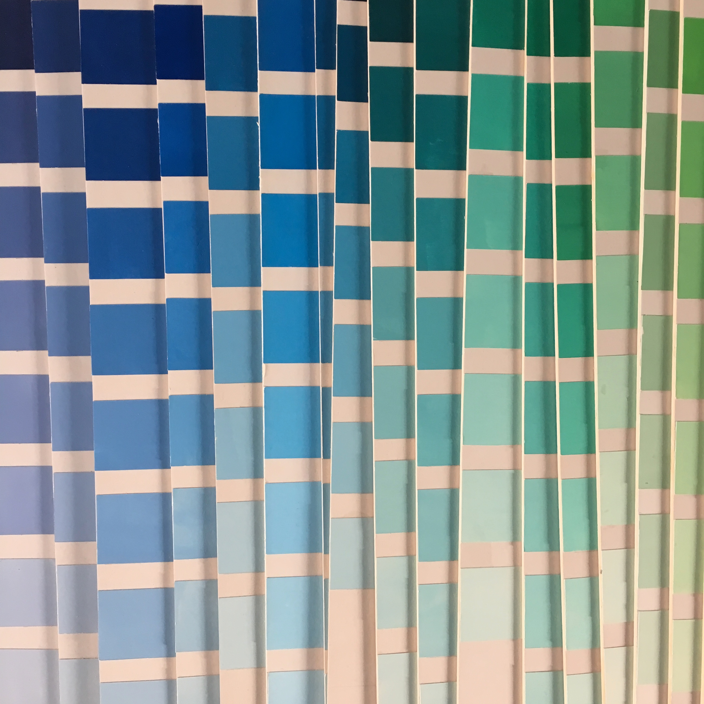

~~~
# ----------------------------------------
# Studies/2020 Studies/design_spaces.html
# ----------------------------------------
page = page.next
page.applyTemplate(template)  
page.name = 'Design spaces'
page.url = 'Studies/design_spaces.html'

content = page.select('Content')
box = content.newBanner()
~~~
## Study suggestions
# Design spaces 

~~~
section = content.newSection()
box = section.newIntroduction()
~~~

# [Redoing your workspace?](studies-design_spaces.html#design-a-workspace) [Choosing colors at IKEA?](studies-design_spaces.html#choosing-colors) [Looking for a style?](studies-design_spaces.html#creating-an-identity) [Mastering the skill of selection?](studies-design_spaces.html#how-to-organize-structure-in-chaos) [Creating an exhibit?](studies-design_spaces.html#design-an-exhibition) [Making sandbox for experiments?](studies-design_spaces.html#design-your-studio-sandbox)

~~~
box = section.newCropped()
~~~

~~~
box = section.newMain()
~~~
<a name="choosing-colors"/>
## Choosing colors

How to select a color or a color palette? What criteria matter in a given set of circumstances? How does material, medium and technique influence such a choice?
In a sequence of exercises, the student will develop ways to look, measure and compare selected colors. 

~~~
box = box.newInfo()
~~~

* A month of exercises and personal coaching, **€1.500** per student
* A season of exercises and personal coaching **€2.500** per student
* Daily feedback on Slack for the duration of the study
* Document sharing and versioning through GitHub
* Design principles for planning, process, methods for feedback and testing criteria 

~~~
box = section.newCropped()
~~~

~~~
box = section.newMain()
~~~
<a name="creating-an-identity"/>
## Creating an identity: the look and feel

Learn how to design a series of visual components for an identity, so the identity gains a strong character. Designing the balance between coherency and diversity with a set of recognizable elements which will represent the brand in an optimal form. 
Sketching, making models and making presentations in all different stages in the design process will be the main course of this program.

~~~
box = box.newInfo()
~~~

* A month of exercises and personal coaching, **€1.500** per student
* A season of exercises and personal coaching **€2.500** per student
* Daily feedback on Slack for the duration of the study
* Document sharing and versioning through GitHub
* Design principles for planning, process, methods for feedback and testing criteria 

~~~
box = section.newCropped()
~~~

~~~
box = section.newMain()
~~~
<a name="design-patterns-and-structures"/>
## Design patterns and structures

Making one-off designs is relatively easy. There are no other requirement than for that single solution. If at all. Learn to design methods and strategies if the plan changes along the way. How to proceed if a single design needs to become a series? How to respond to clients that change their goals in that direction?

~~~
box = box.newInfo()
~~~

* A month of exercises and personal coaching, **€1.500** per student
* A season of exercises and personal coaching **€2.500** per student
* Daily feedback on Slack for the duration of the study
* Document sharing and versioning through GitHub
* Design principles for planning, process, methods for feedback and testing criteria 

~~~
box = section.newCropped()
~~~

~~~
box = section.newMain()
~~~
<a name="how-to-organize-structure-in-chaos"/>
## How to organize structure in chaos

You have a project that starts with a pile of legacy publications. Or the content of an attic. Or you inherited and archive of design stuff that is supposed to become a website. Where do you start? How do you make such a project finish in the time that is available? Learn the development of selection methods, sketching techniques and directions to validate the process itself. 

~~~
box = box.newInfo()
~~~
* A month of exercises and personal coaching, **€1.500** per student
* A season of exercises and personal coaching **€2.500** per student
* Daily feedback on Slack for the duration of the study
* Document sharing and versioning through GitHub
* Design principles for planning, process, methods for feedback and testing criteria 

~~~
box = section.newCropped()
~~~

~~~
box = section.newMain()
~~~
<a name="design-a-workspace"/>
## Design a workspace 

Design the interior of a workspace, based on requirements, planning, budget and usage. What are the most important requirements and attributes? Development of sketching techniques, modelling and presentation. Design the process itself, alongside the interior. Special focus on materials, color, textures and the usage of space. The interior could be your own studio space, as well as the target of an external design project.

~~~
box = box.newInfo()
~~~

* A month of exercises and personal coaching, **€1.500** per student
* A season of exercises and personal coaching **€2.500** per student
* Daily feedback on Slack for the duration of the study
* Document sharing and versioning through GitHub
* Design principles for planning, process, methods for feedback and testing criteria 

~~~
box = section.newCropped()
~~~

~~~
box = section.newMain()
~~~
<a name="design-an-exhibition"/>
## Design an exhibition

Design an exhibition space, based on requirements, planning, budget and usage. Development of sketching techniques, modelling and presentation. Design the process itself, alongside the interior. Special focus on message, typography, layout, imaging, materials, color, textures and the usage of space. The exhibition could be your own spacial portfolio, as well as the target of an external design project.

~~~
box = box.newInfo()
~~~

* A month of exercises and personal coaching, **€1.500** per student
* A season of exercises and personal coaching **€2.500** per student
* Daily feedback on Slack for the duration of the study
* Document sharing and versioning through GitHub
* Design principles for planning, process, methods for feedback and testing criteria 

~~~
box = section.newCropped()
~~~

~~~
box = section.newMain()
~~~
<a name="design-the-environment"/>
## Design the environment

Whatever your environment is - physical, virtual and mental - that brings your creative thinking to the next level, you can make it help focus for development and improvement.

Through a variety of exercises – writing, sketching, making an inventory of environmental aspects and talking with others – you'll experience new opportunities to get more grip on your environment.  

~~~
box = box.newInfo()
~~~

* A month of exercises and personal coaching, **€1.500** per student
* A season of exercises and personal coaching **€2.500** per student
* Daily feedback on Slack for the duration of the study
* Document sharing and versioning through GitHub
* Design principles for planning, process, methods for feedback and testing criteria 

~~~
box = section.newCropped()
~~~

~~~
box = section.newMain()
~~~
<a name="design-your-studio-sandbox"/>
## Design your studio sandbox

Even design projects with a high degree of routine can benefit from built-in sandboxes. How to create them? How to make your own challenging hidden space?

~~~
box = box.newInfo()
~~~
* A month of exercises and personal coaching, **€1.500** per student
* A season of exercises and personal coaching **€2.500** per student
* Daily feedback on Slack for the duration of the study
* Document sharing and versioning through GitHub
* Design principles for planning, process, methods for feedback and testing criteria 

~~~
box = section.newCropped()
~~~

~~~
box = section.newMain()
~~~

## Other study suggestions

* [Type design](studies-type_design.html)
* [Typography](studies-typography.html)
* [Graphic design](studies-graphic_design.html)
* [Design spaces](studies-design_spaces.html)
* [Design practice](studies-design_practice.html)
* [Design education](studies-design_education.html)

~~~
box = section.newCropped()
~~~

