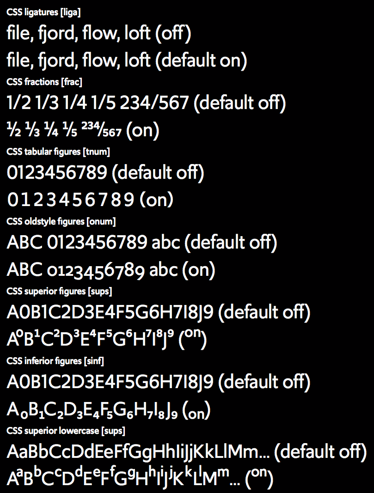
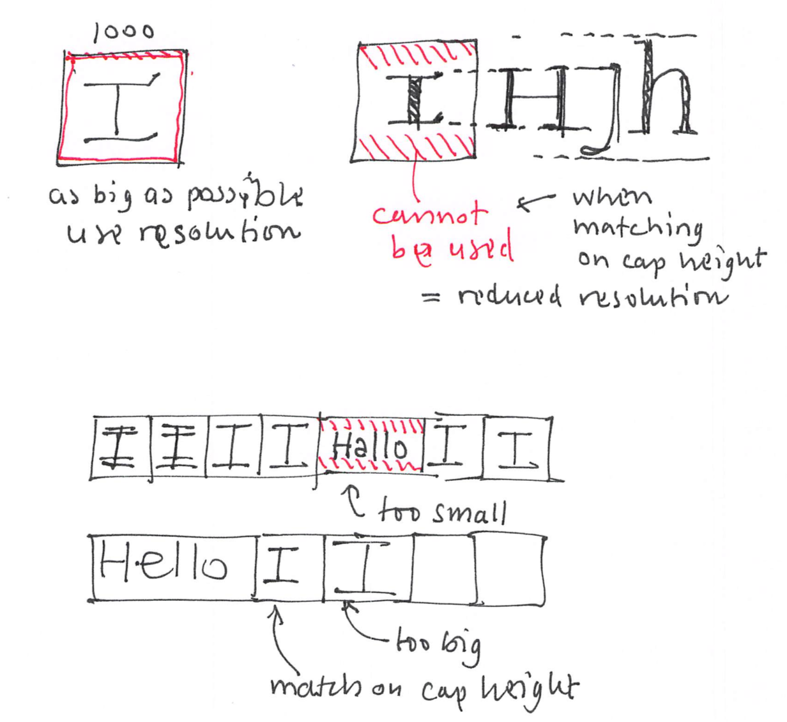

~~~
# ----------------------------------------
# studies-type_design.html
# ----------------------------------------
page = page.next
page.applyTemplate(template)  
page.name = 'Type design'
page.url = 'Studies/type_design.html'

content = page.select('Content')
box = content.newBanner()
~~~

## Study suggestions
# Type design 

~~~
section = content.newSection()
box = section.newIntroduction()
~~~

# [Drawing basic contrast?](studies-type_design.html#discover-the-basics-of-type-design) [Mastering Variable Fonts?](studies-type_design.html#the-design-process-of-variable-fonts) [Learning to code?](studies-type_design.html#scripting-for-type-designers) [Discovering the basics of type design?](studies-type_design.html#discover-the-basics-of-type-design) [Improving your sketching techniques?](studies-type_design.html#improve-your-sketching-techniques)

~~~
box = section.newCropped()
~~~

~~~
box = section.newMain()
~~~
<a name="live-coaching-of-your-design-project"/>
## Live coaching of your (type) design project

You have a challenging complex design project to work on. It is really interesting and rewarding, but it is also hard to get it planning and keep quality under control. Especially if the project runs over a longer period of time.
How the coaching is organized, depends on what you need, what works best. It can be a single lesson for support, during the initial stages of the project, or it can extend to helping you with management and feedback of the entire project. 

Part of the coaching role can also be the development of simple scripted tools to support the design process. 

~~~
box = box.newInfo()
~~~

* Initial online hangout, free of charge.
* A month of exercises and personal coaching, **€1.500** per student
* A season of exercises and personal coaching **€2.500** per student
* Daily feedback on Slack for the duration of the study
* Coaching the development of scripts to support the design process.
* Document sharing and versioning through GitHub
* Design principles for planning, process, methods for feedback and testing criteria 

~~~
box = section.newCropped()
~~~

~~~
box = section.newMain()
~~~
<a name="discover-the-basics-of-type-design"/>
## Discover the basics of type design

Type design is not your main background, but as a designer, you often are in situation when it would be good knowing more about it. When selecting a typeface for one of your designs. Or when you need to explain it to your client. It is possible to read about it. But it’s a lot more efficient learning how to write and draw by yourself.

~~~
box = box.newInfo()
~~~

* Initial online hangout, free of charge.
* A month of exercises and personal coaching, **€1.500** per student
* A season of exercises and personal coaching **€2.500** per student
* Daily feedback on Slack for the duration of the study
* Document sharing and versioning through GitHub
* Design principles for planning, the process, methods for feedback and testing criteria 

~~~
box = section.newCropped()
~~~

~~~
box = section.newMain()
~~~
<a name="the-design-process-of-variable-fonts"/>
## The design process of Variable Fonts

How do you get your design process beyond the traditional Variable Font axes of weight, width and optical size? How to make your experience grow from Multiple Master Thinking into Variable Font thinking? Develop sketching techniques. Make the production and testing of Variable Fonts work inside the cycles of your design process.

**Gerrit Noordzij Cube code by Just van Rossum**

~~~
box = box.newInfo()
~~~

* Initial online hangout, free of charge.
* A month of exercises and personal coaching, **€1.500** per student
* A season of exercises and personal coaching **€2.500** per student
* Daily feedback on Slack for the duration of the study
* Document sharing and versioning through GitHub
* Design principles for planning, process, methods for feedback and testing criteria 

~~~
box = section.newCropped()
~~~

~~~
box = section.newMain()
~~~
<a name="improve-your-sketching-techniques"/>
## Improve your sketching techniques

Learn to improve your sketching techniques for type and typography, using Erik van Blokland’s [TypeCooker](http://www.typecooker.com) website to generate small and complex type design assignments. Experiment with various materials, scales and level of detail. Train yourself in sketching the usage of type in publications, info-graphics and interfaces.

~~~
box = box.newInfo()
~~~

* A month of exercises and personal coaching, **€1.500** per student
* A season of exercises and personal coaching **€2.500** per student
* Daily feedback on Slack for the duration of the study
* Document sharing and versioning through GitHub
* Design principles for planning, process, methods for feedback and testing criteria 

~~~
box = section.newCropped()
~~~

~~~
box = section.newMain()
~~~
<a name="automated-proofing-and-specimens"/>
## Automated proofing and specimens

Learn the basics of scripting proofs and specimens for TTF, OTF and UFO. Sketching techniques for layouts. Patterns of Python code. Discover how to disassemble the design of specimens into parts that can be automated. Writing some templates that are directly useful for you. 

~~~
box = box.newInfo()
~~~

* A month of exercises and personal coaching, **€1.500** per student
* A season of exercises and personal coaching **€2.500** per student
* Daily feedback on Slack for the duration of the study
* Document sharing and versioning through GitHub
* Design principles for planning, process, methods for feedback and testing criteria 

~~~
box = section.newCropped()
~~~

~~~
box = section.newMain()
~~~
<a name="automated-qa-for-type-designers"/>
## Automated QA for type designers

Learn the basics of scripting, testing the quality of TTF, OTF and UFO fonts during the design process. Develop patterns of Python code. Analysis of mistakes and errors. How to detect and possibly solve them automatically, by running your scripts.

~~~
box = box.newInfo()
~~~

* A month of exercises and personal coaching, **€1.500** per student
* A season of exercises and personal coaching **€2.500** per student
* Daily feedback on Slack for the duration of the study
* Document sharing and versioning through GitHub
* Design principles for planning, process, methods for feedback and testing criteria 

~~~
box = section.newCropped()
~~~

~~~
box = section.newMain()
~~~
<a name="latin-type-design-for-non-latin-type-designers"/>
## Latin type design for (non-Latin) type designers

Learn the basics of Latin type. Sketching techniques. Principles of contrast. Weight and width. Relations and differences. The design process of Variable Fonts. Selection of tools. Scripting that can be automated. Models to differentiate between the best practice and arbitrary design choices.

~~~
box = box.newInfo()
~~~

* Initial online hangout, free of charge.
* A month of exercises and personal coaching, **€1.500** per student
* A season of exercises and personal coaching **€2.500** per student
* Daily feedback on Slack for the duration of the study
* Document sharing and versioning through GitHub
* Design principles for planning, process, methods for feedback and testing criteria 

~~~
box = section.newCropped()
~~~

~~~
box = section.newMain()
~~~
<a name="scripting-for-type-designers"/>
## Scripting for (Latin and non-Latin) type designers

Learn the basics of scripting for the editing tool that you are familiar with (RoboFont, Glyphs or FontLab). Sketching techniques. Patterns of Python code. How to disassemble a design problem into parts that can be automated. Writing some tools that are directly useful for you. Finding methods and directions for new tools, without the help of DD.S.

~~~
box = box.newInfo()
~~~

* Initial online hangout, free of charge.
* A month of exercises and personal coaching, **€1.500** per student
* A season of exercises and personal coaching **€2.500** per student
* Daily feedback on Slack for the duration of the study
* Document sharing and versioning through GitHub
* Design principles for planning, process, methods for feedback and testing criteria 

~~~
box = section.newCropped()
~~~

~~~
box = section.newMain()
~~~

## Other study suggestions

* [Type design](studies-type_design.html)
* [Typography](studies-typography.html)
* [Graphic design](studies-graphic_design.html)
* [Design spaces](studies-design_spaces.html)
* [Design practice](studies-design_practice.html)
* [Design education](studies-design_education.html)

~~~
box = section.newCropped()
~~~

