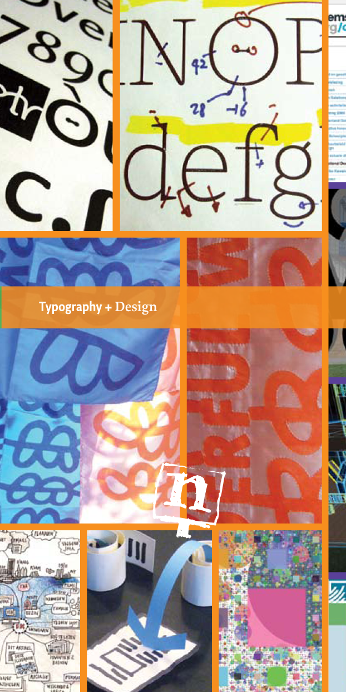
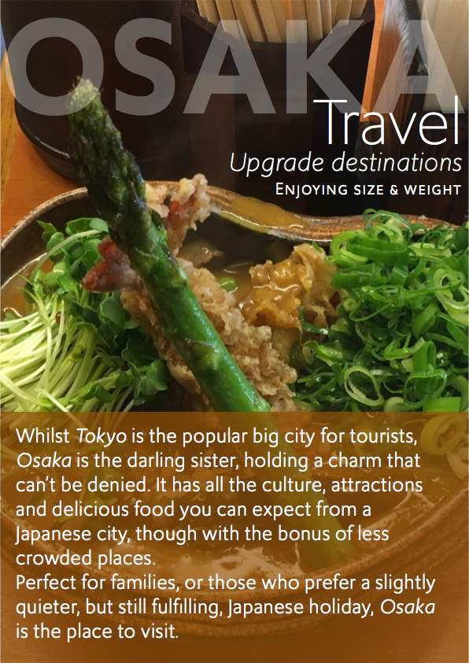
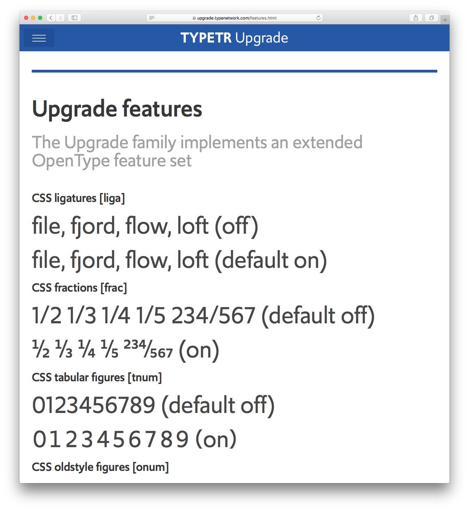
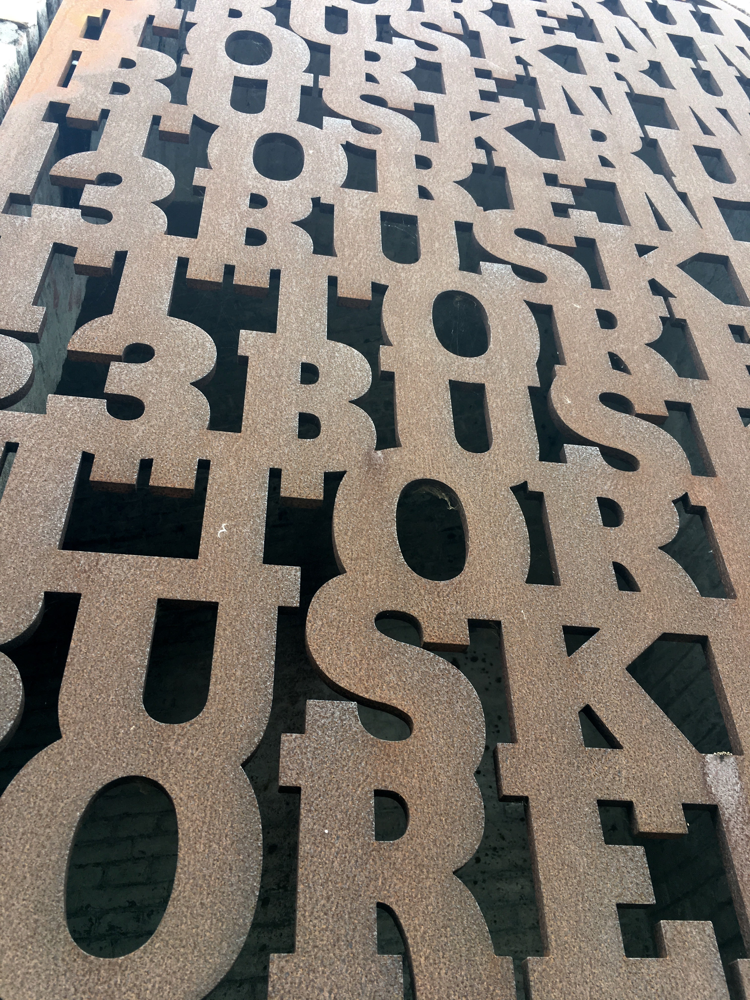

~~~
# ----------------------------------------
# Studies/2019 Studies/typography.html
# ----------------------------------------
page = page.next
page.applyTemplate(template)  
page.name = 'Typography'
page.url = 'Studies/typography.html'

content = page.select('Content')
box = content.newBanner()
~~~
## Study suggestions
# Typography 
~~~
section = content.newSection()
box = section.newIntroduction()
~~~

# [Learning to use typefaces in typography?](studies-typography.html#learn-how-to-use-typetr-typefaces-in-your-designs) [Seeking rules for type in corporate identities?](studies-typography.html#learn-how-to-use-type-and-typography-in-corporate-identities) [Wondering about the specifics of typography online?](studies-typography.html#learn-how-to-use-type-and-typography-in-corporate-identities)

~~~
box = section.newCropped()
~~~

~~~
box = section.newMain()
~~~
<a name="learn-how-to-use-typetr-typefaces-in-your-designs"/>
## Learn how to use TYPETR typefaces in your designs

While designing the typefaces for the TYPETR library, we obviously have ideas, hints and tips how they can best be used in typography. And while producing them, many examples and type specimens are made for testing and presentation. Why not share these with people who take the effort to buy a full family license?

See the TYPETR websites featuring [Upgrade](http://upgrade.typenetwork.com) (all type used in this website) and [Bitcount](http://bitcount.typenetwork.com) as examples of what we could talk about.

~~~
box = box.newInfo()
~~~

* A day of exercises, feedback and initial introduction hangout: free of charge with a purchase of a full family license at [Type Network](http://typetr.typenetwork.com) 
* Access to examples, templates and [DrawBot](http://drawbot.com)/[PageBot](https://github.com/PageBot/PageBot) script and programs.

~~~
box = section.newCropped()
~~~

~~~
box = section.newMain()
~~~
<a name="learn-how-to-use-type-and-typography-in-corporate-identities"/>
## Learn how to use type and typography in corporate identities

You are doing projects for corporate clients that include the use of type in print and online. How do you select the right one? And if such a typeface cannot be found, how would you brief a type designer?

The right application of type and typography can also save money for your client. Sometimes even a lot. How about using that as an argument for your next identity project?

~~~
box = box.newInfo()
~~~

* A week of exercises and 3 lessons, **€450** per student
* A month of exercises, projects and 8 lessons, **€1.700** per student
* Daily feedback by e-mail on results for the duration of the study
* Document sharing and versioning through GitHub
* Design principles for planning, process, methods for feedback and testing criteria 

~~~
box = section.newCropped()
~~~

~~~
box = section.newMain()
~~~
<a name="learn-how-to-use-type-and-typography-online"/>
## Learn how to use type and typography online

The use of type in websites using CSS has many issues to check on for typographers and graphic designers. Why select one typeface and not the other? How to address OpenType Features? How to make optimal usage of Variable Fonts technology in web pages? Study and exercises can enhance the selection and usage of type in websites.

~~~
box = box.newInfo()
~~~

* A week of exercises and 3 lessons, **€450** per student
* A month of exercises, projects and 8 lessons, **€1.700** per student
* Daily feedback by e-mail on results for the duration of the study
* Document sharing and versioning through GitHub
* Design principles for planning, process, methods for feedback and testing criteria 

~~~
box = section.newCropped()
~~~

~~~ 
box = section.newMain()
~~~

## Other study suggestions

* [Type design](studies-type_design.html)
* [Typography](studies-typography.html)
* [Graphic design](studies-graphic_design.html)
* [Design spaces](studies-design_spaces.html)
* [Design practice](studies-design_practice.html)
* [Design education](studies-design_education.html)

~~~
box = section.newCropped()
~~~

