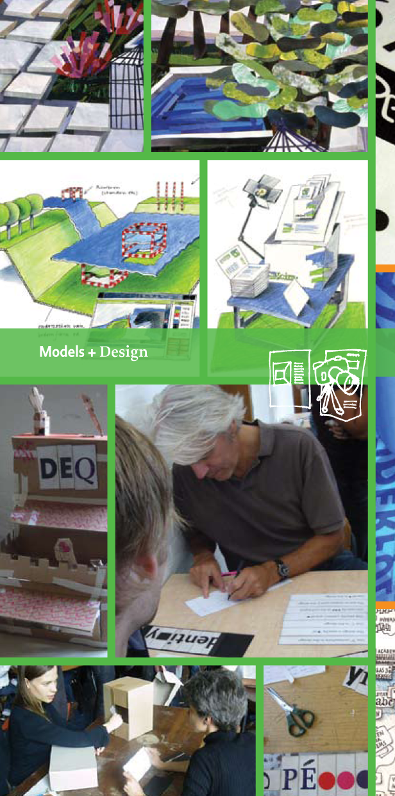

~~~
# ----------------------------------------
# Studies/2020-studies.html
# ----------------------------------------
page = page.next
page.applyTemplate(template)  
page.name = 'Studies'
page.url = 'studies.html'

content = page.select('Content')
box = content.newBanner()
~~~
# Examine the 2020 study suggestions
~~~
box = content.newIntroduction()
~~~

# [Redesigning your current design process?](studies-design_practice.html#design-of-design-models) [Methods for rapid prototyping?](studies-design_practice.html#rapid-prototyping-for-graphic-designers) [Redoing your interior?](studies-design_spaces.html#design-a-workspace) [How to educate customers?](studies-design_practice.html#how-to-deal-with-clients) [Directions for further design education?](studies-design_education.html#virtual-studies-and-teaching-online)

~~~
section = content.newSection()
box = section.newMain()
~~~
## Studies in 2020

We keep improving the curriculum. The mandatory design of design education. Instead of the fixed [2018](2018-program.html) list of workshops, studies and dates, in practice, we found out that it is better to make the schedule entirely flexible. Hints of topics, templates of studies and suggestions for the process behind.

---
## Pricing

Each lesson is an online hangout, lasting for a part of the day, morning or afternoon, depending on your timezone. The pricing is based on the length and intensity of a study. 

If a study is spread over a longer period time, intensity can be lower for the same price. However, such a schema requires more self-discipline from students to take full advantage of their study and the support we can offer them.

[See more about pricing here.](pricing.html)

---
## Other study suggestions

* [Type design](studies-type_design.html)
* [Typography](studies-typography.html)
* [Graphic design](studies-graphic_design.html)
* [Design spaces](studies-design_spaces.html)
* [Design practice](studies-design_practice.html)
* [Design education](studies-design_education.html)

~~~
box = section.newCropped()
~~~

