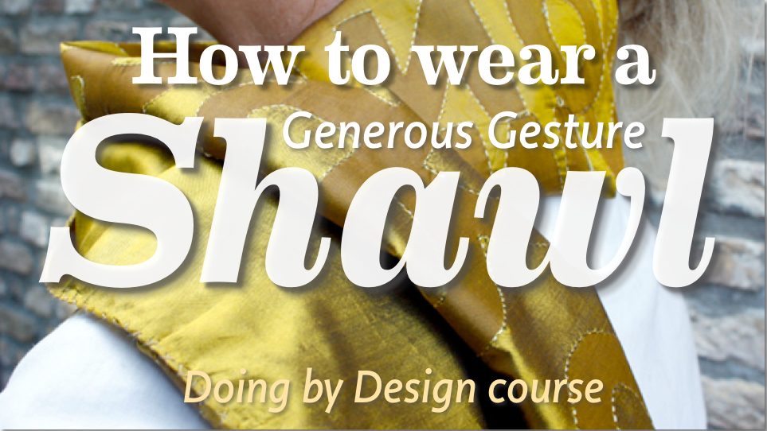
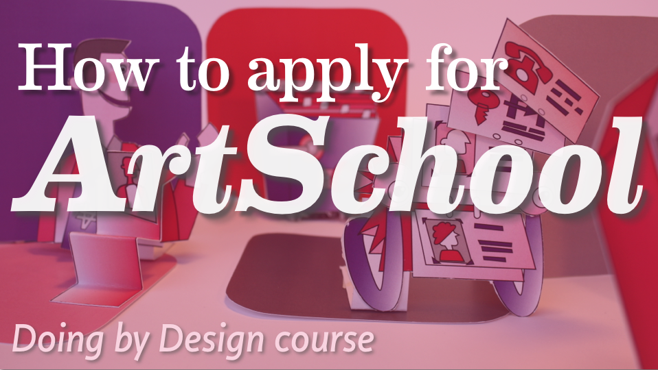
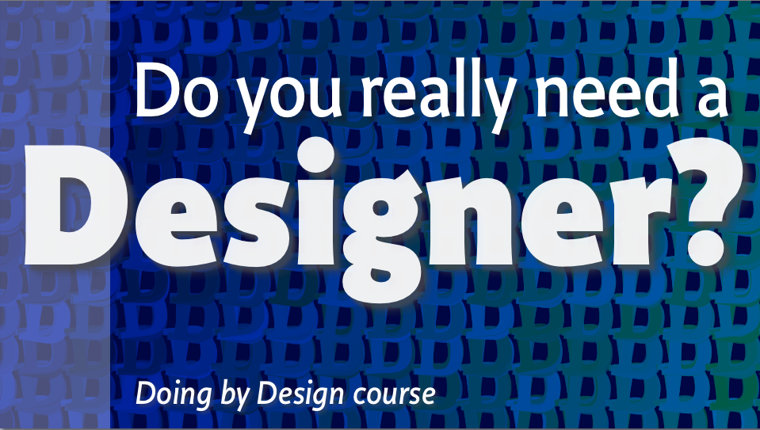

~~~Python
cid = 'Website'

from pagebot.publications import Website

doc = Website(autoPages=0, title='Design Design Space')

page = doc.newPage(name='index.html', template='home')
page.info.cssPath = 'sources/pagebot.css'
#page.info.headPath = 'sources/head.html'
#page.info.bodyPath = 'sources/body.html'
box = page['Main']

~~~

# designdesign.space
Develop your skills. Query your questions. Improve your sketching. Acquire new techniques. Research your presentations. Design your design process. 

In extendable studies of 1 day, 1 week, 1 month or 1 year, as it fits your practical limits. As a start.

Teachers/coaches/designers: Petr van Blokland, Claudia Mens and others

## http://designdesign.space
## designdesignspace.com

### What designdesign.space is not

* It is not a course
* It is not an (academic) education, leading to Master or PhD
* It is not an (online) school
* It is not a how to InDesign/HTML/CSS/JS/otherDesignTool training
* It is not a series of slides, presentations or a stack of books (although these can be part of it).

### What designdesign.space is

* A personal environment to develop design skills, by accepting design challenges, meeting with coaches and colleage students in online feed-back sessions and presentations.
* The design of personal space (time, topic and skills) profession preparation for the rest of your life.
* The focus is on design students. Not on predefined course content.

~~~Python
page = doc.newPage(name=about.html', template='home')
page.info.cssPath = 'sources/pagebot.css'
box = page['Main']

~~~

### What is designdesign.space for

* Graduated design students
* Designers with experience, working in practice
* Designers interested in improving their process
* Designers interested in specializing a specific topic
* Designers interested to develop skill that make them independent from future developments.
* Designers who would like to do a follow-up/refresh study, but are lacking time, finance or geographic location to make it work.

In general the aim is to get graduated students as well as experienced designers back to a space of “WOW!”.

### For which designers does designdesign.space best?

* Open minded and willing to get valuable feed-back on their work
* Interested to improve and change
* Interested to participate in the work of colleague students
* Disciplined to work hard between online sessions
* More interested in the development of skills and challenging assignments than assessed diploma’s.

### What designdesign.space offers

* Learning how to create an environment and context to design and develop.
* Developing the skill to design the design process.
* Scalable traject: 1 day, 1 week, 1 month or 1 year.
* Online (shared documents, video, hangouts).
* Environment with experienced designer coaches and colleage students. Contact ranging from daily to weekly.
* Each design student defines length, speed of study and select specialization topics.
* The study finishes with a valued certificate on “graduation”, signed by external designers of statue. 
* Short term visible value for students, even with the longer time frames.

~~~Python
page = doc.newPage(name=schedule.html', template='home')
page.info.cssPath = 'sources/pagebot.css'
box = page['Main']
~~~

### What is the time frame?
There are several options, ranging from 1 day, 1 week, 1 month and 1 year, all offering the same process. The difference is the level of details, development of skill and amount of specialization in specific topcis.

### What does it cost?

There are 4 possible training levels.

* 1 day $150
* 1 week $800 (7 days)
* 1 month $2000 (calendar month)
* 1 year $6000

For students who whish to extend one time frame into another, the payed amount will be deducted by 50%.

* 1 day extending into 1 week: 1/2 $150 + $800 = $875
* 1 week extending into 1 month: 1/2 $800 + $2000 = $2400
* 1 day extending into 1 week extending into 1 month: 1/2 $800 + $2000 = $2400
* 1 month extending into one year: 1/2 $2000 + $6000 = $7000
* 1 week extending into 1 month extending into 1 year: 1/2 $2400 + $6000 = $7200

Tuition needs to be payed before the training starts. 
No refunding is possible, but students have the right to build in breaks for some period of time, if that is discussed before hand. 
In exceptional situations payment in portions can be discussed.

### What is the schedule & how to submit?

Every 3 months a new day-week-month-year sequence starts, under the condition that there are at least 3 students. 

The coaches have the right to decide postponing the start of a new sequence, if not enough students submitted and group them together.

Since working as a team of students a minimum amount is required, and also a mininum level of quality, motivation, dedication and experience. 

Students are submitted after showing their portfolios and the result of a given assignment. They have to write a motivation and development plan, which will be presented in a Google Hangout.
If there is enough time between submission and the start of a new sequence, students can get some initial assignment to work on without coaching. 
The volume this depends on the length of the of the training that students apply for.

Students finishing one training level adequately, automatically get admitions for a next level.

~~~Python
page = doc.newPage(name=articles.html')
page.info.cssPath = 'sources/pagebot.css'
box = page['Main']
~~~

### How does it work?

* Design students meet online with each other and the coaches in regular intervals.
* Students get assignments for design projects with time frames ranging from several hours to several months. The assignments are challenges, for which specific topics can be filled by the individual students.
* Questions how to approach these challenges, research on what skills need to be developed, what knowledge needs to be acquired and what techniques/materials need to be developed and how to design the planning for the project, are all part of the assignment. 
* With regular intervals (ranging from hours to weeks) the various levels of intermediate results are presented to the group of students and coaches. It is the aim of the coaches to create a safe environment in which anything can be said about any aspect of the work and the process.
* The process of creating such a safe environment and the methods for feed-back themselves are part of the assignments, and therefor subject to sketching and modification too.
* In the presentations feed-back is given on the presented work, but also on the presentation itself and on the process and proceedings between presentations. 

### Biggest advantage of this activity for us

* Not bound to any accreditation or institution
* No startup cost
* Highly scalable in volume of students
* Highly scalable in contributing teachers
* Very flexible in focus, content and directions
* Works anywhere, anytime, any language, country and culture, as long as people get online.
* Large “touch base” of students who already have similar experience in our regular lessons
* A lot of this we already have available as assignments, examples, etc.
* Flexible in pricing for special cases.
* Focus is on design students, not on buildings, organizations and degrees.

### The design process

The idea behind the training is that every design process can be divided into three phases: research, design and presentation.
As e.g. the research phase by definition has design and presentation aspects (answering questions such as “How am I going to do the research” and “How am I going to present the research results?”), every phase has this division in three, making a recursive structure.
Of course the required time and level of details are subject of choice, but that itself is a design question to be answered.

### Personal design space

An important aspect of every design project is that it is a journey, a travel, with some definition of starting point, some definition of the target, but – by definition – an undefined path from one to the other. Otherwise that path would have been called a production process.

From the personal experience for the designer, such a journey has always had conditions that must be filled for success.

* Calling; dreams, plans, goals and knowing yourself
* Fellowship; the social fabric, the environment of the designer
* Dragon; where you stumble, the treasure lies
* Performance; stepping into the middle of the moment 
* Return; bringing home the Holy Grail

*Campbell, J (1949), The Hero with a Thousand Faces. New York: MJF Books*

~~~Python
page = doc.newPage(name=projects.html')
page.info.cssPath = 'sources/pagebot.css'
box = page['Main']
~~~

### Specialization topics

In all of the four time frames of a sequence (day, week, month, year) students can select a combination of specializations (where this selection process also is part of the design skills to be developed).
The difference between the time frames is the level of details and the amount of skill training. For the rest each phase in the process is a recursive copy of itself.

The combination of any 2 or 3 topics from the list below gives each students a unique personal research environment to develop.

#### Topics

* Typography
* Type design
* Design for fashion
* Design of information visualization
* Interior and exhibition design
* Design for multiple media from single source
* Parametric design, programming and coding
* Corporate design

#### Process

* Design of research methods
* Sketching techniques
* Design the design process
* Presentation techniques
* Design of feedback and evaluation techniques
* Design of testing methods

~~~Python
page = doc.newPage(name=specializations.html')
page.info.cssPath = 'sources/pagebot.css'
box = page['Main']
~~~

#### Contexts

* Design education
* Working in teams, running a studio
* Dealing with customers
* Design for users

Each of these items contain a world of detailed knowledge and design parameters that can be developed with students who select such a topic. As example, for typography (and with reference to adjacent topics) this next level could contain a selection of:

* **Typographic parameters** Categories, bandwidth of possible values, presentation examples, …
* **Typographic layout** Principles, transformation of historic examples, whitespace, aesthetics, …
* **Typographic tools** Grid, type, size, leading, spacing, kerning, width, hyphenation, orientation, contrast, color, pattern, proportion, ratio, interaction, position, meaning, language, any combination and addition to the parameters of Bertin, …
* **Design the process** Base requirements, testing, planning, cooperation with other disciplines, research, marketing, promotion, difference between single solution and generative rules, selection and design of research methods, …
* **Mathematics for designers** Sin/cos/tan/atan, position, rotation, transformation matrices, column calculation, statistics, logarithmic, ranges, light game theory, principles of AI, neural networks and machine learning, …
* **Type design** Variation axes, design of parameters, design of selection criteria, design of the process, …
* **Images as typographic elements** Illustration, photography, info-graphics, ...
* **Target areas** Culture, fashion, politics, international relation, trade, education, …
* **Educating typography** Educating bachelor students, customers, users, yourself inside design cycles, presenting, writing about…
Programming Structure, hierarchy, design or algorithms, …)
* **Coding** All relevant languages related to typography: deepest relevant of Processing, Python, JS, PHP, CSS, HTML, XML, Objective-C, …
* **Tools** Deepest of Adobe applications, scripting, OSX-terminal tools, design of information conversion flows, research on raw data, …
* **Device Measurements** resolution, distortion, proportion, memory usage, …
* **Storage techniques** File, database, formats, git, JSON, plist, XML, UFO, …

## Cases
What we plan to do can best be describe in some cases.

### Case 1 Design of selection and feedback
3 posters, different in one series. Assignemnt is how to judge the result and how to select different judging methods

### Case 2 Basic skills
Painting of color/gray ranges. Material, proportions, ratio, contrast.

### Case 3 Sketching methods
2 weeks to fill a 100 page Moleskine sketchbook, design for a specific subject, context or design challenge.
The presentation is about 5 best pages in combination with validation criteria.

### Case 4 Design research methods inside the design process
This is the integral assignment for TypeMedia 2017 students at the end of their Master year. They have a limited time to write and design 3 mini-thesis document of one page each.

### Case 5 Design interactive poster

### Case 6 Design of corporate identity models

