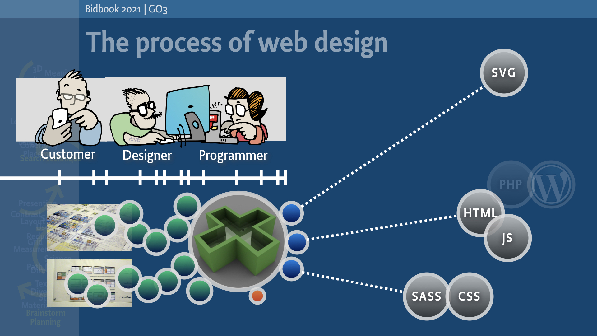
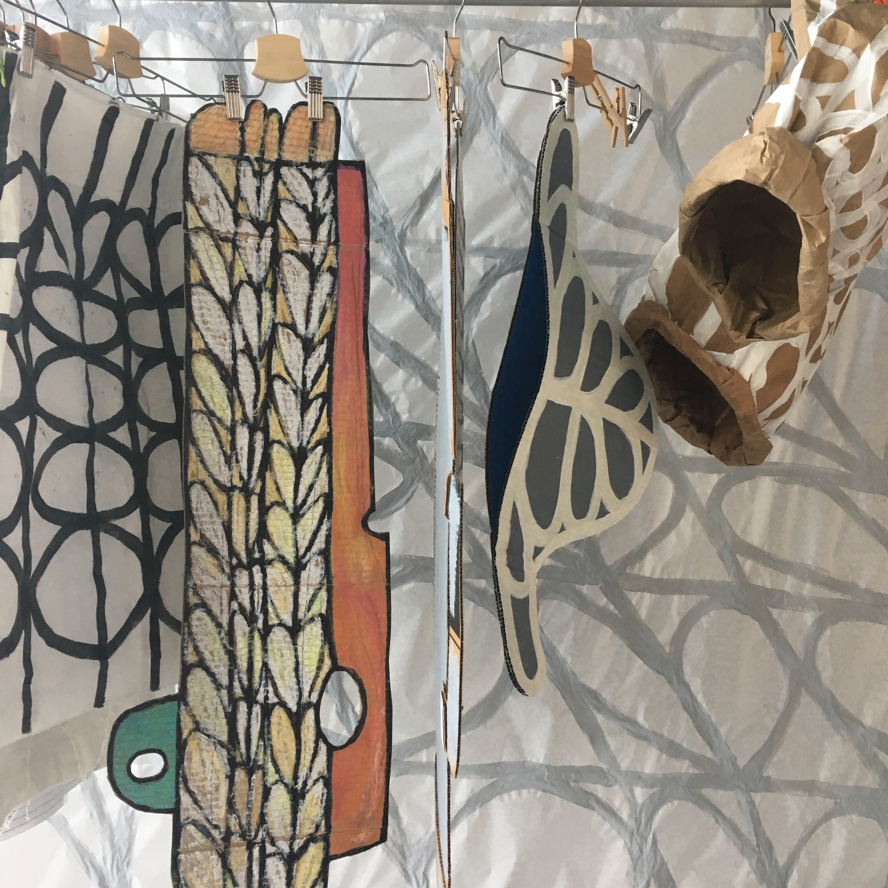
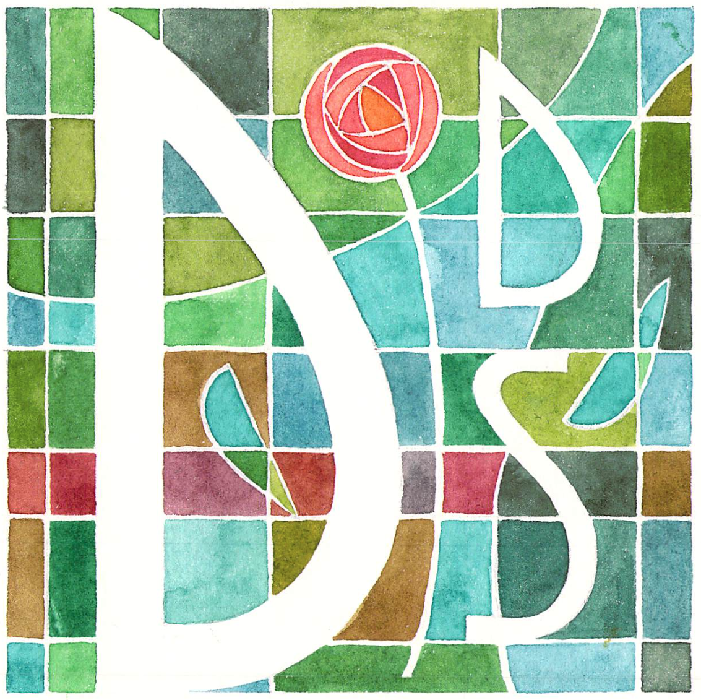
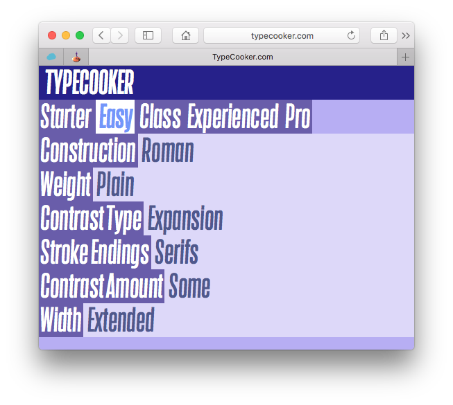

~~~
doc.title = 'Design&nbsp;Design&nbsp;Space'

doc.footerHtml = """Let us know what you think. Do you have any questions for us? <a href="mailto:info@designdesign.space?subject=Tell me more about DesignDesign.Space">info@designdesign.space</a>"""

# Home 
#	Header 
#		Banner 
#		Logo
#			Logo_T
#		Navigation/TopMenu/MenuItem(s)
#	Hero 
#	Content
#		Content_T
#	ContentSide
#		ContentSide_Content
#		ContentSide_Side
#	ColoredSection 
#	Footer
#		Footer_T
# 
# Default
#	Header 
#		Banner 
#		Logo
#			Logo_T 
#		Navigation/TopMenu/MenuItem(s)
#	Hero 
#	Content
#		Content_T
#	ContentSide
#		ContentSide_Content
#		ContentSide_Side
#	ColoredSection 
#	ContentSide2
#		ContentSide2_Content
#		ContentSide2_Side
#	Footer
#		Footer_T

# -----------------------------------------------------------------------------------
# index.html
# -----------------------------------------------------------------------------------
page = doc.newPage(name='index.html', template='home')
box = page.select('Content')
~~~
# What is your design space?

Tell us want you want to study. What do you want to achieve? Improve your latent coding skills, while training your self-discipline? Seeking a sparring partner for an interesting new design project? Updating your technical skills? Or you simply need a refreshing break from a design practice that became too predictable? 

**DesignDesign.Space** can help with that aim. Coaching you through your study, at some moments the teachers can ask the toughest questions. If you are happy with the design you have finally finished, what exactly is it that you are happy with?

What topic would you like to study? And what is your goal at the end? Even finding answers to those questions, could be a design process in itself. How to start? How to continue? And most important: how to finish successfully within the given amount of time? 

## How DDS-studies work

* During your first free hangout, you describe what you want to achieve.
* Together, we will find a way for you doing that. Topics. Teachers. Targets.
* In sequences of relative short assignments, online hangouts, feedback and reflections, we guide you through your study project. And more important, we’ll teach you how to do that yourself.
* It can be a day. Or a week. A month. Or a year. Whichever fits your goals, time and resources. And if your ideas change along the way, that can always be discussed.

## Challenge us

We are educators and designers. For us, teaching is as much of a challenge as any design process is. Send us  your questions on topics that we never thought about before. Lure us into teaching you in a different way than this entire website suggests. We probably will take the challenge.

~~~
box = page.select('Banner')
~~~

~~~
box = page.select('Hero')
~~~
## Hero2

~~~
box = page.select('Content')
~~~
# Program 2019

## Study suggestions for 2019

~~~
box = page.select('ColoredSectionHeader')
~~~
## Topics of study

~~~
box = page.select('ColoredSection1')
~~~
## Design of tools

~~~
box = page.select('ColoredSection2')
~~~
## Design of education

~~~
box = page.select('Content2_T')
~~~
## Content2-2

~~~
box = page.select('ColoredSection0')
~~~
## Design of type

~~~
# -----------------------------------------------------------------------------------
# program.html 
# -----------------------------------------------------------------------------------
page = doc.newPage(name='program.html')
box = page.select('Content_T')
~~~
#[Program 2019](program-2019.html)

We keep improving the curriculum. The mandatory design of design education. Instead of the fixed [2018](program-2018.html) list of workshops, studies and dates, in practice we found it better to make the schedule entirely flexible. Hints of topics, templates of studies and suggestions for the process behind.

Each lesson is an online hangout, lasting for part of the day – morning or afternoon – depending on your timezone. The pricing below is for one student. 

If a study is spread over a longer period time, intensity can be lower for the same price. However, it requires more self-discipline for a student to take full advantage of the study and the support we can offer.

## Pricing

The prices of the studies are indicators, related to length and intensity. A specific topic can be addressed in a couple of days. Or it can be the subject of thourough study, lasting for a month or longer. 

A lesson can extend in time, if multiple students attend at the same time.

* Initial online hangout, free of charge.
* Single lesson, **$190** per student
* A week of 3 lessons (1+ hour each), **$490** per student
* A month or more of 8 lessons (2+ hours each), **$1.900** per student
* A season **$3.900**
* A year **$7.900**

## Ask for info

Let us know on [info@designdesign.space](mailto:info@designdesign.space?subject=Tell%20me%20more%20about%20DesignDesign.Space) if there is something you are interested in of the program below. Or tell is if you would have other wishes that are related to design. 

*Don't hesitate to contact us if the indicated price is the only problem for you not do a study.*

##[Reviewing 2018 studies](program-2018.html)

~~~
# -----------------------------------------------------------------------------------
# program-2019.html 
# -----------------------------------------------------------------------------------
page = doc.newPage(name='program-2019.html')
box = page.select('Content_T')
~~~
The program 2019 consists of suggestions of possible studies and topics. You can start any time during the year. 

And if you have additional ideas or different requests for a study personalized to your needs: just let us know.

# Type design

## Design the design process of Variable Fonts

How do you get your design process beyond the traditional Variable Font axes of weight, width and optical size? How to make your experience grow from Multiple Master Thinking into Variable Font thinking? Develop sketching techniques. Make the production and testing of Variable Fonts to be included inside the cycles of your design process.

* A week of 3 lessons (1+ hour each), **$490** per student
* Daily feedback by e-mail on results for the duration of the study
* Document sharing and versioning through GitHub
* Design principles for planning, the process, methods for feedback and testing criteria 

## Automated proofing and specimens

Learn the basics of scripting proofs and specimens for TTF, OTF and UFO. Sketching techniques for layouts. Patterns of Python code. How to disassemble the design of specimens into parts that can be automated. Writing some templates that are directly useful for you. 

* A month or more of 8 lessons (2+ hours each), **$1.900** per student
* Daily feedback by e-mail on results for the duration of the study
* Document sharing and versioning through GitHub
* Design principles for planning, the process, methods for feedback and testing criteria 

## Automated QA for typedesigners

Learn the basics of scripting testing the quality of TTF, OTF and UFO during the design process. Patterns of Python code. Anaysis of mistakes and errors. How to detect and possibly solved then automatic by running scripts.

* A month or more of 8 lessons (2+ hours each), **$1.900** per student
* Daily feedback by e-mail on results for the duration of the study
* Document sharing and versioning through GitHub
* Design principles for planning, the process, methods for feedback and testing criteria 

## Latin typedesign for (non-Latin) typedesigners

Learn the basics of Latin type. Sketching techniques. Principles of contrast. Weight and width. Relations and differences. The design process of Variable Fonts. Selection of tools. Scripting what can be automated. Models to differentiate between best practice and artibtrary design choices.

* A month or more of 8 lessons (2+ hours each), **$1.900** per student
* Daily feedback by e-mail on results for the duration of the study
* Document sharing and versioning through GitHub
* Design principles for planning, the process, methods for feedback and testing criteria 

## Scripting for (Latin and non-Latin) typedesigners

Learn the basics of scripting for the editing tool that you are familiar with (RoboFont, Glyphs or FontLab). Sketching techniques. Patterns of Python code. How to disassemble a design problem into parts that can be automated. Writing some tools that are directly useful for you. Finding methods and directions for new tools, without the help of DDS.

* A month or more of 8 lessons (2+ hours each), **$1.900** per student
* Daily feedback by e-mail on results for the duration of the study
* Document sharing and versioning through GitHub
* Design principles for planning, the process, methods for feedback and testing criteria 

## Live coaching of your (type)design project

You have this challenging complex design project to work on. It is really interesting and rewarding, but it is hard to get planning and quality under control. Especially if the project runs over a longer period of time.
How coaching is organized, depends on your needs. It can be a single lesson for support, while writing the quote, up to helping you with management and feedback of the entire project. 

* Initial online hangout, free of charge.
* A single lesson, **$190** per student
* A week of 3 lessons (1+ hour each), **$490** per student
* A month or more of 8 lessons (2+ hours each), **$1.900** per student
* Daily feedback by e-mail on results for the duration of the study
* Document sharing and versioning through GitHub
* Design principles for planning, the process, methods for feedback and testing criteria 

# Graphic design

## Visual grammar for graphic designers

Disassemble your graphic design into parameters, models and methods. Why do you choose a color or a typeface? How to separate the **this one** from **this kind of**, when making a series of covers. Or different types of publications within one identity.

* A month or more of 8 lessons (2+ hours each), **$1.900** per student
* Daily feedback by e-mail on results for the duration of the study
* Document sharing and versioning through GitHub
* Design principles for planning, the process, methods for feedback and testing criteria 

## Info-graphics: The design of automated designs

Design systems that generate info-graphics. For online use and for print. How do you bridge the gap between (big)databases, the design of templates using high level typographic standards, scriptable illustration techniques and applications for automated output. Using DrawBot, PageBot and current web technologies. 

* A month or more of 8 lessons (2+ hours each), **$1.900** per student
* Daily feedback by e-mail on results for the duration of the study
* Document sharing and versioning through GitHub
* Design principles for planning, the process, methods for feedback and testing criteria 

## Scripting the design of printed publications

Design systems that generate books, magazines, newspapers, brochures, manuals or catalogues. Intended for print. How do you bridge the gap between unpredictable content, sketching design rules, the design of templates that use high level typographic standards, scriptable illustration techniques and applications for automated output. Using DrawBot and PageBot (for OSX and Linux platforms).

* A month or more of 8 lessons (2+ hours each), **$1.900** per student
* Daily feedback by e-mail on results for the duration of the study
* Document sharing and versioning through GitHub
* Design principles for planning, the process, methods for feedback and testing criteria 

## Scripting the design of online publications

Design systems that generate applications, documents and websites, intended for online usage. How do you bridge the gap between unpredictable content, sketching design rules, the design of templates that use high level typographic standards, scriptable illustration techniques and applications for automated output. Using DrawBot and PageBot, generating HTML/CSS/Javascript (for OSX and Linux platforms).

* A month or more of 8 lessons (2+ hours each), **$1.900** per student
* Daily feedback by e-mail on results for the duration of the study
* Document sharing and versioning through GitHub
* Design principles for planning, the process, methods for feedback and testing criteria 

## Identity design: Branding with and without the use of logos

Design parametric models for an identity. Which parameters create the visual coherency? And which parameters are diverse, without the need to specify? Is that always the same list? If not, what is the best selection for a particular brand?
How to write scripts to automate (parts of) the models for your parameters testing.

* A month or more of 8 lessons (2+ hours each), **$1.900** per student
* Daily feedback by e-mail on results for the duration of the study
* Document sharing and versioning through GitHub
* Design principles for planning, the process, methods for feedback and testing criteria 



## Python scripting for graphic designers

Learn the basics of scripting your graphic design process. Sketching techniques. Decide what can be automated and what not. Patterns of Python code, using DrawBot and PageBot. Connect to InDesign. Parameters for magazines, websites, exhibition spaces and corporate identities.  Develop models to differentiate between best practice and arbitrary design choices.

* A month or more of 8 lessons (2+ hours each), **$1.900** per student
* Daily feedback by e-mail on results for the duration of the study
* Document sharing and versioning through GitHub
* Design principles for planning, the process, methods for feedback and testing criteria 

# Design spaces

## Design an interior 

Design an interior, based on requirements, planning, budget and usage. Development of sketching techniques, modelling and presentation. Design the process itself, alongside the interior. Special focus is on materials, color, textures and the usage of space. The interior could be your own studio space, as well a the target of an external design project.

* A week of 3 lessons (1+ hour each), **$490** per student
* A month or more of 8 lessons (2+ hours each), **$1.900** per student
* Daily feedback by e-mail on results for the duration of the study
* Document sharing and versioning through GitHub
* Design principles for planning, the process, methods for feedback and testing criteria 

## Design an exhibition

Design an exhibition space, based on requirements, planning, budget and usage. Development of sketching techniques, modelling and presentation. Design the process itself, alongside the interior. Special focus is on message, typography, layout, imaging, materials, color, textures and the usage of space. The exhibition could be your own spacial portfolio, as well as the target of an external design project.

* A week of 3 lessons (1+ hour each), **$490** per student
* A month or more of 8 lessons (2+ hours each), **$1.900** per student
* Daily feedback by e-mail on results for the duration of the study
* Document sharing and versioning through GitHub
* Design principles for planning, the process, methods for feedback and testing criteria 

## Design the environment

* A week of 3 lessons (1+ hour each), **$490** per student
* A month or more of 8 lessons (2+ hours each), **$1.900** per student
* Daily feedback by e-mail on results for the duration of the study
* Document sharing and versioning through GitHub
* Design principles for planning, the process, methods for feedback and testing criteria 

## Design your studio sandbox

* A week of 3 lessons (1+ hour each), **$490** per student
* A month or more of 8 lessons (2+ hours each), **$1.900** per student
* Daily feedback by e-mail on results for the duration of the study
* Document sharing and versioning through GitHub
* Design principles for planning, the process, methods for feedback and testing criteria 

# Running a design practice

## Design of design models

Develop and select design methods. What is avaiable beyond “scrum”? Which methods can you design for yourself, by scaling and managing details. Sketching and making of small scale models is such a technique: get an impression about your design choices in an early stage, without making the “real thing”.

* A week of 3 lessons (1+ hour each), **$490** per student
* Daily feedback by e-mail on results for the duration of the study
* Document sharing and versioning through GitHub
* Design principles for planning, the process, methods for feedback and testing criteria 

## Rapid prototyping for graphic designers

Learn to develop efficient and powerful prototyping techniques including manual sketching, digital tools and coding, with the goal of controlling the broadening and narrowing of options and directions a project may take.
Through sketching, hands-on practical exercises and presentations, you explore the process of making prototypes.
This study is a follow up on the **Design of design models**, but can be also joined separately.

* A week of 3 lessons (1+ hour each), **$490** per student
* Daily feedback by e-mail on results for the duration of the study
* Document sharing and versioning through GitHub
* Design principles for planning, the process, methods for feedback and testing criteria 

## Sketching techniques

Similar to the “Rapid Prototyping” workshop, this study addresses the management of details, too. The difference is the more extended focus on sketching skills, materials, coding and the visual language of scaled models.

* A month or more of 8 lessons (2+ hours each), **$1.900** per student
* Daily feedback by e-mail on results for the duration of the study
* Document sharing and versioning through GitHub
* Design principles for planning, the process, methods for feedback and testing criteria 

## Live coaching while starting your studio

You are working on starting your own studio. You just graduated or you have been working in a design studio for years and now it is time to start your own. It seems to be a promising, interesting and rewarding plan. But it is also hard to control planning, budget and clients fantasies. Especially if projects run over a longer period of time.
How coaching is organized, depends on your needs. It varies from a single lesson of support, while writing an initial quote, up to helping you with management and feedback of your entire project.

* A week of 3 lessons (1+ hour each), **$490** per student
* A month or more of 8 lessons (2+ hours each), **$1.900** per student
* Document sharing and versioning through GitHub
* Daily support and feedback on results for the duration of the study
* Design principles for planning, the process, methods for feedback and testing criteria 

## How to deal with customers?

Use cases, models, simulations, sketching and presentation techniques are the subject of this 3-lesson workshop on how to deal best with customers. Students are offered to think about planning in relation to what they charge for their designs. The workshop addresses the difference between cost and investment, leisure and learning, with special attention on the success of failure.

* A week of 3 lessons (1+ hour each), **$490** per student
* Document sharing and versioning through GitHub
* Daily support and feedback on results for the duration of the study
* Design principles for planning, the process, methods for feedback and testing criteria 

## Running a home studio with employees, while raising a family
 
Examples and cases from our own experience. What worked for us and what didn't. Points of view, excersices and feedback. The dilemma choose focus. Roles and rules. The choice of not working overtime. Employer or design? Friends or families. 
The workshop gives students a wide variety of strategies and scenarios. 

* A week of 3 lessons (1+ hour each), **$490** per student
* Document sharing and versioning through GitHub
* Daily support and feedback on results for the duration of the study
* Design principles for planning, the process, methods for feedback and testing criteria 

## Design of virtual studies and teaching online

With a total of 60 years of educating design, both in physical space, as well as in virtual environments, we can offer that experience as a topic of a study. How to design design education? Methods for feedback. What works in an online environment and what doesn’t? How to build layers of assignments? What is the goal? What is realistic?

* A week of 3 lessons (1+ hour each), **$490** per student
* A month or more of 8 lessons (2+ hours each), **$1.900** per student
* Document sharing and versioning through GitHub
* Daily support and feedback on results for the duration of the study
* Design principles for planning, the process, methods for feedback and testing criteria 

## Virtual sabbatical

You have been working as a designer for some years, employed by a studio or running your own. You have been really successful or a bit less, in any case, there is a moment in time to answer the question “What’s next?”. 

At the same time, you don’t think you have the age or freedom or financial resources to take a real sabbatical break and do a Master study abroad for 2 years. DesignDesign.Space offers the opportunity of doing a virtual sabbatical: studying new topics or deepen the ones that you already know in a challenging online environment, together with other students, who are seeking similar extensions to their professional career. How this is organized, depends on your needs and resources. 

* Initial online hangout, free of charge.
* A week of 3 lessons (1+ hour each), **$490** per student
* A month or more of 8 lessons (2+ hours each), **$1.900** per student
* A season **$3.900**
* A year **$7.900**
* Document sharing and versioning through GitHub
* Daily support and feedback on results for the duration of the study
* Design principles for planning, the process, methods for feedback and testing criteria 

~~~
# -----------------------------------------------------------------------------------
# program-2018.html 
# -----------------------------------------------------------------------------------
page = doc.newPage(name='program-2018.html')
box = page.select('Content_T')
~~~
# Program 2018 Reviews

## What we did in 2018

* **Scripting Variable Font specimens for type designers using PageBot** (1 day)
* **Variable Fonts: design strategies and tool development** (3 days)
* **Python scripting for graphic designers** (4 weeks)
* **TypeLab, during Typographics 2018** (3 days)
* **Python scripting for graphic designers: public workshop** (1 day)
* **The design of Latin type, for non-Latin typedesigners** (8 weeks)
* **Scripting for non-Latin type** (6 weeks)
* **Scripting the visual grammar for graphic design** (4 weeks)
* **Design the design process** (10 days)
* **Mapping the profession in detail, for type design students** (12 days)
* **Various individual coaching projects, ranging from type-crit to support at the background of regular art students**

Around 120 students have joined one or more of the workshops and studies.
Read some of the testimonials below.
 
## Testimonials

*“This was a unique opportunity in that it wasn’t just a programming class, but one that was specifically catered to type designers to meet their needs. I didn’t know any Python whatsoever prior to this course, so in the beginning, it felt like being thrown into the sea without a life jacket. Petr is not a lifeguard; he is a swimming coach. He won’t rescue you — that’s too easy — but he will throw you a rope. (In fact, many ropes. You ask one question and he gives you five answers.) I appreciated that everyone was able to swim at their own pace. An experienced designer and astonishingly deep thinker, Petr offers far more than just coding knowledge. It was a privilege to be able to learn from him.*
*Again, thank you so much! I learned a ton these four weeks and I'm so grateful.”* **– June Shin**

---

*“The one month course is designed to accommodate type designers with various levels of Python and programming knowledge. The learning environment is set up similarly to a master's class which allows Petr to focus on individual needs. In addition, the course allows students to take their studies towards their personal needs and interests. The class is not just a skill learning environment as a good portion of the time is dedicated for critical discussions such as designing one's design process or the ways new technologies and developments will effect and change how we design and think about type.”* **– Cem Eskinazi**

---

*“For me, the Python scripting for type designers course from Design Design Space was a perfect complement to my formation as a typeface designer. It was a unique opportunity to learn type-related Python in first hand from a competent instructor. Petr doesn’t leave questions open, and the course’s pace flows according to each student’s needs.”* **– Filipe Negrão**

~~~
# -----------------------------------------------------------------------------------
# type-tools-teaching.html
# -----------------------------------------------------------------------------------
page = doc.newPage(name='type-tools-teaching.html')
box = page.select('Content_T')
~~~
# Type, Tools & Teaching

~~~
# -----------------------------------------------------------------------------------
# design-type.html
# -----------------------------------------------------------------------------------
page = doc.newPage(name='design-type.html')
box = page.select('Content_T')
~~~
# Design type

~~~
# -----------------------------------------------------------------------------------
# design-tool.html
# -----------------------------------------------------------------------------------
page = doc.newPage(name='design-tools.html')
box = page.select('Content_T')
~~~
# Design tools

~~~
# -----------------------------------------------------------------------------------
# design-education.html
# -----------------------------------------------------------------------------------
page = doc.newPage(name='design-education.html')
box = page.select('Content_T')
~~~
# Design design education

~~~
"""
## A 5-day workshop about Graphic Design^780

The workshop addresses the profession of Graphic Design. What skills and knowledge should students get to be a designer for the rest of their professional lives? 

How would you design such a workshop for yourself? How would you train that design skill?

DesignDesign.Space can coach you in that process. [More...](scales-more-780.html)
"""
~~~

~~~
# -----------------------------------------------------------------------------------
# design-something.html
# -----------------------------------------------------------------------------------
page = doc.newPage(name='design-something.html')
box = page.select('Content_T')
~~~
# Design something else

~~~
# -----------------------------------------------------------------------------------
# scales.html
# -----------------------------------------------------------------------------------
page = doc.newPage(name='scales.html')
box = page.select('Content_T')
~~~
# Design Design Scales

Many of the assignments are online, under the name *DesignDesign.Scale*. Because that is what they are: the scales that musicians play for practice. And the name also refers to the scaled models that architects use. 

An increasing amount of assignments in this site will contain “how-to-do-it” information. Try them. If it works for you, that is great. If you need more coaching, then consider a study at DesignDesign.Space, where many more of these exercises are waiting for you.

If you don't manage to finalize an assignment in the recommended amount of time, then that is not a problem. Designing the process and planning the flow are integral parts of the design process itself. 

Maybe next time you can better select the level of details (select the level of details better). Or pick a different tool. Or another “quality level” for your sketches.

Each assignment has its own number. You can get an impression about their topics by their range of 100. Within that range, simple assignments have low numbers. High numbers indicate higher complexity. 

Some assignments are grouped as a sequence. Their number is followed by a letter.

## Scaled exercises

* [Preparing projects ^0](scales-preparing-projects-0.html)
* [Sketching ^100](scales-sketching-100.html)
* [Research ^200](scales-research-200.html)
* [Programming and coding ^400](scales-programming-coding-400.html)
* Optics and esthetics ^500
* Process ^600
* [Design edudation ^700](scales-design-education-700.html)
* Testing, selection and feedback ^800
* Target, requirements and customers^900
* [Type^1000](scales-type-1000.html)
* [Typography^1100](scales-typography-1100.html)
* Graphic design^1200
* [Design of identities^1200](scales-design-of-identities-1300.html)
* [Publication design^1300](scales-design-of-publications-1400.html)
* Web design^1500
* 3D Design^1600
* Product design^1700
* Environmental design^1800

## Free feedback from DDS teachers

Are you doing Scale assignments from this site? Then send us the result. We will give you feedback on it for free if it is good enough, and if you allow us to place it on this site as example. Credited or anonymous, as you like. 

~~~
# -----------------------------------------------------------------------------------
# scales-preparing-projects-0.html
# -----------------------------------------------------------------------------------
page = doc.newPage(name='scales-preparing-projects-0.html')
box = page.select('Content_T')
~~~
# Preparing projects^0

## Study Thesis^10

Write a 2-page Thesis about your expected study.
Include title, images, summary, literature references and footnotes.
Sketch the layout and content in multiple scales, before anything else. Make many short cycles. Final presentation in **3 hours**

~~~
# -----------------------------------------------------------------------------------
# scales-sketching-100.html
# -----------------------------------------------------------------------------------
page = doc.newPage(name='scales-sketching-100.html')
box = page.select('Content_T')
~~~
# Sketching^100

## Paint a 3-step gray scale^105
Paint (using guache) a 3-step gray scale (white, middle, black) in three connected rectangles of 60x30mm each. The gray should appear to balance between the white and black. Make multiple iterations, pick the best. Show others and ask if they see visual breaks. **2 hours**

### Paint a 5-step gray scale^105a
First do Scale-105. Then paint two more rectangles to make the range (white, light, middle, dark, black). The range should appear as smooth . Make multiple iterations, pick the best. Show others and ask if they see visual breaks. **2 hours**

### Paint a 9-gray scale^105b
First do Scale-105 and Scale-105a. Then paint 4 more, which grayness fits between the 5 previous rectangles. Make multiple iterations, pick the best. Show others and ask if they see visual breaks. **2 hours**

## Sketch in volume^161
Buy an empty new Moleskin and a fresh black pencil. Select a event from the newspaper, research the topic and collect relevant data. Sketch an info-graphic that explains the event. Repeat for each of the pages of your sketch book. Evaluate with others to select the 3 best. **1 week**

### Planning and evaluation^161a
Do Scale-161. Write a 2-page Thesis about the process, answering questions that address planning (all pages filled?) in relation to the management and level of details. Why do you think the selecte 3 are the best? **5 hours**

~~~
# -----------------------------------------------------------------------------------
# Research
# scales-research-200.html
# -----------------------------------------------------------------------------------
page = doc.newPage(name='scales-research-200.html')
box = page.select('Content_T')
~~~

# Scales: Research^200

## Bertin and design^230
Study the connection between Bertin and design. Sketch info-graphics that show his 7 parameters. Write a 3-page Thesis with the result. Design a method to validate your work. **3 days**

### Bertin and time^230a
Do Scale-208. Now add “time”, not as an 8th parameter, but as 2nd dimension: Research and name the characteristic of each parameter when changing in time. Write a 3-page Thesis with the result. Design a method to validate your work. **3 days**

## Research recursion^240
Research the role of **recursion** in design. Aim for the widest ranges of examples and relate them by this principle. Write a 2-page Thesis with the result. Design an evaluation method for a feedback and apply it. **1 day**

## Integers^260
Research number sequences at [https://oeis.org](https://oeis.org). Write a 2-page Thesis about a sequence of your choice. Include images of sketches how it could be used in graphic design. Make multiple short cycles. Final presentation in **5 hours**

### Thesis process^260a
Do Scale-260. Write a 2-page Thesis about the process you went through. What were the cycles like? And based on what did you select from options? Did you manage in 5 hours? Add a graph of the planning. **5 hours**

## Analyze a design^270
Select a design you made before. Make a list of all typograhic parameters: as values and how they relate. Write a 2-page Thesis. Get a feedback. **2 days**

### Improve by numbers^270a
Do Scale-260. Decide what aspects of the design could be improved and express them as numbers and algorithmic relations. Make new versions in multiple fast cycles. Design a method for feedback. **2 days**

## Grids^274
See also [Scale-730](scales-design-education-700.html#730) and [Scale-730](scales-design-education-700.html#731) and relate the result to the use of grids in history. Write a 5-page Thesis with the result. Make multiple short cycles. Design a method for feedback by others. **5 days**

~~~
# -----------------------------------------------------------------------------------
# Programming & coding
# scales-programming-coding-400.html
# -----------------------------------------------------------------------------------
page = doc.newPage(name='scales-programming-coding-400.html')
box = page.select('Content_T')
~~~

# Programming & coding^400

## Automate optical size^420
Frist do Scale-1002a Take the measured values and write an algorithm that generates optical circles and squares for sizes of squares. Is the result linear to the size? **1 day**

## Generative identities^450
First do Scale-1208. Write PageBot elements that generate corporate identities, using the pricple of coherency and diversity. Make multiple short complete cycles. Design methods to evaluate the results. **1 week**

## Analyze and generate a design^460
First do Scale-260. Take the list of parameters with their bandwidth of values
Write a DrawBot/PageBot script that re-creates your design. Or comes close. **3 days**

### UI on your generated design^460a
First do Scale-460. Write the code for a UI-app that allows users to generate alternative versions of your design in a controlled set of options. **2 days**

~~~
# -----------------------------------------------------------------------------------
# Design Education
# scales-design-education-700.html
# -----------------------------------------------------------------------------------
page = doc.newPage(name='scales-design-education-700.html')
box = page.select('Content_T')
~~~

# Design education^700

## Educating grids for print^730
Write a script (DrawBot/PageBot) that generates variations of grids for print. Use them in an educational context. Design a method to validate the result with a group. **1 day**

## Educating grids for web^731
Write a script (DrawBot/PageBot) that generates variations of grids for CSS. Use them in an educational context. Design a method to validate the result with a group. **1 day**

## Educate exhibition design^740
First do Scale-1320. Write a 5-page Theses about the process to be used for teaching purposes. Design a method to evaluate the result with students. Make multiple iterations. **1 day**

## Design a workshop about Graphic Design^780

Design a 5-day workshop addressing the profession of Graphic Design. What skills and knowledge should students get to be a designer for the rest of their professional lives? Also, design a method for feedback: how good is your workshop? **1 day** [More...](scales-more-780.html)

~~~
# -----------------------------------------------------------------------------------
# scales-more-780.html
# -----------------------------------------------------------------------------------
page = doc.newPage(name='scales-more-780.html')
box = page.select('Content_T')
~~~
# Design a workshop about Graphic Design^780

*Design a 5-day workshop addressing the profession of Graphic Design. What skills and knowledge should students get to be a designer for the rest of their professional lives? Also design a method for feedback: how good is your workshop?*

## The process

### What is the “sketching process” of designing a workshop?

### Validation and feedback

No design functions without understanding what they are supposed to do. How to achieve the design. 

# Example curriculum

## Lesson 1 (30/11) 

* Top-down inventory of the profession
* Bottom-up inventory of goals and expectations
* Sketching techniques
* Documentation, editors and Git
* Programming, scripting and coding
* Presentation techniques
* Roles 
* Planning and agenda: specify the lessons
* Workshop: List of Requirements
* Feedback and evaluation methods
* Do the workshop in one hour
* Do the workshop again in one hour
* Evaluate the result and the day
* Define the assignment(s) until the next lesson

### Top-down inventory of the profession

* Preparation
	* Topic
		* New typedesign
		* Typography
		* Identity design
		* Info-graphics
		* Motion graphic/animation/design changing in time
		* Advertisement
		* Graphic design into public space/Environmental design
	  * Design of design education
		* Design of the profession/selection direction/skill/level of details
		* Conceptual design
		* UX/UI
	* Briefing
	* Design List of Requirement/No-go parameter vs. nice-to-have
		* Printing (static information)
			* Analog techniques/materials
		* Digital documents
		* Web (dynamic information)
	* Time management/planning/scrum
	* Budget/pricing
	* Search/research method
		* Design of client base
* Process
	* Design of the process
	* Sketching method/technique/tools, visualization
	* Tools
		* Story-telling/editorial
		* Typedesign
		* Typography
		* Illustration
		* Text
		* Motion graphic/animation/design changing in time
		* UX/UI
		* 3D
		* Programming, scripting and coding
	* Testing
* Presentation
	* Design presentation techniques
	* 3D (exhibition, folder, book)

* Production
* Usage/buying

### Bottom-up inventory of goals and expectations

* Making images for a portfolio
* Controlling the design process
* Full path of a design assignment
* A little writing
* Designing/making/finishing? a typeface
* Context of (graphic) design

## Lesson 2 (14/12)

## Lesson 3 (17/12)

## Lesson 4 (Online lesson)

## Lesson 5 (18/01)

* Final presentation and evaluation

~~~
# -----------------------------------------------------------------------------------
# scales-type-1000.html
# -----------------------------------------------------------------------------------
page = doc.newPage(name='scales-type-1000.html')
box = page.select('Content_T')
~~~

# Type^1000

## Optical circle size^1002 

Draw a filled black square on white background of 6x6 centimeter. Draw a filled circle and triangle (flat side below) on the same baseline, that appear to have the same size as the circle. **1 hour**

### Optical circle sizes^1002a

Start with Scale-1002. Validate the result with a group who did the same, viewing them from a distance. Reject the circles and triangles that are unanimous too small or too large. Measure the remains and conclude the range of optical sizes. **1 hour**

### Optical size for outlines^1002b

Start with Scale-1002 and Scale-1002a, but now all shapes are drawn as black outline of 5mm, white inside. Is their optical size still the same? Discuss and explain the result with the group. **1 hour**

### Find an equation for the circle overshoot^1002c
Write an algorythm that does the circle overshoot calculation. Write a Python script that draws the square, circle and triangle. **3 hours**

~~~
# -----------------------------------------------------------------------------------
# scales-typography-1100.html
# -----------------------------------------------------------------------------------
page = doc.newPage(name='scales-typography-1100.html')
box = page.select('Content_T')
~~~

# Typography^1100

~~~
# -----------------------------------------------------------------------------------
# scales-design-identities-1300.html
# -----------------------------------------------------------------------------------
page = doc.newPage(name='scales-design-identities-1300.html')
box = page.select('Content_T')
~~~

# Design of identities^1300

## Design models^1308

Design some models for the design process of corporate identities.

Use the balance between coherency and diversity and basic principle.

Design the best method for presentation and evaluation. Make short cycles. **1 day**

## TypeCooker identity^1340

Select a fictional company or product. Open Erik van Blokland’s [TypeCooker](http://typecooker.com). 

Select a random recipe and use it to draw a logo. Design an evaluation method for the results others and apply it. Make multiple short cycles. **1 day**

~~~
# -----------------------------------------------------------------------------------
# scales-design-publications-1400.html
# -----------------------------------------------------------------------------------
page = doc.newPage(name='scales-design-publications-1400.html')
box = page.select('Content_T')
~~~

# Design of publication^1400

## Design a book exhibition^1420

Choose a book. Design an exhibition about the content.

Make models 1:10. Make movies as presentation. Design a method to validate the result with a group. **5 hours**

## Design a news exhibition^1421

Choose a topic from the news. Research and collect data. Design an exhibition about the result. 

Make models 1:10. Make movies as presentation. Design a method to validate the result with a group. **1 day**

~~~
# -----------------------------------------------------------------------------------
# about.html
# -----------------------------------------------------------------------------------
page = doc.newPage(name='about.html')
box = page.select('Content_T')
~~~
# Contact

[designdesign.space](designdesign.space)
[info@designdesign.space](mailto:info@designdesign.space?subject=DesignDesign.Space%20Study%20Information)

**Petr van Blokland**
Twitter @petrvanblokland
Mobile +31 6 24 219 502
Line +31 15 887 1233 
E-mail [buro@petr.com](mailto:buro@petr.com) 
[Instagram](https://www.instagram.com/petrvanblokland/)

**Claudia Mens** 
E-mail [claudia@petr.com](mailto:claudia@petr.com) 
Mobile +31 6 41 367 689
Line +31 15 887 1233
[Instagram Pepper](https://www.instagram.com/pepperandtom)

Rietveld 56, 2611 LM Delft, The Netherlands

[typetr.typenetwork.com](typetr.typenetwork.com)
[upgrade.typenetwork.com](upgrade.typenetwork.com)
[bitcount.typenetwork.com](bitcount.typenetwork.com)

# About this site

This site is generated by [PageBot](https://GitHub.com/PageBot/PageBot/blob/master/README.md)

# Trademarks

PageBot®, DesignDesign.Space®, Upgrade® and PowerLift® are 2017+ registered trademarks by Buro Petr van Blokland + Claudia Mens, Delft, The Netherlands. 
