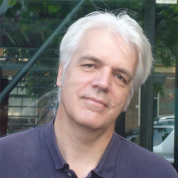

~~~
# ----------------------------------------
# Scales/preparing-projects.html
# ----------------------------------------
template = doc.getTemplate('home')
page = page.next
page.applyTemplate(template)  
page.name = 'Preparing projects'
page.url = 'Scales/preparing-projects.html'
box = page.select('Logo')
~~~

# DesignDesign.Space

~~~
box = page.select('Banner')
~~~

# Scales: Preparing projects

~~~
box = page.select('SlideShow')
box.transition = 'blind'
box.easing = 'ease'
~~~

~~~
box = page.select('Introduction0')
~~~

# Quoting a project? Working for a pitch?  

~~~ 
box = page.select('SlideSide')
~~~
Example study

## Choosing colors

How to design a coherent set of colors for a defined purpose, by managing the similarities and differences between colors? Which models to use? And what is the best process for the available time? 

The study *Choosing colors* learns students to design color palettes, in paint and digital tools. And the crossings between those media.

~~~
box = page.select('Main0')
~~~
<a name="S10"/>
## Study Thesis^10

Write a 2-page Thesis about your expected study.
Include title, images, summary, literature references and footnotes.
Sketch the layout and content in multiple scales, before anything else. Make many short cycles. Final presentation in **3 hours**

---

<a name="S20"/>
## Quoting a project^20

Making a quote for any project is fundamentally impossible. Yet, that is what most customers require for designers to get the assignment. 

The solution to the problem is to run the entire project in simulation mode. In your head and on paper, Alone and with others. Based on experience of similar projects and activities. What needs to be done in what order? How do you estimate the time that others will be spending on the projects? The answer: talk to them.

<a name="S20a"/>
### Describe an imaginary design project^20a

Break the project down into parts and estimate them separately. Remember that designers always guess too optimistic. Reality is that everything designers do, takes more time than planned. On the other hand, if you would count all the time that they **want**, you’ll never get to a competing quote. Where is the realistic balance?

Then assemble the parts back into a total estimate for the projects, still showing hours and costs for the individual parts. Try to find out how close or far-off that total is from projects by other designers. And verify with your customer, if that amount is according to the budget.

Iterate if the amount is too different. Yes: Making a competing project estimate and planning is a design process in itself. **3 hours**

~~~
# ----------------------------------------
# Scales/preparing-projects.html
# ----------------------------------------
template = doc.getTemplate('home')
page = page.next
page.applyTemplate(template)  
page.name = 'Sketching'
page.url = 'Scales/sketching.html'
box = page.select('Logo')
~~~

# DesignDesign.Space

~~~
box = page.select('Banner')
~~~

# Scales: Sketching

~~~
box = page.select('SlideShow')
box.transition = 'blind'
box.easing = 'ease'
~~~

~~~
box = page.select('Introduction0')
~~~

# Starting a project? Digital too slow? 

~~~
box = page.select('Main0')
~~~
<a name="S105"/>
## Paint a 3-step gray scale^105
Paint (using guache) a 3-step gray scale (white, middle, black) in three connected rectangles of 60x30mm each. The gray should appear to balance between the white and black. Make multiple iterations, pick the best. Show others and ask if they see visual breaks. **2 hours**

<a name="S105a"/>
### Paint a 5-step gray scale^105a
First do Scale-105. Then paint two more rectangles to make the range (white, light, middle, dark, black). The range should appear as smooth . Make multiple iterations, pick the best. Show others and ask if they see visual breaks. **2 hours**

<a name="S105b"/>
### Paint a 9-gray scale^105b
First do Scale-105 and Scale-105a. Then paint 4 more, which grayness fits between the 5 previous rectangles. Make multiple iterations, pick the best. Show others and ask if they see visual breaks. **2 hours**

---

<a name="S161"/>
## Sketch in volume^161
Buy an empty new Moleskin and a fresh black pencil. Select a event from the newspaper, research the topic and collect relevant data. Sketch an info-graphic that explains the event. Repeat for each of the pages of your sketch book. Evaluate with others to select the 3 best. **1 week**

<a name="S161a"/>
### Planning and evaluation^161a
Do Scale-161. Write a 2-page Thesis about the process, answering questions that address planning (all pages filled?) in relation to the management and level of details. Why do you think the selected 3 are the best? **5 hours**

~~~
# ----------------------------------------
# Scales/preparing-projects.html
# ----------------------------------------
template = doc.getTemplate('home')
page = page.next
page.applyTemplate(template)  
page.name = 'Research'
page.url = 'Scales/research.html'
box = page.select('Logo')
~~~

# DesignDesign.Space

~~~
box = page.select('Banner')
~~~

# Scales: Research

~~~
box = page.select('SlideShow')
box.transition = 'blind'
box.easing = 'ease'
~~~

~~~
box = page.select('Introduction0')
~~~

# Who is Bertin? Math in design? Analyze the parameters. Study grids. The history of publishing: what is next?

~~~ 
box = page.select('Main0')
~~~
<a name="S230"/>
## Bertin and design^230
Study the connection between Bertin and design. Sketch info-graphics that show his 7 parameters. Write a 3-page Thesis with the result. Design a method to validate your work. **3 days**

<a name="S230a"/>
### Bertin and time^230a
Do Scale-208. Now add “time”, not as an 8th parameter, but as 2nd dimension: Research and name the characteristic of each parameter when changing in time. Write a 3-page Thesis with the result. Design a method to validate your work. **3 days**

---

<a name="S240"/>
## Research recursion^240
Research the role of **recursion** in design. Aim for the widest ranges of examples and relate them by this principle. Write a 2-page Thesis with the result. Design an evaluation method for a feedback and apply it. **1 day**

---

<a name="S260"/>
## Integers^260
Research number sequences at [https://oeis.org](https://oeis.org). Write a 2-page Thesis about a sequence of your choice. Include images of sketches how it could be used in graphic design. Make multiple short cycles. Final presentation in **5 hours**

<a name="S260a"/>
### Thesis process^260a
Do [Scale-260](#S260). Write a 2-page Thesis about the process you went through. What were the cycles like? And based on what did you select from options? Did you manage in 5 hours? Add a graph of the planning. **5 hours**

---

<a name="S270"/>
## Analyze a design^270
Select a design you made before. Make a list of all typograhic parameters: as values and how they relate. Write a 2-page Thesis. Get a feedback. **2 days**

<a name="S270a"/>
### Improve by numbers^270a
Exercise [Scale-260](#260) as start. Decide what aspects of the design could be improved and express them as numbers and algorithmic relations. Make new versions in multiple fast cycles. Design a method for feedback. **2 days**

---

<a name="S274"/>
## Grids^274
See also [Scale-730](scales-design-education-700.html#730) and [Scale-730](scales-design-education-700.html#731) and relate the result to the use of grids in history. Write a 5-page Thesis with the result. Make multiple short cycles. Design a method for feedback by others. **5 days**

~~~
# ----------------------------------------
# Scales/programming-coding.html
# ----------------------------------------
template = doc.getTemplate('home')
page = page.next
page.applyTemplate(template)  
page.name = 'Programming & coding'
page.url = 'Scales/programming-coding.html'
box = page.select('Logo')
~~~

# DesignDesign.Space

~~~
box = page.select('Banner')
~~~

# Scales: Programming & coding

~~~
box = page.select('SlideShow')
box.transition = 'blind'
box.easing = 'ease'
~~~

~~~
box = page.select('Introduction0')
~~~

# Difference between programming and coding. Generative design. 

~~~ 
box = page.select('Main0')
~~~
<a name="S420"/>
## Automate optical size^420
Frist exercise [Scale-1002a](#1002a) Take the measured values and write an algorithm that generates optical circles and squares for sizes of squares. Is the result linear to the size? **1 day**

---

<a name="S450"/>
## Generative identities^450
First do [Scale-1208](#1208). Write PageBot elements that generate corporate identities, using the principle of coherency and diversity. Make multiple short complete cycles. Design methods to evaluate the results. **1 week**

---
<a name="S460"/>
## Analyze and generate a design^460
First exercise [Scale-260](#260). Take the list of parameters with their bandwidth of values
Write a DrawBot/PageBot script that re-creates your design. Or comes close. **3 days**

<a name="S460"/>
### User-Interface on your generated design^460a
First exercise [Scale-460](#460). Write the code for a UI-app that allows users to generate alternative versions of your design in a controlled set of options. **2 days**

~~~
# ----------------------------------------
# Scales/design-education.html
# ----------------------------------------
template = doc.getTemplate('default')
page = page.next
page.applyTemplate(template)  
page.name = 'Design education'
page.url = 'Scales/design-education.html'
box = page.select('Logo')
~~~

# DesignDesign.Space

~~~
box = page.select('Banner')
~~~

# Scales: Design education

~~~
box = page.select('SlideShow')
box.transition = 'blind'
box.easing = 'ease'
~~~

~~~
box = page.select('Introduction0')
~~~

# How to educate design? 

~~~ 
box = page.select('Main0')
~~~
<a name="S730"/>
## Educating grids for print^730
Write a script (DrawBot/PageBot) that generates variations of grids for print. Use them in an educational context. Design a method to validate the result with a group. **1 day**

---

<a name="S731"/>
## Educating grids for web^731
Write a script (DrawBot/PageBot) that generates variations of grids for CSS. Use them in an educational context. Design a method to validate the result with a group. **1 day**

---

<a name="S740"/>
## Educate exhibition design^740
First do [Scale-1320](#S1320). Write a 5-page Theses about the process to be used for teaching purposes. Design a method to evaluate the result with students. Make multiple iterations. **1 day**

---

<a name="S760"/>
## Make student sketch out a timeline for their carreer^760

What medium would you choose? What would the iterations of such  a process look like? What would they present at then end of the day? And how could those results be verified to some extend?
**1 day** 

---

<a name="S790"/>
## Design a workshop about Graphic Design^790

Design a 5-day workshop addressing the profession of Graphic Design. What skills and knowledge should students get to be a designer for the rest of their professional lives? Also design a method for feedback: how good is your workshop?

~~~
# ----------------------------------------
# Scales/type-design.html
# ----------------------------------------
template = doc.getTemplate('default')
page = page.next
page.applyTemplate(template)  
page.name = 'Type design'
page.url = 'Scales/type-design.html'
box = page.select('Logo')
~~~

# DesignDesign.Space

~~~
box = page.select('Banner')
~~~

# Scales: Type design

~~~
box = page.select('SlideShow')
box.transition = 'blind'
box.easing = 'ease'
~~~

~~~
box = page.select('Introduction0')
~~~

# Type design? 

~~~ 
box = page.select('Main0')
~~~
<a name="S1002"/>
## Optical circle size^1002 

*[[Sketch, look from a distance, measure, sketch again]]*

Draw a filled black square on white background of 6x6 centimeter. Draw a filled circle and triangle (flat side below) on the same baseline, that appear to have the same size as the circle. **1 hour**

<a name="S1002a"/>
### Optical circle sizes^1002a

Start with Scale-1002. Validate the result with a group who did the same, viewing them from a distance. Reject the circles and triangles that are unanimous too small or too large. Measure the remains and conclude the range of optical sizes. **1 hour**

<a name="S1002b"/>
### Optical size for outlines^1002b

Start with Scale-1002 and Scale-1002a, but now all shapes are drawn as black outline of 5mm, white inside. Is their optical size still the same? Discuss and explain the result with the group. **1 hour**

<a name="S1002c"/>
### Find an equation for circle overshoot, comparing to the size of a square^1002c
Write an algorythm that does the circle overshoot calculation. Write a Python script that draws the square, circle and triangle. **3 hours**

~~~
# ----------------------------------------
# Scales/typography.html
# ----------------------------------------
template = doc.getTemplate('default')
page = page.next
page.applyTemplate(template)  
page.name = 'Typography'
page.url = 'Scales/typography.html'
box = page.select('Logo')
~~~

# DesignDesign.Space

~~~
box = page.select('Banner')
~~~

# Scales: Typography

~~~
box = page.select('SlideShow')
box.transition = 'blind'
box.easing = 'ease'
~~~

~~~
box = page.select('Introduction0')
~~~

# Searching for the best values for nice typography? The hidden measures of a book? Or the metrics that drives web-pages? 

~~~ 
box = page.select('Main0')
~~~
<a name="S1120"/>
## Parameters of an existing book^1120

Select the spread of an existing book, containing a certain complexity of typography and image. Scan the spread pages and use that file as a layer in InDesign. Try to rebuild the exact same layout, guessing measures and values. Make a spreadsheet of all values used. **1 day**

---

<a name="S1121"/>
## Parameters of an existing magazine^1121

Select the spread of an existing magazine, containing a certain complexity of typography. Scan the spread pages and use that file as a layer in InDesign. Try to rebuild the exact same layout, guessing measures and values. Make a spreadsheet of all values used. **1 day**

---

<a name="S1180"/>
## Regenerate book pages^1180

Do [Scale-1120](#S1220). Write a script that generates the spread pages of the book, using DrawBot and PageBot. Then assemble the values to reverse-engineer their relation. Generate similar pages, based on the same algorythms. **2 days**

---

<a name="S1181"/>
## Parameters magazine pages^1181

*[[PageBot output for intermediate versions of a design.]]*

Do [Scale-1121](#S1121). Write a script that generates some spread pages of the magazine, using DrawBot and PageBot. The review the value found and formulate the overall rules. Generate new - yet similar – pages, based on the same algorythms. **Take 2 days to iterate**

~~~
# ----------------------------------------
# Scales/design-identities.html
# ----------------------------------------
template = doc.getTemplate('default')
page = page.next
page.applyTemplate(template)  
page.name = 'Identities'
page.url = 'Scales/identities.html'
box = page.select('Logo')
~~~

# DesignDesign.Space

~~~
box = page.select('Banner')
~~~

# Scales: Design of identities

~~~
box = page.select('SlideShow')
box.transition = 'blind'
box.easing = 'ease'
~~~

~~~
box = page.select('Introduction0')
~~~

# Identities? 

~~~ 
box = page.select('Main0')
~~~

## Design models^1308

*[[XXXXX Caption here]]*

Design some models for the design process of corporate identities.

Use the balance between coherency and diversity and basic principle.

Design the best method for presentation and evaluation. Make short cycles. **1 day**

## <a name="#S1320"/>Design Identity???? 

## TypeCooker identity^1340

Select a fictional company or product. Open Erik van Blokland’s [TypeCooker](http://typecooker.com). 

Select a random recipe and use it to draw a logo. Design an evaluation method for the results others and apply it. Make multiple short cycles. **1 day**

~~~
# ----------------------------------------
# Scales/publications.html
# ----------------------------------------
template = doc.getTemplate('default')
page = page.next
page.applyTemplate(template)  
page.name = 'Publications'
page.url = 'Scales/publications.html'
box = page.select('Logo')
~~~

# DesignDesign.Space

~~~
box = page.select('Banner')
~~~

# Scales: Design of publications

~~~
box = page.select('SlideShow')
box.transition = 'blind'
box.easing = 'ease'
~~~

~~~
box = page.select('Introduction0')
~~~

# Design of publications? 

~~~ 
box = page.select('Main0')
~~~

## Design a book exhibition^1420

Choose a book. Design an exhibition about the content.

Make models 1:10. Make movies as presentation. Design a method to validate the result with a group. **5 hours**

## Design a news exhibition^1421

Choose a topic from the news. Research and collect data. Design an exhibition about the result. 

Make models 1:10. Make movies as presentation. Design a method to validate the result with a group. **1 day**

~~~
# ----------------------------------------
# about.html
# ----------------------------------------
template = doc.getTemplate('default')
page = page.next
page.applyTemplate(template)  
page.url = 'about.html'
page.name = 'About'
box = page.select('Logo')
~~~

# DesignDesign.Space

~~~
box = page.select('Banner')
~~~
# Contact us to try a free initial hangout

~~~
box = page.select('SlideShow')
box.transition = 'blind'
box.easing = 'ease'
~~~

<!--

-->

~~~ 
box = page.select('SlideSide')
~~~
Example study

## Choosing colors

How to design a coherent set of colors for a defined purpose, by managing the similarities and differences between colors? Which models to use? And what is the best process for the available time? 

The study *Choosing colors* learns students to design color palettes, in paint and digital tools. And the crossings between those media.

~~~
box = page.select('Main0')
~~~

# Contact

* [designdesign.space](designdesign.space)
* [info@designdesign.space](mailto:info@designdesign.space?subject=DesignDesign.Space%20Study%20Information)

# About this site

This site is generated by [PageBot](https://GitHub.com/PageBot/PageBot/blob/master/README.md)

# Links

* [typetr.typenetwork.com](typetr.typenetwork.com)
* [upgrade.typenetwork.com](upgrade.typenetwork.com)
* [bitcount.typenetwork.com](bitcount.typenetwork.com)

# Trademarks

PageBot®, DesignDesign.Space®, Upgrade®, Bitcount® and PowerLift® are 2017+ registered trademarks by Buro Petr van Blokland + Claudia Mens, Delft, The Netherlands. 

~~~
box = page.select('Side00')
~~~

* **Petr van Blokland**
* E-mail [buro@petr.com](mailto:buro@petr.com) 
* Mobile +31 6 24 219 502
* Line +31 15 887 1233 
* Snail-mail: Rietveld 56, 2611 LM Delft, NL
* Twitter @petrvanblokland
* [Instagram: TYPETR/PetrvanBlokland](https://www.instagram.com/petrvanblokland/)

~~~
box = page.select('Side01')
~~~

* **Claudia Mens** 
* E-mail [claudia@petr.com](mailto:claudia@petr.com) 
* Mobile +31 6 41 367 689
* Line +31 15 887 1233
* Snail-mail: Rietveld 56, 2611 LM Delft, NL
* Twitter @claudiamens
* [Instagram PepperAndTom](https://www.instagram.com/pepperandtom)

