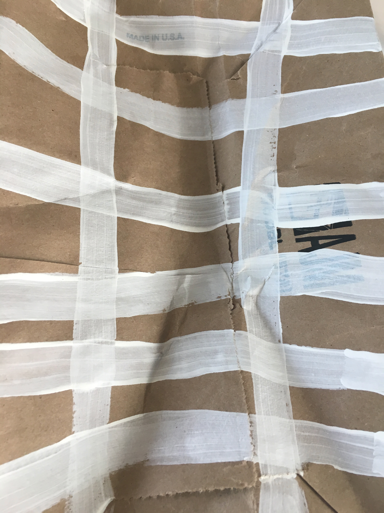
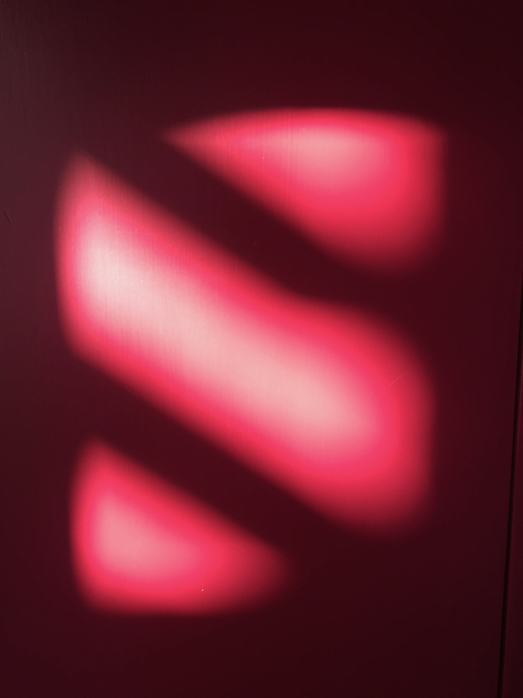
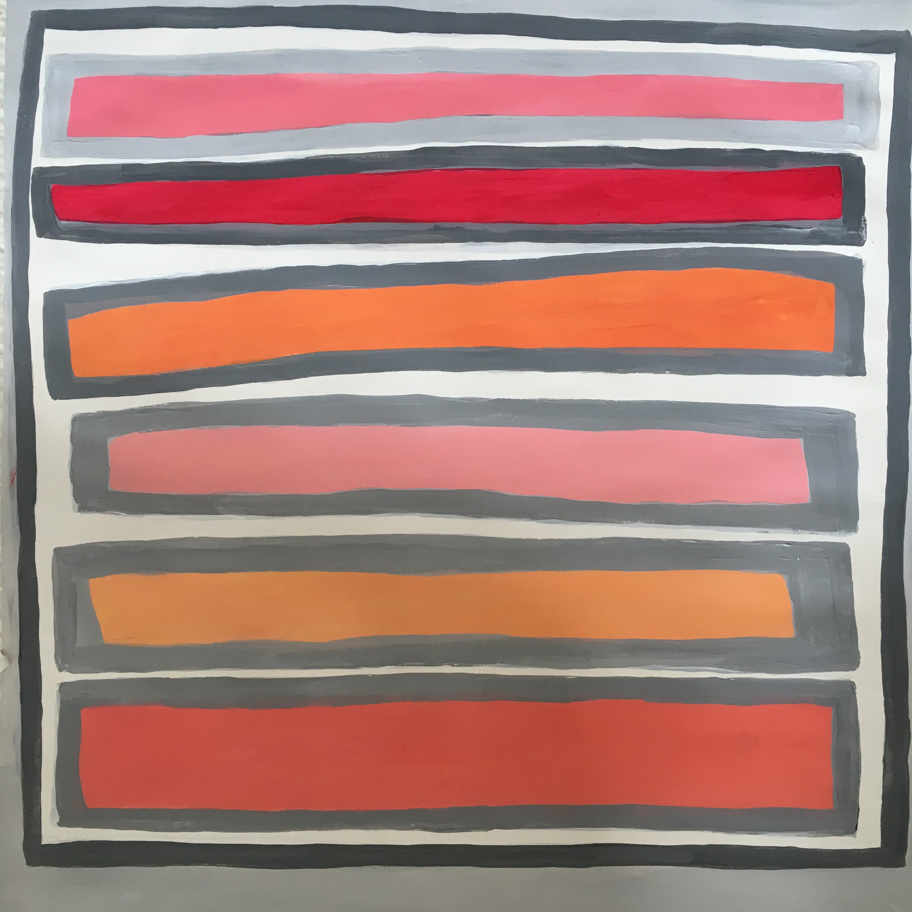
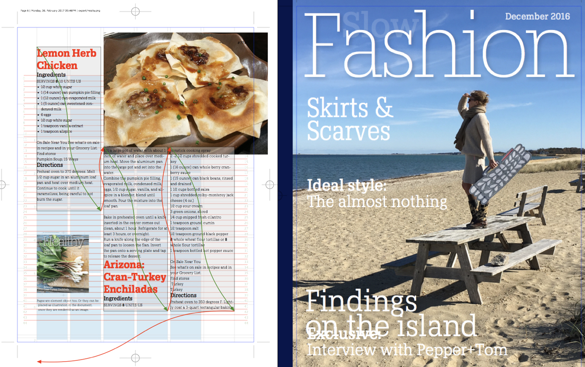

~~~
doc.title = 'Design&nbsp;Design&nbsp;Space'

doc.footerHtml = """Let us know what you think. Do you have any questions for us? <a href="mailto:info@designdesign.space?subject=Tell me more about DesignDesign.Space">info@designdesign.space</a>"""

# Uncomment to see cssId/cssClass markers in the page
#doc.view.showIdClass = True

# Home 
#	Header 
#		Logo (+BurgerButton)
#		Navigation/TopMenu/MenuItem(s)
#  		Banner
#  		SlideShow (on Home)
#      	Slides
#      	SlideSide
#	Introduction0
#	Content0
#      Main0
#      Side00
#      Side01
#      Side02
#      Side03
#	Introduction1
#	Content1
#      Main1
#      Side10
#      Side11
#      Side12
#      Side13
#	Footer
#
# ----------------------------------------
# index.html
# ----------------------------------------
page.name = 'Home'
page.url = 'index.html'
box = page.select('Logo')
~~~

# DesignDesign.Space

~~~
box = page.select('Banner')
~~~
# Which study can we offer you in 2019?
~~~
box = page.select('SlideShow')
#box.transition = 'blind'
#box.easing = 'ease'
~~~



~~~ 
box = page.select('SlideSide')
~~~
### Example studies

## Develop your process. Expand your skills.

One of the important tasks in any design process is to create structure from chaos. Grouping objects by similar characteristics or behavior. Sorting by height? Or is it better to create order by color?

<!--
The study *Making structure from chaos* learns students to design parameters – like size, color, position, texture, value – weigh their values to fit the needs. In a sketch process and as final presentation. Following individual style preferences while matching with requirements of the user. 
-->

~~~
box = page.select('Introduction0')
~~~

# [Discover the basics of typedesign?](studies-typedesign.html#discover-basics-of-typedesign) Improving your sketching techniques? Programming pages? Learning to code? Mastering typography? Starting a studio? And more!

~~~
box = page.select('Main0')
~~~
## It all happens in DesignDesign.Space studies

If you tell us what you want to study in a first free online hangout, we make suggestions. What would you like to achieve? Improve your latent coding skills, while training your self-discipline? Seeking a sparring partner for an interesting new design project? Updating your technical skills? Or do you simply need a refreshing break from design practice? 

---
## DesignDesign.Space as coach

**DesignDesign.Space** can help you to answer these questions and to achieve your goals. Coaching you through your study, the teachers can ask the toughest questions. And they also are available to help you answering them: If you are happy with the design you have finally finished, what exactly are you happy with? How does that fit the expectations of the user? And how would you get there next time?

[See more about pricing here.](pricing.html)

~~~
box = page.select('Side00')
~~~
## How studies work

* During a first free hangout, we can talk about possible goals.
* Together, we will find a way for you to get there. Topics & Tools. By painting, drawing, sketching or by coding. Or by using all.
* In sequences of relative short assignments, online hangouts, feedback and reflections, we explore the paths through your study project. And more important, we’ll teach you how to do that yourself.
* The journey can take a day. Or a week. A month. A year. Whichever fits your goals, time and resources. And, of course, the level of details that you need. 
* If your plans change along the way, that can always be discussed.

[See more about pricing here.](pricing.html)

~~~
box = page.select('Introduction1')
~~~

# XXXXXXX
~~~
box = page.select('Main1')
~~~

## What is your design space?

~~~
"""

*[[Making a successful design, it helps thinking backwards. By understanding what it is supposed to do. Not by hoping for the ultimate **lucky shot**.]]*
"""
~~~

**DesignDesign.Space** offers a wide variety of study topics: ranging from graphic design to type design, typography, programming, identities, 3D and education.

---
## Other study suggestions

* [Type design](studies-typedesign.html)
* [Typography](studies-typography.html)
* [Graphic design](studies-graphicdesign.html)
* [Design spaces](studies-designspaces.html)
* [Design practice](studies-designpractice.html)
* [Design education](studies-designeducation.html)

~~~
box = page.select('Side10')
~~~
## Challenge us

We are educators and we are designers too. That means we are open for suggestions about our teaching and the program. For us, teaching is as much of a challenge as any design process. Send us your questions on topics that we never thought about before. How can this website be improved? Lure us into teaching you in a different way than this website suggests. We will probably take the challenge.

~~~
# ----------------------------------------
# Studies/2019-studies.html
# ----------------------------------------
template = doc.getTemplate('default')
page = page.next
page.applyTemplate(template)  
page.name = 'Studies'
page.url = 'studies.html'
box = page.select('Logo')
~~~

# DesignDesign.Space

~~~
box = page.select('Banner')
~~~
# Examine the 2019 study suggestions

~~~
box = page.select('SlideShow')
#box.transition = 'blind'
#box.easing = 'ease'
~~~




~~~ 
box = page.select('SlideSide')
~~~
Example study

## Making structure from chaos

One of the important tasks in any design process is to create structure from chaos. Grouping objects by similar characteristics or behavior. Sorting by height? Or is it better to create order by color?

The study *Making structure from chaos* learns students to design those parameters and weigh their values to fit the needs. In a sketch process and as final presentation. Following individual style preferences while matching with requirements of the user. 

~~~
box = page.select('Introduction0')
~~~

# Redesign your current design process? Methods for rapid prototyping? Redo your interior? How to educate customers? Directions for design education?

~~~
box = page.select('Main0')
~~~
# Studies in 2019

We keep improving the curriculum. The mandatory design of design education. Instead of the fixed [2018](2018-program.html) list of workshops, studies and dates, in practice, we found out that it is better to make the schedule entirely flexible. Hints of topics, templates of studies and suggestions for the process behind.

---
## Pricing

Each lesson is an online hangout, lasting for part of the day – morning or afternoon – depending on your timezone. The pricing is based on the length and intensity of a study. 

If a study is spread over a longer period time, intensity can be lower for the same price. However, it requires more self-discipline for a student to take full advantage of the study and the support we can offer.

[See more about pricing here.](pricing.html)

---

## Other study suggestions

* [Type design](studies-typedesign.html)
* [Typography](studies-typography.html)
* [Graphic design](studies-graphicdesign.html)
* [Design spaces](studies-designspaces.html)
* [Design practice](studies-designpractice.html)
* [Design education](studies-designeducation.html)

~~~
# ----------------------------------------
# Studies/2019 Studies/typedesign.html
# ----------------------------------------
template = doc.getTemplate('default')
page = page.next
page.applyTemplate(template)  
page.name = 'Type design'
page.url = 'Studies/typedesign.html'
box = page.select('Logo')
~~~

# DesignDesign.Space
~~~
box = page.select('Banner')
~~~

## Study suggestions
# Study typedesign 
~~~
box = page.select('SlideShow')
#box.transition = 'blind'
#box.easing = 'ease'
~~~




~~~ 
box = page.select('SlideSide')
~~~
### Example study

## Making structure from chaos

One of the important tasks in any design process is to create structure from chaos. Grouping objects by similar characteristics or behavior. Sorting by height? Or is it better to create order by color?

The study *Making structure from chaos* learns students to design those parameters and weigh their values to fit the needs. In a sketch process and as final presentation. Following individual style preferences while matching with requirements of the user. 

~~~
box = page.select('Introduction0')
~~~

# Learning to code? Discover the basics of typedesign? Improving your sketching techniques? Programming pages? Mastering typography? 

~~~
box = page.select('Main0')
~~~

## Live coaching of your (type)design project

You have a challenging complex design project to work on. It is really interesting and rewarding, but it is hard to get planning and quality under control. Especially if the project runs over a longer period of time.
How coaching is organized, depends on your needs. It can be a single lesson for support, while writing the quote, up to helping you with management and feedback of the entire project. 

* Initial online hangout, free of charge.
* A single lesson for a whole day, **$190** per student
* Or a week of exercises and 3 lessons (1+ hour each), **$490** per student
* Or an extended month of exercises and 8 lessons (2+ hours each), **$1.900** per student
* Daily feedback by e-mail on results for the duration of the study
* Document sharing and versioning through GitHub
* Design principles for planning, the process, methods for feedback and testing criteria 

---

## <a name="discover-basics-of-typedesign"/>Discover the basics of typedesign

Type design is not your main background, but as designer you often are in situation that it would be good knowing more about it. When selecting a typeface for one of your designs. Or when you need to explain to a client. It is possible to read about it. But it’s a lot more efficient learning how to write and draw by yourself.

* Initial online hangout, free of charge.
* A single lesson, **$190** per student
* Or a week of exercises and 3 lessons (1+ hour each), **$490** per student
* Daily feedback by e-mail on results for the duration of the study
* Document sharing and versioning through GitHub
* Design principles for planning, the process, methods for feedback and testing criteria 

---

## Automated proofing and specimens

Learn the basics of scripting proofs and specimens for TTF, OTF and UFO. Sketching techniques for layouts. Patterns of Python code. How to disassemble the design of specimens into parts that can be automated. Writing some templates that are directly useful for you. 

* A single lesson, **$190** per student
* Or week of exercises and 3 lessons (1+ hour each), **$490** per student
* Or an extened month of exercises and 8 lessons (2+ hours each), **$1.900** per student
* Daily feedback by e-mail on results for the duration of the study
* Document sharing and versioning through GitHub
* Design principles for planning, the process, methods for feedback and testing criteria 

---

## Automated QA for typedesigners

Learn the basics of scripting testing the quality of TTF, OTF and UFO during the design process. Patterns of Python code. Anaysis of mistakes and errors. How to detect and possibly solve them automatically by running scripts.

* A single lesson, **$190** per student
* Or week of exercises and 3 lessons (1+ hour each), **$490** per student
* Or an extened month of exercises and 8 lessons (2+ hours each), **$1.900** per student
* Daily feedback by e-mail on results for the duration of the study
* Document sharing and versioning through GitHub
* Design principles for planning, the process, methods for feedback and testing criteria 

---

## Latin typedesign for (non-Latin) typedesigners

Learn the basics of Latin type. Sketching techniques. Principles of contrast. Weight and width. Relations and differences. The design process of Variable Fonts. Selection of tools. Scripting that can be automated. Models to differentiate between best practice and artibtrary design choices.

* Initial online hangout, free of charge.
* A month of exercises and 8 lessons (2+ hours each), **$1.900** per student
* Daily feedback by e-mail on results for the duration of the study
* Document sharing and versioning through GitHub
* Design principles for planning, the process, methods for feedback and testing criteria 

---

## Scripting for (Latin and non-Latin) typedesigners

Learn the basics of scripting for the editing tool that you are familiar with (RoboFont, Glyphs or FontLab). Sketching techniques. Patterns of Python code. How to disassemble a design problem into parts that can be automated. Writing some tools that are directly useful for you. Finding methods and directions for new tools, without the help of DDS.

* Initial online hangout, free of charge.
* A month of exercises and 8 lessons (2+ hours each), **$1.900** per student
* Daily feedback by e-mail on results for the duration of the study
* Document sharing and versioning through GitHub
* Design principles for planning, the process, methods for feedback and testing criteria 

---

## Design the design process of Variable Fonts

*[[Sketching on design spaces.]]*

How do you get your design process beyond the traditional Variable Font axes of weight, width and optical size? How to make your experience grow from Multiple Master Thinking into Variable Font thinking? Develop sketching techniques. Make the production and testing of Variable Fonts to be included inside the cycles of your design process.

* Initial online hangout, free of charge.
* A week of exercises and 3 lessons (1+ hour each), **$490** per student
* Daily feedback by e-mail on results for the duration of the study
* Document sharing and versioning through GitHub
* Design principles for planning, the process, methods for feedback and testing criteria 

---

## Other study suggestions

* [Type design](studies-typedesign.html)
* [Typography](studies-typography.html)
* [Graphic design](studies-graphicdesign.html)
* [Design spaces](studies-designspaces.html)
* [Design practice](studies-designpractice.html)
* [Design education](studies-designeducation.html)

~~~
# ----------------------------------------
# Studies/2019 Studies/typography.html
# ----------------------------------------
template = doc.getTemplate('default')
page = page.next
page.applyTemplate(template)  
page.name = 'Typography'
page.url = 'Studies/typography.html'
box = page.select('Logo')
~~~

# DesignDesign.Space
~~~
box = page.select('Banner')
~~~
## Study suggestions
# Typography 
~~~
box = page.select('SlideShow')
#box.transition = 'blind'
#box.easing = 'ease'
~~~




~~~ 
box = page.select('SlideSide')
~~~
Example study

## Making structure from chaos

One of the important tasks in any design process is to create structure from chaos. Grouping objects by similar characteristics or behavior. Sorting by height? Or is it better to create order by color?

The study *Making structure from chaos* learns students to design those parameters and weigh their values to fit the needs. In a sketch process and as final presentation. Following individual style preferences while matching with requirements of the user. 

~~~
box = page.select('Introduction0')
~~~

# Learning to code? Discover the basics of typedesign? Improving your sketching techniques? Programming pages? Mastering typography? 

~~~
box = page.select('Main0')
~~~

---

## Other study suggestions

* [Type design](studies-typedesign.html)
* [Typography](studies-typography.html)
* [Graphic design](studies-graphicdesign.html)
* [Design spaces](studies-designspaces.html)
* [Design practice](studies-designpractice.html)
* [Design education](studies-designeducation.html)

~~~
# ----------------------------------------
# Studies/2019 Studies/graphicdesign.html
# ----------------------------------------
template = doc.getTemplate('default')
page = page.next
page.applyTemplate(template)  
page.name = 'Graphic design'
page.url = 'Studies/graphicdesign.html'
box = page.select('Logo')
~~~

# DesignDesign.Space
~~~
box = page.select('Banner')
~~~
## Study suggestions
# Graphic design 
~~~
box = page.select('SlideShow')
#box.transition = 'blind'
#box.easing = 'ease'
~~~




~~~ 
box = page.select('SlideSide')
~~~
### Example study

## Making structure from chaos

One of the important tasks in any design process is to create structure from chaos. Grouping objects by similar characteristics or behavior. Sorting by height? Or is it better to create order by color?

<!--
The study *Making structure from chaos* learns students to design those parameters and weigh their values to fit the needs. In a sketch process and as final presentation. Following individual style preferences while matching with requirements of the user. 
-->

~~~
box = page.select('Introduction0')
~~~

# Learning to code? Discover the basics of typedesign? Improving your sketching techniques? Programming pages? Mastering typography? 

~~~
box = page.select('Main0')
~~~

## Visual grammar for graphic designers

Disassemble your graphic design into parameters, models and methods. Why do you choose a color or a typeface? How to separate **this one** from **this kind of**, when making a series of covers, or different types of publications within one identity.

* A month of exercises or more and 8 lessons (2+ hours each), **$1.900** per student
* Daily feedback by e-mail on results for the duration of the study
* Document sharing and versioning through GitHub
* Design principles for planning, the process, methods for feedback and testing criteria 

---

## Info-graphics: The design of automated designs

Design systems that generate info-graphics. For online use and for print. How do you bridge the gap between (big) databases, the design of templates using high level typographic standards, scriptable illustration techniques and applications for automated output. Using DrawBot, PageBot and current web technologies. 

* A month of exercises or more and 8 lessons (2+ hours each), **$1.900** per student
* Daily feedback by e-mail on results for the duration of the study
* Document sharing and versioning through GitHub
* Design principles for planning, the process, methods for feedback and testing criteria 

---

## Scripting the design of printed publications

*[[Designing parameters that represent the principles of layout, typography and imaging is the main focus for this study. These pages where created by PageBot scripts.]]*

Design systems that generate books, magazines, newspapers, brochures, manuals or catalogues. Intended for print. How do you bridge the gap between unpredictable content, sketching design rules, the design of templates that use high level typographic standards, scriptable illustration techniques and applications for automated output. Using DrawBot and PageBot (for OSX and Linux platforms).

* A month of exercises or more and 8 lessons (2+ hours each), **$1.900** per student
* Daily feedback by e-mail on results for the duration of the study
* Document sharing and versioning through GitHub
* Design principles for planning, the process, methods for feedback and testing criteria 

---

## Scripting the design of online publications

*[[Any design process benefits from short iterations, prototyping and the merging of disciplines. Web design is not different.]]*
 
Design systems that generate applications, documents and websites, intended for online usage. How do you bridge the gap between unpredictable content, sketching design rules, the design of templates that use high level typographic standards, scriptable illustration techniques and applications for automated output. Using DrawBot and PageBot, generating HTML/CSS/Javascript (for OSX and Linux platforms).

* A month of exercises or more and 8 lessons (2+ hours each), **$1.900** per student
* Daily feedback by e-mail on results for the duration of the study
* Document sharing and versioning through GitHub
* Design principles for planning, the process, methods for feedback and testing criteria 

---

## Identity design: Branding with and without the use of logos

*[[The “traditional” set of branding parameters.]]*

*[[The xxxxxx for branding can be part of the design process.]]*

Design parametric models for an identity. Which parameters create the visual coherency? And which parameters are diverse, without the need to specify? Is that always the same list? If not, what is the best selection for a particular brand?
How to write scripts to automate (parts of) the models for your parameters testing.

* A month of exercises or more and 8 lessons (2+ hours each), **$1.900** per student
* Daily feedback by e-mail on results for the duration of the study
* Document sharing and versioning through GitHub
* Design principles for planning, the process, methods for feedback and testing criteria 

---

## Choosing a typedesign

What are the criteria for choosing the best typedesign for a particular graphic design project? 

* A week of exercises and 3 lessons (1+ hour each), **$490** per student
* Daily feedback by e-mail on results for the duration of the study
* Document sharing and versioning through GitHub
* Design principles for planning, the process, methods for feedback and testing criteria 

---

## Python scripting for graphic designers

Learn the basics of scripting your graphic design process. Sketching techniques. Decide what can be automated and what not. Patterns of Python code, using DrawBot and PageBot. Connect to InDesign. Parameters for magazines, websites, exhibition spaces and corporate identities.  Develop models to differentiate between best practice and arbitrary design choices.

* A month of exercises or more and 8 lessons (2+ hours each), **$1.900** per student
* Daily feedback by e-mail on results for the duration of the study
* Document sharing and versioning through GitHub
* Design principles for planning, the process, methods for feedback and testing criteria 

---

## Other study suggestions

* [Type design](studies-typedesign.html)
* [Typography](studies-typography.html)
* [Graphic design](studies-graphicdesign.html)
* [Design spaces](studies-designspaces.html)
* [Design practice](studies-designpractice.html)
* [Design education](studies-designeducation.html)

~~~
# ----------------------------------------
# Studies/2019 Studies/designspaces.html
# ----------------------------------------
template = doc.getTemplate('default')
page = page.next
page.applyTemplate(template)  
page.name = 'Design spaces'
page.url = 'Studies/designspaces.html'
box = page.select('Logo')
~~~

# DesignDesign.Space

~~~
box = page.select('Banner')
~~~

## Study suggestions
# Design spaces 

~~~
box = page.select('SlideShow')
#box.transition = 'blind'
#box.easing = 'ease'
~~~




~~~
box = page.select('Introduction0')
~~~

# Learning to code? Discover the basics of typedesign? Improving your sketching techniques? Programming pages? Mastering typography? 

~~~
box = page.select('Main0')
~~~

## Choosing colors

How to select a color or a color palette? What criteria matter in a given set of circumstances? How does material, medium and technique influence such a choice?
In a sequence of exercises the student will develop ways to look, measure and compare selected colors. 

* A week of exercises and 3 lessons (1+ hour each), **$490** per student
* A month or more of 8 lessons (2+ hours each), **$1.900** per student
* Daily feedback by e-mail on results for the duration of the study
* Document sharing and versioning through GitHub
* Design principles for planning, the process, methods for feedback and testing criteria 

---

## Creating an identity: the look and feel

Learn how to design a serie of visual components for an identity so the identity becomes a strong character. Designing the balance between coherency and diversity with a set of recognizable elements who will represent the brand optima forma. 
Sketching, making models and making presentations in all diferent stadia in the design process will be the main course of this program.

---

## How to organize structure in chaos

---
## Design an interior 

Design an interior, based on requirements, planning, budget and usage. What are the most important requirements and attributes? Development of sketching techniques, modelling and presentation. Design the process itself, alongside the interior. Special focus is on materials, color, textures and the usage of space. The interior could be your own studio space, as well a the target of an external design project.

* A week of exercises and 3 lessons (1+ hour each), **$490** per student
* A month or more of 8 lessons (2+ hours each), **$1.900** per student
* Daily feedback by e-mail on results for the duration of the study
* Document sharing and versioning through GitHub
* Design principles for planning, the process, methods for feedback and testing criteria 

---
## Design an exhibition

Design an exhibition space, based on requirements, planning, budget and usage. Development of sketching techniques, modelling and presentation. Design the process itself, alongside the interior. Special focus is on message, typography, layout, imaging, materials, color, textures and the usage of space. The exhibition could be your own spacial portfolio, as well as the target of an external design project.

* A week of exercises and 3 lessons (1+ hour each), **$490** per student
* A month or more of 8 lessons (2+ hours each), **$1.900** per student
* Daily feedback by e-mail on results for the duration of the study
* Document sharing and versioning through GitHub
* Design principles for planning, the process, methods for feedback and testing criteria 

---
## Design the environment

Whatever your environment is - physical, virtual and mental - that brings your creative thinking to the next level, you can make it focus for development and improvement.

Through a variety of exercises – writing, sketching, making an inventory of environmental aspects and talking with others – you'll experience new oportunities to get more grip on your environment.  

* A week of exercises and 3 lessons (1+ hour each), **$490** per student
* A month or more of 8 lessons (2+ hours each), **$1.900** per student
* Daily feedback by e-mail on results for the duration of the study
* Document sharing and versioning through GitHub
* Design principles for planning, the process, methods for feedback and testing criteria 

---

## Design your studio sandbox

Even design projects with a high degree of routine can benefit from built-in sandboxes. How to create them? How to make your own challenging hidden space?

* A week of 3 lessons (1+ hour each), **$490** per student
* A month or more of 8 lessons (2+ hours each), **$1.900** per student
* Daily feedback by e-mail on results for the duration of the study
* Document sharing and versioning through GitHub
* Design principles for planning, the process, methods for feedback and testing criteria 

---

## Other study suggestions

* [Type design](studies-typedesign.html)
* [Typography](studies-typography.html)
* [Graphic design](studies-graphicdesign.html)
* [Design spaces](studies-designspaces.html)
* [Design practice](studies-designpractice.html)
* [Design education](studies-designeducation.html)

~~~
# ----------------------------------------
# Studies/2019 Studies/designpractice.html
# ----------------------------------------
template = doc.getTemplate('default')
page = page.next
page.applyTemplate(template)  
page.name = 'Design practice'
page.url = 'Studies/designpractice.html'
box = page.select('Logo')
~~~

# DesignDesign.Space

~~~
box = page.select('Banner')
~~~

## Study suggestions
# Running a design practice

~~~
box = page.select('SlideShow')
#box.transition = 'blind'
#box.easing = 'ease'
~~~




~~~
box = page.select('Introduction0')
~~~

# Learning to code? Discover the basics of typedesign? Improving your sketching techniques? Programming pages? Mastering typography? 

~~~
box = page.select('Main0')
~~~

## Design of design models

Develop and select design methods. What is available beyond “scrum”? Which methods can you design for yourself, by scaling and managing details? Sketching and making of small scale models is such a technique: get an impression about your design choices at an early stage, without making the “real thing”.

* A week of 3 lessons (1+ hour each), **$490** per student
* Daily feedback by e-mail on results for the duration of the study
* Document sharing and versioning through GitHub
* Design principles for planning, the process, methods for feedback and testing criteria 

## Rapid prototyping for graphic designers

Learn to develop efficient and powerful prototyping techniques including manual sketching, digital tools and coding, with the goal of controlling the broadening and narrowing of options and directions a project may take.
Through sketching, hands-on practical exercises and presentations, you explore the process of making prototypes.
This study is a follow up on the **Design of design models**, but can be also joined separately.

* A week of 3 lessons (1+ hour each), **$490** per student
* Daily feedback by e-mail on results for the duration of the study
* Document sharing and versioning through GitHub
* Design principles for planning, the process, methods for feedback and testing criteria 

## Sketching techniques

Similar to the “Rapid Prototyping” workshop, this study addresses the management of details, too. The difference is the more extended focus on sketching skills, materials, coding and the visual language of scaled models.

* A month or more of 8 lessons (2+ hours each), **$1.900** per student
* Daily feedback by e-mail on results for the duration of the study
* Document sharing and versioning through GitHub
* Design principles for planning, the process, methods for feedback and testing criteria 

---

## Live coaching while starting your studio

You are working on starting your own studio. You just graduated or you have been working in a design studio for years and now it is time to start your own. It seems to be a promising, interesting and rewarding plan. But it is also hard to control planning, budget and clients fantasies. Especially if projects run over a longer period of time.
How coaching is organized, depends on your needs. It varies from a single lesson of support, while writing an initial quote, up to helping you with management and feedback of your entire project.

* A week of 3 lessons (1+ hour each), **$490** per student
* A month or more of 8 lessons (2+ hours each), **$1.900** per student
* Document sharing and versioning through GitHub
* Daily support and feedback on results for the duration of the study
* Design principles for planning, the process, methods for feedback and testing criteria 

---
 
## How to deal with customers?

Use cases, models, simulations, sketching and presentation techniques are the subject of this 3-lesson workshop on how to deal best with customers. Students are offered to think about planning in relation to what they charge for their designs. The workshop addresses the difference between cost and investment, leisure and learning, with special attention on the success of failure.

* A week of 3 lessons (1+ hour each), **$490** per student
* Document sharing and versioning through GitHub
* Daily support and feedback on results for the duration of the study
* Design principles for planning, the process, methods for feedback and testing criteria 

---

## Running a home studio with employees, while raising a family
 
Examples and cases from our own experience. What worked for us and what didn't. Points of view, excersices and feedback. The dilemma choose focus. Roles and rules. The choice of not working overtime. Employer or design? Friends or families. 
The workshop gives students a wide variety of strategies and scenarios. 

* A week of 3 lessons (1+ hour each), **$490** per student
* Document sharing and versioning through GitHub
* Daily support and feedback on results for the duration of the study
* Design principles for planning, the process, methods for feedback and testing criteria 

---

## Design of virtual studies and teaching online

With a total of 60 years of educating design, both in physical space, as well as in virtual environments, we can offer that experience as a topic of a study. How to design design education? Methods for feedback. What works in an online environment and what doesn’t? How to build layers of assignments? What is the goal? What is realistic?

* A week of 3 lessons (1+ hour each), **$490** per student
* A month or more of 8 lessons (2+ hours each), **$1.900** per student
* Document sharing and versioning through GitHub
* Daily support and feedback on results for the duration of the study
* Design principles for planning, the process, methods for feedback and testing criteria 

---

## Virtual sabbatical

You have been working as a designer for some years, employed by a studio or running your own. You have been really successful or a bit less, in any case, there is a moment in time to answer the question “What’s next?”. 

At the same time, you don’t think you have the age or freedom or financial resources to take a real sabbatical break and do a Master study abroad for 2 years. DesignDesign.Space offers the opportunity of doing a virtual sabbatical: studying new topics or deepen the ones that you already know in a challenging online environment, together with other students, who are seeking similar extensions to their professional career. How this is organized, depends on your needs and resources. 

* Initial online hangout, free of charge.
* A single lesson for a day: **$190** per student
* A week of 3 lessons (1+ hour each), **$490** per student
* A month or more of 8 lessons (2+ hours each), **$1.900** per student
* A season **$3.900**
* A year **Ask**
* Document sharing and versioning through GitHub
* Daily support and feedback on results for the duration of the study
* Design principles for planning, the process, methods for feedback and testing criteria 

---

## Other study suggestions

* [Type design](studies-typedesign.html)
* [Typography](studies-typography.html)
* [Graphic design](studies-graphicdesign.html)
* [Design spaces](studies-designspaces.html)
* [Design practice](studies-designpractice.html)
* [Design education](studies-designeducation.html)

~~~
box = page.select('Side00')
~~~

## Ask for info

Let us know by mail at [info@designdesign.space](mailto:info@designdesign.space?subject=Tell%20me%20more%20about%20DesignDesign.Space), if you are interested to study. We can discuss how that would work in a first free hangout online. Or tell us what other wishes that are related to design or education you already have.

*Don't hesitate to contact us if the indicated price is the only problem that prevents you from studying.*

##[Reviewing 2018 studies](program-2018.html)

---

## Other study suggestions

* [Type design](studies-typedesign.html)
* [Typography](studies-typography.html)
* [Graphic design](studies-graphicdesign.html)
* [Design spaces](studies-designspaces.html)
* [Design practice](studies-designpractice.html)
* [Design education](studies-designeducation.html)

~~~
# ----------------------------------------
# Studies/2019 Studies/designeducation.html
# ----------------------------------------
template = doc.getTemplate('default')
page = page.next
page.applyTemplate(template)  
page.name = 'Design education'
page.url = 'Studies/designeducation.html'
box = page.select('Logo')
~~~

# DesignDesign.Space

~~~
box = page.select('Banner')
~~~

## Study suggestions
# Design design education

~~~
box = page.select('SlideShow')
#box.transition = 'blind'
#box.easing = 'ease'
~~~




~~~
box = page.select('Introduction0')
~~~

# Learning to code? Discover the basics of typedesign? Improving your sketching techniques? Programming pages? Mastering typography? 

---

## Other study suggestions

* [Type design](studies-typedesign.html)
* [Typography](studies-typography.html)
* [Graphic design](studies-graphicdesign.html)
* [Design spaces](studies-designspaces.html)
* [Design practice](studies-designpractice.html)
* [Design education](studies-designeducation.html)

~~~
# ----------------------------------------
# Studies/2018-reviews.html
# ----------------------------------------
template = doc.getTemplate('default')
page = page.next
page.applyTemplate(template)  
page.name = 'Reviews'
page.url = 'reviews.html'
box = page.select('Logo')
~~~

# DesignDesign.Space

~~~
box = page.select('Banner')
~~~
# What students did in 2018

~~~
box = page.select('Introduction0')
~~~

# Around 120 students have joined one or more of the workshops and studies in 2018. Read some of the testimonials below. 

~~~
box = page.select('Main0')
~~~

# What we did in 2018

* **Scripting Variable Font specimens for type designers using PageBot** (1 day)
* **Variable Fonts: design strategies and tool development** (3 days)
* **Python scripting for graphic designers** (4 weeks)
* **TypeLab, during Typographics 2018** (3 days)
* **Python scripting for graphic designers: public workshop** (1 day)
* **The design of Latin type, for non-Latin typedesigners** (8 weeks)
* **Scripting for non-Latin type** (6 weeks)
* **Scripting the visual grammar for graphic design** (4 weeks)
* **Design the design process** (10 days)
* **Mapping the profession in detail, for type design students** (12 days)
* **Various individual coaching projects, ranging from type-crit to support at the background of regular art students**

 
# What students wrote

*“This was a unique opportunity in that it wasn’t just a programming class, but one that was specifically catered to type designers to meet their needs. I didn’t know any Python whatsoever prior to this course, so in the beginning, it felt like being thrown into the sea without a life jacket. Petr is not a lifeguard; he is a swimming coach. He won’t rescue you — that’s too easy — but he will throw you a rope. (In fact, many ropes. You ask one question and he gives you five answers.) I appreciated that everyone was able to swim at their own pace. An experienced designer and astonishingly deep thinker, Petr offers far more than just coding knowledge. It was a privilege to be able to learn from him.*
*Again, thank you so much! I learned a ton these four weeks and I'm so grateful.”* **– June Shin**

---

*“The one month course is designed to accommodate type designers with various levels of Python and programming knowledge. The learning environment is set up similarly to a master's class which allows Petr to focus on individual needs. In addition, the course allows students to take their studies towards their personal needs and interests. The class is not just a skill learning environment as a good portion of the time is dedicated to critical discussions, such as designing one's design process or the ways new technologies and developments will effect and change how we design and think about type.”* **– Cem Eskinazi**

---

*“For me, the Python scripting for type designers course from Design Design Space was a perfect complement to my formation as a typeface designer. It was a unique opportunity to learn type-related Python in first hand from a competent instructor. Petr doesn’t leave questions open, and the course’s pace flows according to each student’s needs.”* **– Filipe Negrão**

---

*“This is my first time to have a formal Latin Design class. I am very lucky that I can learn from Petr because there is few Latin design classes in Taiwan.* 

*Petr always is teaching design knowledge enthusiastically, using all he knows, when you have questions. Petr not only taught us how to design Latin fonts, but also how to think about the effect of every design and how to adjust them to become a better one. The most important thing is that you don't have to be afraid, if you are a starter because Petr will give a tailored class for everyone. I can promise that you can get a lot of treasures from Petr. I appreciate a lot that I could gain this experience from DDS.”* **- Tom Kuo**

~~~
# ----------------------------------------
# pricing.html
# ----------------------------------------
template = doc.getTemplate('default')
page = page.next
page.applyTemplate(template)  
page.name = 'Pricing'
page.url = 'pricing.html'
box = page.select('Logo')
~~~

# DesignDesign.Space

~~~
box = page.select('Banner')
~~~
# What does it cost?

~~~
box = page.select('Introduction0')
~~~
# The prices of DDS-studies are based on personal coaching and custom made design challenges with personal feedback. That is different from standard online courses.
~~~
box = page.select('Main0')
~~~

## Pricing

Each lesson is an online hangout, lasting for part of the day – morning or afternoon – depending on your timezone. The total price is based on the length and intensity of a study. 

If a study is spread over a longer period of time, intensity can be lower for the same price. However, it requires more self-discipline for a student to take full advantage of the study and the support we can offer.

The prices of the studies are indicators, dependant on length and intensity. A specific topic can be addressed in a couple of days. Or it can be the subject of a thourough study, lasting for a month or longer. 

Lessons can extend in time, if multiple students attend at the same time.

* Initial online hangout, free of charge.
* A single lesson for a whole day: **$190** per student
* A week of 3 lessons (1+ hour each): **$490** per student
* A month or more of 8 lessons (2+ hours each): **$1.900** per student
* A season: **$3.900**
* A year: **Ask**

### Furthermore, for all studies and workshops:

* Daily feedback by e-mail on results for the duration of the study
* Document sharing and versioning through GitHub
* Design principles for planning, the process, methods for feedback and testing criteria 

~~~
# ----------------------------------------
# about.html
# ----------------------------------------
template = doc.getTemplate('default')
page = page.next
page.applyTemplate(template)  
page.name = 'About'
page.url = 'about.html'
box = page.select('Logo')
~~~

# DesignDesign.Space

~~~
box = page.select('Banner')
~~~
# Contact us to try a free initial hangout

~~~
box = page.select('SlideShow')
box.transition = 'blind'
box.easing = 'ease'
~~~






<!--


-->

~~~ 
box = page.select('SlideSide')
~~~
Example study

## Choosing colors

How to design a coherent set of colors for a defined purpose, by managing the similarities and differences between colors? Which models to use? And what is the best process for the available time? 

The study *Choosing colors* learns students to design color palettes, in paint and digital tools. And the crossings between those media.

~~~
box = page.select('Main0')
~~~

# Contact

* [designdesign.space](designdesign.space)
* [info@designdesign.space](mailto:info@designdesign.space?subject=DesignDesign.Space%20Study%20Information)

# About this site

This site is generated by [PageBot](https://GitHub.com/PageBot/PageBot/blob/master/README.md)

# Links

* [typetr.typenetwork.com](typetr.typenetwork.com)
* [upgrade.typenetwork.com](upgrade.typenetwork.com)
* [bitcount.typenetwork.com](bitcount.typenetwork.com)

# Trademarks

PageBot®, DesignDesign.Space®, Upgrade®, Bitcount® and PowerLift® are 2017+ registered trademarks by Buro Petr van Blokland + Claudia Mens, Delft, The Netherlands. 

~~~
box = page.select('Side00')
~~~

* **Petr van Blokland**
* E-mail [buro@petr.com](mailto:buro@petr.com) 
* Mobile +31 6 24 219 502
* Line +31 15 887 1233 
* Snail-mail: Rietveld 56, 2611 LM Delft, NL
* Twitter @petrvanblokland
* [Instagram: TYPETR/PetrvanBlokland](https://www.instagram.com/petrvanblokland/)

~~~
box = page.select('Side01')
~~~

* **Claudia Mens** 
* E-mail [claudia@petr.com](mailto:claudia@petr.com) 
* Mobile +31 6 41 367 689
* Line +31 15 887 1233
* Snail-mail: Rietveld 56, 2611 LM Delft, NL
* Twitter @claudiamens
* [Instagram PepperAndTom](https://www.instagram.com/pepperandtom)

