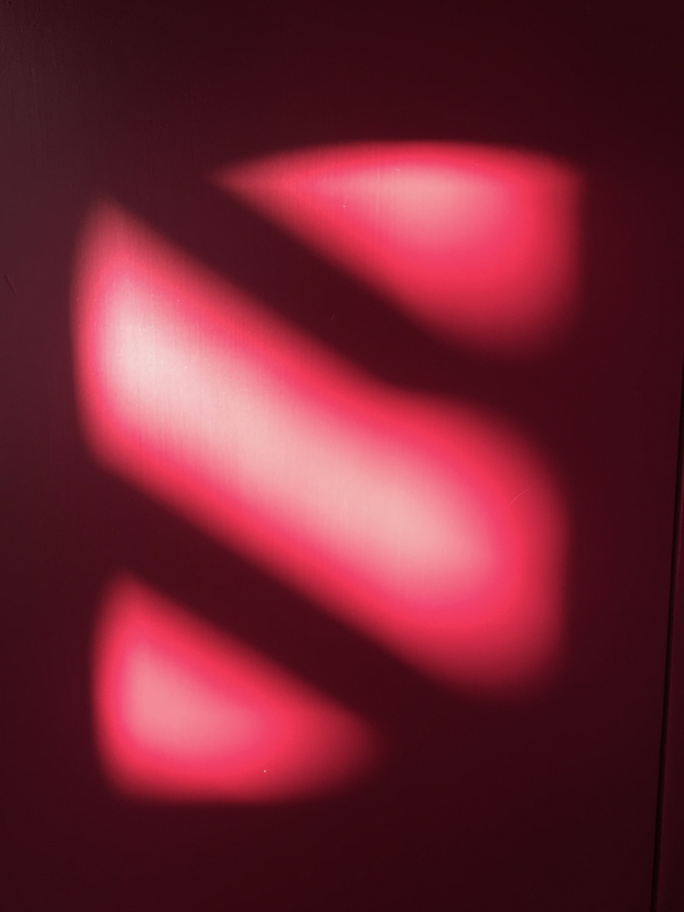
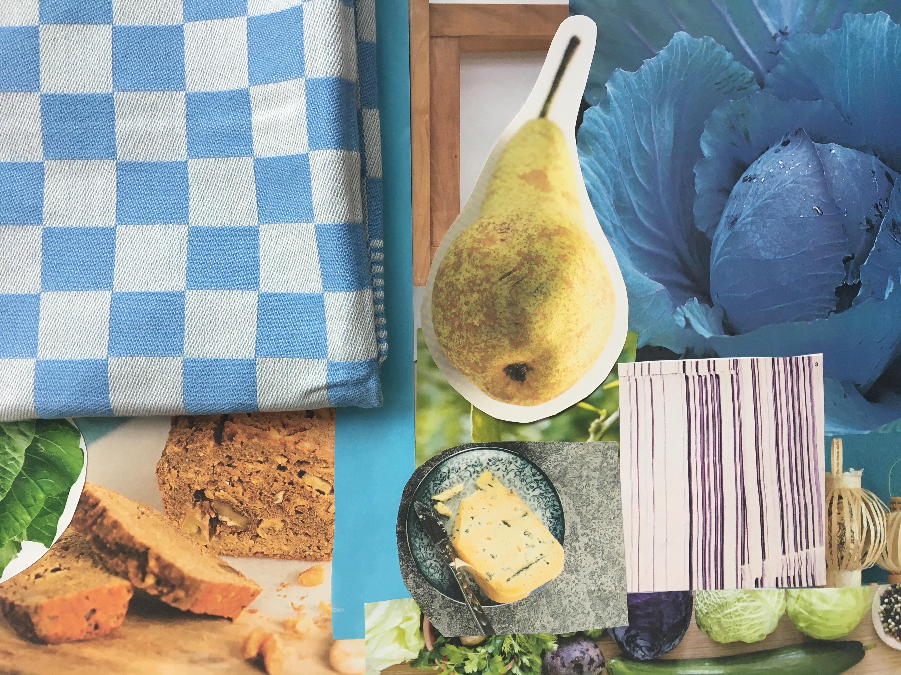
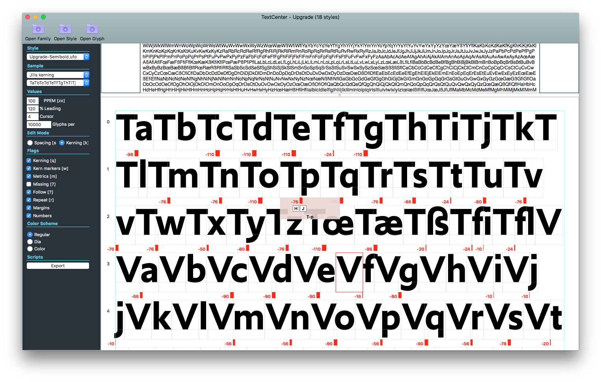
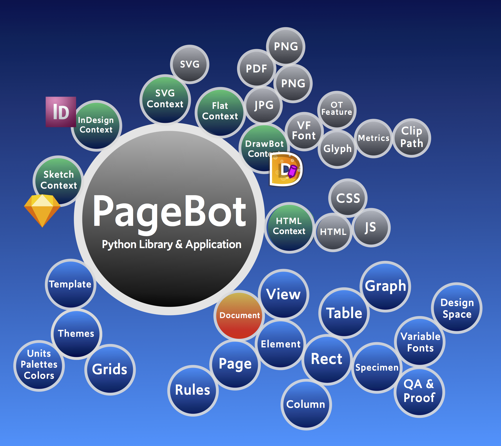
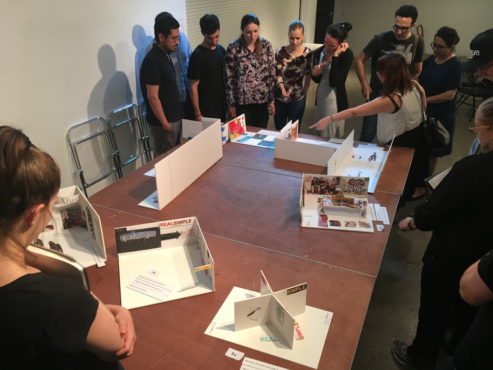
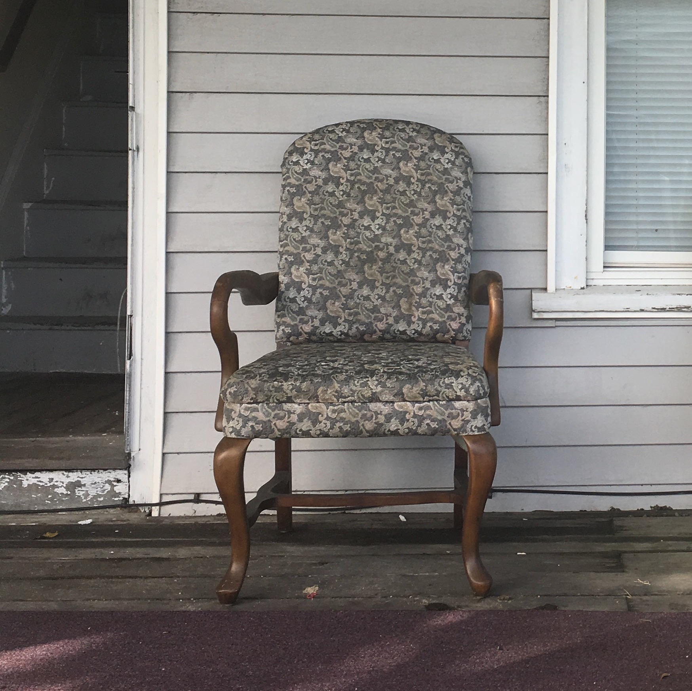
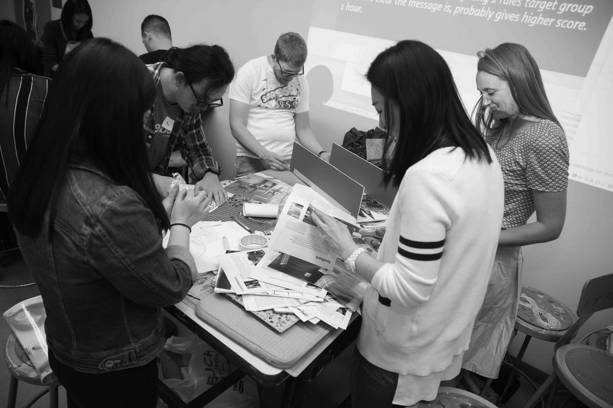
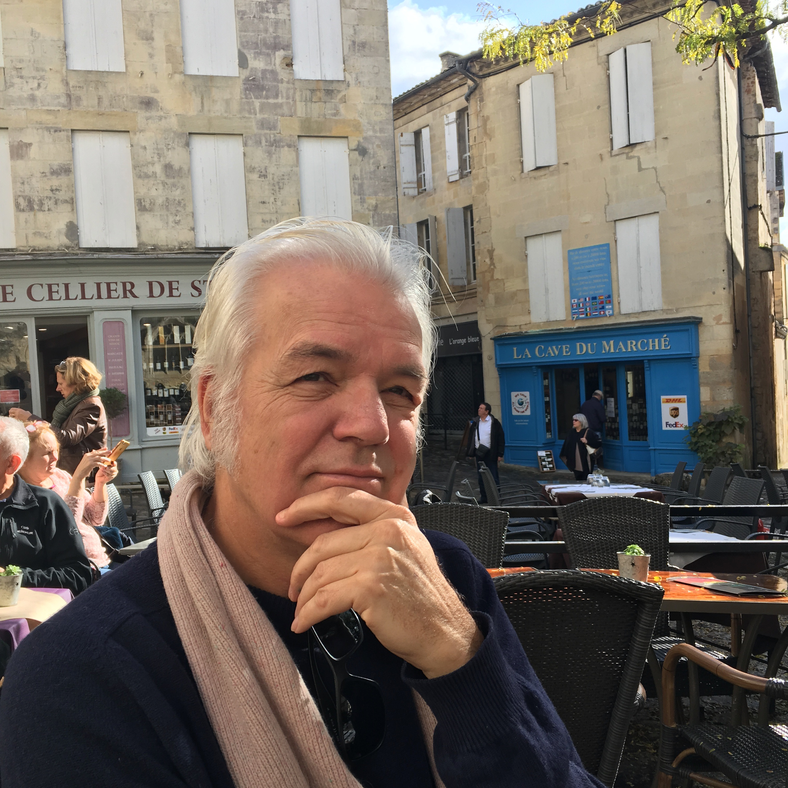

~~~
doc.title = 'Design&nbsp;Design&nbsp;Space'

doc.footerHtml = """Let us know what you think. Do you have any questions for us? <a href="mailto:info@designdesign.space?subject=Tell me more about DesignDesign.Space">info@designdesign.space</a>"""

# Uncomment to see cssId/cssClass markers in the page
#doc.view.showIdClass = True

# Page (Home)
#	Wrapper
#		Header 
#			Logo (+BurgerButton)
#			Navigation/TopMenu/MenuItem(s)
#      Content
#  			Banner
#  			SlideShow (on Home)
#      		Slides
#      		SlideSide
#			Section(s)
#				Introduction
#				Main
#				Mains
#					Main
#				Side
#				Sides
#					Side
#		Footer
#
# ----------------------------------------
# index.html
# ----------------------------------------
page.name = 'Home'
page.url = 'index.html'
content = page.select('Content')
box = content.newBanner()
~~~
# Which studies can we offer you in 2019?
~~~
from pagebot.constants import *
slideshow = content.newSlideShow(h=300, slideW='100%', slideH=300, startIndex=3, autoHeight=True, 
carousel=2, dynamicHeight=False, transition='slide', easing=CSS_EASE, frameDuration=4, duration=0.7, pauseOnHit=True, randomPlay=False)
box = slideshow.slides
~~~

~~~ 
box = slideshow.side
~~~
### Example studies

## Develop your process. Expand your skills.

Design studies come in many different forms. There is never a single solution. It is one of the main tasks of every designer: to search and select. Which type of study fits you best? What kind of topic, medium or intensity appeals best to your way of learning? Let us know, we might have some challenging exercises for you.

~~~
section = content.newSection()
box = section.newIntroduction()
~~~

# [Discovering the basics of type design?](studies-typedesign.html#discover-the-basics-of-type-design) [Improving your sketching techniques?](studies-designpractice.html#sketching-techniques) [Starting a studio?](studies-designpractice.html#live-coaching-while-starting-your-studio) [Programming pages?](studies-graphicdesign.html#scripting-the-design-of-printed-publications) [Learning to code type specimens?](studies-typedesign.html#automated-proofing-and-specimens) [Mastering typography?](studies-graphicdesign.html#scripting-the-design-of-printed-publications) So are we.

~~~
box = section.newMain()
~~~
## It all happens in DesignDesign.Space studies

If you tell us what you want to study by mail or in a first free online hangout, we are happy to make suggestions. What would you like to achieve? Seeking a sparring partner for an interesting new design project? Improving your latent skills, while training your self-discipline? Or simply needing a refreshing break from your normal design practice? 

---
## DesignDesign.Space as your coach

**DesignDesign.Space** can help you to answer these questions and to achieve your goals. Coaching you through your study, the teachers can ask the toughest questions. They are also available to help you answering them: If you are happy with the design you have finished, what exactly are you happy with? How does that fit the expectations of the user? And how would you get there next time?

---
## What is your design space?

**DesignDesign.Space** offers a wide variety of study topics: ranging from graphic design to type design, typography, programming, identities, 3D and education.

---
## How studies work

* In a first free hangout, we will talk about what you want to achieve.
* Together, we will find a way for you to get there. Topics & Tools. By painting, drawing, sketching or by coding. Or by a combination of all.
* In sequences of relative short assignments, online hangouts, personal feedback and reflections, we explore the paths of your study project. And more importantly, we’ll teach you how to do that yourself.
* The journey can take a day. Or a week. A month. A year. Whichever fits your goals, time and resources. We see it as our challenge to customize the study to what is realistic for you. And to make it match the result you may need in your daily practice.
* As your plans are likely to change along the way, the changes in your study time can always be discussed.

[See more about pricing here.](pricing.html)

~~~
box = section.newSide()
~~~

---
## Other study suggestions

* [Type design](studies-typedesign.html)
* [Typography](studies-typography.html)
* [Graphic design](studies-graphicdesign.html)
* [Design spaces](studies-designspaces.html)
* [Design practice](studies-designpractice.html)
* [Design education](studies-designeducation.html)

---
## Challenge us

We are educators and we are designers, too. That means, we are open for suggestions about the program and about the way we teach. For us, educating other designers is as much of a challenge as any design process. [Send](mailto:info@designdesign.space?subject=What%20I%20would%20like%20to%20%20study%20in%20DesignDesign.Space...) us your request for topics that we never thought about. Or ideas about how this website can be improved. Lure us into teaching you in a different way than what we suggest here. We’ll likely take the challenge.

~~~
# ----------------------------------------
# Studies/2019-studies.html
# ----------------------------------------
page = page.next
page.applyTemplate(template)  
page.name = 'Studies'
page.url = 'studies.html'

content = page.select('Content')
box = content.newBanner()
~~~
# Examine the 2019 study suggestions
~~~
section = content.newSection()
box = section.newIntroduction()
~~~

# [Redesigning your current design process?](studies-designpractice.html#design-of-design-models) [Methods for rapid prototyping?](studies-designpractice.html#rapid-prototyping-for-graphic-designers) [Redoing your interior?](studies-designspaces.html#design-a-workspace) [How to educate customers?](studies-designpractice.html#how-to-deal-with-clients) [Directions for further design education?](studies-designeducation.html#virtual-studies-and-teaching-online)

~~~
box = section.newMain()
~~~
# Studies in 2019

We keep improving the curriculum. The mandatory design of design education. Instead of the fixed [2018](2018-program.html) list of workshops, studies and dates, in practice, we found out that it is better to make the schedule entirely flexible. Hints of topics, templates of studies and suggestions for the process behind.

---
## Pricing

Each lesson is an online hangout, lasting for a part of the day, morning or afternoon, depending on your timezone. The pricing is based on the length and intensity of a study. 

If a study is spread over a longer period time, intensity can be lower for the same price. However, such a schema requires more self-discipline from students to take full advantage of their study and the support we can offer them.

[See more about pricing here.](pricing.html)

---
## Other study suggestions

* [Type design](studies-typedesign.html)
* [Typography](studies-typography.html)
* [Graphic design](studies-graphicdesign.html)
* [Design spaces](studies-designspaces.html)
* [Design practice](studies-designpractice.html)
* [Design education](studies-designeducation.html)

~~~
box = section.newCropped()
~~~

~~~
# ----------------------------------------
# studies-typedesign.html
# ----------------------------------------
page = page.next
page.applyTemplate(template)  
page.name = 'Type design'
page.url = 'Studies/typedesign.html'

content = page.select('Content')
box = content.newBanner()
~~~

## Study suggestions
# Type design 

~~~
section = content.newSection()
box = section.newMain().newIntroduction()
~~~

# [Drawing basic contrast?](studies-typedesign.html#discover-the-basics-of-type-design) [Mastering Variable Fonts?](studies-typedesign.html#the-design-process-of-variable-fonts) [Learning to code?](studies-typedesign.html#scripting-for-type-designers) [Discovering the basics of type design?](studies-typedesign.html#discover-the-basics-of-type-design) [Improving your sketching techniques?](studies-typedesign.html#improve-your-sketching-techniques)

~~~
box = section.newCropped()
~~~

~~~
box = section.newMain()
~~~
<a name="live-coaching-of-your-design-project"/>
## Live coaching of your (type) design project

You have a challenging complex design project to work on. It is really interesting and rewarding, but it is also hard to get it planning and keep quality under control. Especially if the project runs over a longer period of time.
How the coaching is organized, depends on what you need, what works best. It can be a single lesson for support, during the initial stages of the project, or it can extend to helping you with management and feedback of the entire project. 

Part of the coaching role can also be the development of simple scripted tools to support the design process. 

~~~
box = box.newInfo()
~~~

* Initial online hangout, free of charge.
* A single lesson of exercises for a whole day, **€170** per student
* A week of exercises and 3 lessons, **€450** per student
* Or with regular intervals during the duration of the project, **€90** per hour
* Daily feedback by e-mail on results for the duration of the study
* Coaching the development of scripts to support the design process.
* Document sharing and versioning through GitHub
* Design principles for planning, process, methods for feedback and testing criteria 

~~~
box = section.newCropped()
~~~

~~~
box = section.newMain()
~~~
<a name="discover-the-basics-of-type-design"/>
## Discover the basics of type design

Type design is not your main background, but as a designer, you often are in situation when it would be good knowing more about it. When selecting a typeface for one of your designs. Or when you need to explain it to your client. It is possible to read about it. But it’s a lot more efficient learning how to write and draw by yourself.

~~~
box = box.newInfo()
~~~

* Initial online hangout, free of charge.
* A single lesson of exercises for a whole day, **€170** per student
* A week of exercises and 3 lessons, **€450** per student
* Daily feedback by e-mail on results for the duration of the study
* Document sharing and versioning through GitHub
* Design principles for planning, the process, methods for feedback and testing criteria 

~~~
box = section.newCropped()
~~~

~~~
box = section.newMain()
~~~
<a name="the-design-process-of-variable-fonts"/>
## The design process of Variable Fonts

How do you get your design process beyond the traditional Variable Font axes of weight, width and optical size? How to make your experience grow from Multiple Master Thinking into Variable Font thinking? Develop sketching techniques. Make the production and testing of Variable Fonts work inside the cycles of your design process.

~~~
box = box.newInfo()
~~~

* Initial online hangout, free of charge.
* A week of exercises and 3 lessons, **€450** per student
* A month of exercises, projects and 8 lessons, **€1.700** per student
* Daily feedback by e-mail on results for the duration of the study
* Document sharing and versioning through GitHub
* Design principles for planning, process, methods for feedback and testing criteria 

~~~
box = section.newCropped()
~~~

**Gerrit Noordzij Cube code by Just van Rossum**

~~~
box = section.newMain()
~~~
<a name="improve-your-sketching-techniques"/>
## Improve your sketching techniques

Learn to improve your sketching techniques for type and typography, using Erik van Blokland’s [TypeCooker](http://www.typecooker.com) website to generate small and complex type design assignments. Experiment with various materials, scales and level of detail. Train yourself in sketching the usage of type in publications, info-graphics and interfaces.

~~~
box = box.newInfo()
~~~

* A single lesson, **€170** per student
* A week of exercises and 3 lessons, **€450** per student
* A month of exercises, projects and 8 lessons, **€1.700** per student
* Daily feedback by e-mail on results for the duration of the study
* Document sharing and versioning through GitHub
* Design principles for planning, process, methods for feedback and testing criteria 

~~~
box = section.newCropped()
~~~

~~~
box = section.newMain()
~~~
<a name="automated-proofing-and-specimens"/>
## Automated proofing and specimens

Learn the basics of scripting proofs and specimens for TTF, OTF and UFO. Sketching techniques for layouts. Patterns of Python code. Discover how to disassemble the design of specimens into parts that can be automated. Writing some templates that are directly useful for you. 

~~~
box = box.newInfo()
~~~

* A single lesson, **€170** per student
* A week of exercises and 3 lessons, **€450** per student
* A month of exercises, projects and 8 lessons, **€1.700** per student
* Daily feedback by e-mail on results for the duration of the study
* Document sharing and versioning through GitHub
* Design principles for planning, process, methods for feedback and testing criteria 

~~~
box = section.newCropped()
~~~

~~~
box = section.newMain()
~~~
<a name="automated-qa-for-type-designers"/>
## Automated QA for type designers

Learn the basics of scripting, testing the quality of TTF, OTF and UFO fonts during the design process. Develop patterns of Python code. Analysis of mistakes and errors. How to detect and possibly solve them automatically, by running your scripts.

~~~
box = box.newInfo()
~~~

* A single lesson, **€170** per student
* A week of exercises and 3 lessons, **€450** per student
* A month of exercises, projects and 8 lessons, **€1.700** per student
* Daily feedback by e-mail on results for the duration of the study
* Document sharing and versioning through GitHub
* Design principles for planning, process, methods for feedback and testing criteria 

~~~
box = section.newCropped()
~~~

~~~
box = section.newMain()
~~~
<a name="latin-type-design-for-non-latin-type-designers"/>
## Latin type design for (non-Latin) type designers

Learn the basics of Latin type. Sketching techniques. Principles of contrast. Weight and width. Relations and differences. The design process of Variable Fonts. Selection of tools. Scripting that can be automated. Models to differentiate between the best practice and artibtrary design choices.

~~~
box = box.newInfo()
~~~

* Initial online hangout, free of charge.
* A month of exercises, projects and 8 lessons, **€1.700** per student
* Daily feedback by e-mail on results for the duration of the study
* Document sharing and versioning through GitHub
* Design principles for planning, process, methods for feedback and testing criteria 

~~~
box = section.newCropped()
~~~

~~~
box = section.newMain()
~~~
<a name="scripting-for-type-designers"/>
## Scripting for (Latin and non-Latin) type designers

Learn the basics of scripting for the editing tool that you are familiar with (RoboFont, Glyphs or FontLab). Sketching techniques. Patterns of Python code. How to disassemble a design problem into parts that can be automated. Writing some tools that are directly useful for you. Finding methods and directions for new tools, without the help of DDS.

~~~
box = box.newInfo()
~~~

* Initial online hangout, free of charge.
* A month of exercises, projects and 8 lessons, **€1.700** per student
* Daily feedback by e-mail on results for the duration of the study
* Document sharing and versioning through GitHub
* Design principles for planning, process, methods for feedback and testing criteria 

~~~
box = section.newCropped()
~~~

~~~
box = section.newMain()
~~~

## Other study suggestions

* [Type design](studies-typedesign.html)
* [Typography](studies-typography.html)
* [Graphic design](studies-graphicdesign.html)
* [Design spaces](studies-designspaces.html)
* [Design practice](studies-designpractice.html)
* [Design education](studies-designeducation.html)

~~~
box = section.newCropped()
~~~

~~~
# ----------------------------------------
# Studies/2019 Studies/typography.html
# ----------------------------------------
page = page.next
page.applyTemplate(template)  
page.name = 'Typography'
page.url = 'Studies/typography.html'

content = page.select('Content')
box = content.newBanner()
~~~
## Study suggestions
# Typography 
~~~
section = content.newSection()
box = section.newMain().newIntroduction()
~~~

# [Learning to use typefaces in typography?](studies-typography.html#learn-how-to-use-typetr-typefaces-in-your-designs) [Seeking rules for type in corporate identities?](studies-typography.html#learn-how-to-use-type-and-typography-in-corporate-identities) [Wondering about the specifics of typography online?](studies-typography.html#learn-how-to-use-type-and-typography-in-corporate-identities)

~~~
box = section.newCropped()
~~~

~~~
box = section.newMain()
~~~
<a name="learn-how-to-use-typetr-typefaces-in-your-designs"/>
## Learn how to use TYPETR typefaces in your designs

While designing the typefaces for the TYPETR library, we obviously have ideas, hints and tips how they can best be used in typography. And while producing them, many examples and type specimens are made for testing and presentation. Why not share these with people who take the effort to buy a full family license?

See the TYPETR websites featuring [Upgrade](http://upgrade.typenetwork.com) (all type used on in this website) and [Bitcount](http://bitcount.typenetwork.com) as examples of what we could talk about.

* A day of exercises, feedback and initial introduction hangout: free of charge with a purchase of a full family license at [Type Network](http://typetr.typenetwork.com) 
* Access to examples, templates and [DrawBot](http://drawbot.com)/[PageBot](https://github.com/PageBot/PageBot) script and programs.

~~~
box = section.newCropped()
~~~

~~~
box = section.newMain()
~~~
<a name="learn-how-to-use-type-and-typography-in-corporate-identities"/>
## Learn how to use type and typography in corporate identities

You are doing projects for corporate clients that include the use of type in print and online. How do you select the right one? And if such a typeface cannot be found, how would you brief a type designer?

The right application of type and typography can also save money for your client. Sometimes even a lot. How about using that as an argument for your next identity project?

~~~
box = box.newInfo()
~~~

* A week of exercises and 3 lessons, **€450** per student
* A month of exercises, projects and 8 lessons, **€1.700** per student
* Daily feedback by e-mail on results for the duration of the study
* Document sharing and versioning through GitHub
* Design principles for planning, process, methods for feedback and testing criteria 

~~~
box = section.newCropped()
~~~

~~~
box = section.newMain()
~~~
<a name="learn-how-to-use-type-and-typography-online"/>
## Learn how to use type and typography online

The use of type in websites using CSS has many issues to check on for typographers and graphic designers. Why select one typeface and not the other? How to address OpenType Features? How to make optimal usage of Variable Fonts technology in web pages? Study and exercises can adhance to selection and usage of type in websites.

~~~
box = box.newInfo()
~~~

* A week of exercises and 3 lessons, **€450** per student
* A month of exercises, projects and 8 lessons, **€1.700** per student
* Daily feedback by e-mail on results for the duration of the study
* Document sharing and versioning through GitHub
* Design principles for planning, process, methods for feedback and testing criteria 

~~~
box = section.newCropped()
~~~

~~~ 
box = section.newMain()
~~~

## Other study suggestions

* [Type design](studies-typedesign.html)
* [Typography](studies-typography.html)
* [Graphic design](studies-graphicdesign.html)
* [Design spaces](studies-designspaces.html)
* [Design practice](studies-designpractice.html)
* [Design education](studies-designeducation.html)

~~~
box = section.newCropped()
~~~

~~~
# ----------------------------------------
# Studies/2019 Studies/graphicdesign.html
# ----------------------------------------
page = page.next
page.applyTemplate(template)  
page.name = 'Graphic design'
page.url = 'Studies/graphicdesign.html'

content = page.select('Content')
box = content.newBanner()
~~~
## Study suggestions
# Graphic design 
~~~
section = content.newSection()
box = section.newMain().newIntroduction()
~~~

# [Researching generative typography?](studies-typography.html#learn-how-to-use-type-and-typography-online) [Designing a series?](studies-designspaces.html#creating-an-identity) [Discovering the basics of information design?](studies-graphicdesign.html#info-graphics-the-design-of-automated-designs) [Improving your sketching techniques?](studies-designpractice.html#sketching-techniques) [Branding a client?](studies-graphicdesign.html#identity-design)

~~~
box = section.newCropped()
~~~

~~~
box = section.newMain()
~~~
<a name="visual-grammar-for-graphic-designers"/>
## Visual grammar for graphic designers

Disassemble your graphic design into parameters, models and methods. Why do you choose a color or a typeface? How to separate **this one** from **this kind of**, when making a series of covers, or different types of publications within one identity.

~~~
box = box.newInfo()
~~~

* A week of exercises and 3 lessons, **€450** per student
* A month of exercises, projects and 8 lessons, **€1.700** per student
* Daily feedback by e-mail on results for the duration of the study
* Document sharing and versioning through GitHub
* Design principles for planning, process, methods for feedback and testing criteria 

~~~
box = section.newCropped()
~~~

~~~
box = section.newMain()
~~~
<a name="scripting-of-online-publication-design"/>
## Scripting of online publication design
 
Design systems that generate applications, documents and websites, intended for online usage. How to bridge the gap between unpredictable content, sketching design rules, the design of templates that use high level typographic standards, scriptable illustration techniques and applications for automated output, using DrawBot and PageBot, generating HTML/CSS/Javascript (for OSX and Linux platforms).

Any design process benefits from short iterations in a team, automated prototyping and the merging of disciplines. Web design is not different.

Learn to use PageBot to script sites like this one.

~~~
box = box.newInfo()
~~~

* A month of exercises, projects and 8 lessons, **€1.700** per student
* Daily feedback by e-mail on results for the duration of the study
* Document sharing and versioning through GitHub
* Design principles for planning, process, methods for feedback and testing criteria 

~~~
box = section.newCropped()
~~~

~~~
box = section.newMain()
~~~
<a name="info-graphics-the-design-of-automated-designs"/>
## Info-graphics: The design of automated designs

Design systems that generate info-graphics. For online use and for print. How to bridge the gap between (big) databases, the design of templates using high level typographic standards, scriptable illustration techniques and applications for automated output, using DrawBot, PageBot and current web technologies. 

~~~
box = box.newInfo()
~~~

* A week of exercises and 3 lessons, **€450** per student
* A month of exercises, projects and 8 lessons, **€1.700** per student
* Daily feedback by e-mail on results for the duration of the study
* Document sharing and versioning through GitHub
* Design principles for planning, process, methods for feedback and testing criteria 

~~~
box = section.newCropped()
~~~

~~~
box = section.newMain()
~~~
<a name="scripting-the-design-of-printed-publications"/>
## Scripting the design of printed publications

Design systems that generate books, magazines, newspapers, brochures, manuals or catalogues, intended for print. How do you bridge the gap between unpredictable content, sketching design rules, the design of templates that use high level typographic standards, scriptable illustration techniques and applications for automated output, using DrawBot and PageBot (for OSX and Linux platforms).

~~~
box = box.newInfo()
~~~

* A month of exercises, projects and 8 lessons, **€1.700** per student
* Daily feedback by e-mail on results for the duration of the study
* Document sharing and versioning through GitHub
* Design principles for planning, process, methods for feedback and testing criteria 

~~~
box = section.newCropped()
~~~

~~~
box = section.newMain()
~~~
<a name="identity-design"/>
## Identity design: Branding with and without the use of logos

Design parametric models for an identity. Which parameters create the visual coherency? Which parameters are diverse, without the need to specify? Is that always the same list? If not, what is the best selection for a particular brand?
How to write scripts to automate (parts of) the models for your parameters testing.

What is the best usage of graphic elements in a brand? Which are used for recognition and coherency? And which are undefined on purpose, supporting the visual diversity of publications?

~~~
box = box.newInfo()
~~~

* A week of exercises and 3 lessons, **€450** per student
* A month of exercises, projects and 8 lessons, **€1.700** per student
* Daily feedback by e-mail on results for the duration of the study
* Document sharing and versioning through GitHub
* Design principles for planning, process, methods for feedback and testing criteria 

~~~
box = section.newCropped()
~~~

~~~
box = section.newMain()
~~~
<a name="choosing-a-type-design"/>
## Choosing a type design

What are the criteria for choosing the best type design for a particular graphic design project? Forget about existing classification, you can make your own, customized to your needs. Build argumentation to support your choice. Learn to make testing material and specimens. 

~~~
box = box.newInfo()
~~~

* A week of exercises and 3 lessons, **€450** per student
* A month of exercises, projects and 8 lessons, **€1.700** per student
* Daily feedback by e-mail on results for the duration of the study
* Document sharing and versioning through GitHub
* Design principles for planning, process, methods for feedback and testing criteria 

~~~
box = section.newCropped()
~~~

~~~
box = section.newMain()
~~~
<a name="python-scripting-for-graphic-designers"/>
## Python scripting for graphic designers

Learn the basics of scripting your graphic design process. Sketching techniques. Decide what can be automated and what not. Patterns of Python code, using DrawBot and PageBot. Connect to InDesign. Parameters for magazines, websites, exhibition spaces and corporate identities.  Develop models to differentiate between best practice and arbitrary design choices.

~~~
box = box.newInfo()
~~~

* An month of exercises, projects and 8 lessons, **€1.700** per student
* Daily feedback by e-mail on results for the duration of the study
* Document sharing and versioning through GitHub
* Design principles for planning, process, methods for feedback and testing criteria 

~~~
box = section.newSide()
~~~

*[[Using the programming language Python during the design process is a logical choice. Yet, a DesignDesign.Space study assumes no existing knowledge or experience. We start at the level that you have.]]*

---

## Other study suggestions

* [Type design](studies-typedesign.html)
* [Typography](studies-typography.html)
* [Graphic design](studies-graphicdesign.html)
* [Design spaces](studies-designspaces.html)
* [Design practice](studies-designpractice.html)
* [Design education](studies-designeducation.html)

~~~
# ----------------------------------------
# Studies/2019 Studies/designspaces.html
# ----------------------------------------
page = page.next
page.applyTemplate(template)  
page.name = 'Design spaces'
page.url = 'Studies/designspaces.html'

content = page.select('Content')
box = content.newBanner()
~~~
## Study suggestions
# Design spaces 

~~~
section = content.newSection()
box = section.newMain().newIntroduction()
~~~

# [Redoing your workspace?](studies-designspaces.html#design-a-workspace) [Choosing colors at IKEA?](studies-designspaces.html#choosing-colors) [Looking for a style?](studies-designspaces.html#creating-an-identity) [Mastering the skill of selection?](studies-designspaces.html#how-to-organize-structure-in-chaos) [Creating an exhibit?](studies-designspaces.html#design-an-exhibition) [Making sandbox for experiments?](studies-designspaces.html#design-your-studio-sandbox)

~~~
box = section.newCropped()
~~~

~~~
box = section.newMain()
~~~
<a name="choosing-colors"/>
## Choosing colors

How to select a color or a color palette? What criteria matter in a given set of circumstances? How does material, medium and technique influence such a choice?
In a sequence of exercises, the student will develop ways to look, measure and compare selected colors. 

~~~
box = box.newInfo()
~~~

* A week of exercises and 3 lessons, **€450** per student
* A month of exercises, projects and 8 lessons, **€1.700** per student
* Daily feedback by e-mail on results for the duration of the study
* Document sharing and versioning through GitHub
* Design principles for planning, process, methods for feedback and testing criteria 

~~~
box = section.newCropped()
~~~

~~~
box = section.newMain()
~~~
<a name="creating-an-identity"/>
## Creating an identity: the look and feel

Learn how to design a series of visual components for an identity, so the identity gains a strong character. Designing the balance between coherency and diversity with a set of recognizable elements which will represent the brand in an optimal form. 
Sketching, making models and making presentations in all diferent stages in the design process will be the main course of this program.

~~~
box = box.newInfo()
~~~

* A week of exercises and 3 lessons, **€450** per student
* A month of exercises, projects and 8 lessons, **€1.700** per student
* Daily feedback by e-mail on results for the duration of the study
* Document sharing and versioning through GitHub
* Design principles for planning, process, methods for feedback and testing criteria 

~~~
box = section.newCropped()
~~~

~~~
box = section.newMain()
~~~
<a name="design-patterns-and-structures"/>
## Design patterns and structures

Making one-off designs is relatively easy. There are no other requirement than for that single solution. If at all. Learn to design methods and strategies if the plan changes along the way. How to proceed if a single design needs to become a series? How to respond to clients that change their goals in that direction?

~~~
box = box.newInfo()
~~~

* A week of exercises and 3 lessons, **€450** per student
* A month of exercises, projects and 8 lessons, **€1.700** per student
* Daily feedback by e-mail on results for the duration of the study
* Document sharing and versioning through GitHub
* Design principles for planning, process, methods for feedback and testing criteria 

~~~
box = section.newCropped()
~~~

~~~
box = section.newMain()
~~~
<a name="how-to-organize-structure-in-chaos"/>
## How to organize structure in chaos

You have a project that starts with a pile of legacy publications. Or the content of an attic. Or you inherited and archive of design stuff that is supposed to become a website. Where do you start? How do you make such a project finish in the time that is available? Learn the development of selection methods, sketching techniques and directions to validate the process itself. 

~~~
box = box.newInfo()
~~~
* A week of exercises and 3 lessons, **€450** per student
* A month of exercises, projects and 8 lessons, **€1.700** per student
* Daily feedback by e-mail on results for the duration of the study
* Document sharing and versioning through GitHub
* Design principles for planning, process, methods for feedback and testing criteria 

~~~
box = section.newCropped()
~~~

~~~
box = section.newMain()
~~~
<a name="design-a-workspace"/>
## Design a workspace 

Design the interior of a workspace, based on requirements, planning, budget and usage. What are the most important requirements and attributes? Development of sketching techniques, modelling and presentation. Design the process itself, alongside the interior. Special focus on materials, color, textures and the usage of space. The interior could be your own studio space, as well as the target of an external design project.

~~~
box = box.newInfo()
~~~

* A week of exercises and 3 lessons, **€450** per student
* A month of exercises, projects and 8 lessons, **€1.700** per student
* Daily feedback by e-mail on results for the duration of the study
* Document sharing and versioning through GitHub
* Design principles for planning, process, methods for feedback and testing criteria 

~~~
box = section.newCropped()
~~~

~~~
box = section.newMain()
~~~
<a name="design-an-exhibition"/>
## Design an exhibition

Design an exhibition space, based on requirements, planning, budget and usage. Development of sketching techniques, modelling and presentation. Design the process itself, alongside the interior. Special focus on message, typography, layout, imaging, materials, color, textures and the usage of space. The exhibition could be your own spacial portfolio, as well as the target of an external design project.

~~~
box = box.newInfo()
~~~

* A week of exercises and 3 lessons, **€450** per student
* A month of exercises, projects and 8 lessons, **€1.700** per student
* Daily feedback by e-mail on results for the duration of the study
* Document sharing and versioning through GitHub
* Design principles for planning, process, methods for feedback and testing criteria 

~~~
box = section.newCropped()
~~~

~~~
box = section.newMain()
~~~
<a name="design-the-environment"/>
## Design the environment

Whatever your environment is - physical, virtual and mental - that brings your creative thinking to the next level, you can make it help focus for development and improvement.

Through a variety of exercises – writing, sketching, making an inventory of environmental aspects and talking with others – you'll experience new oportunities to get more grip on your environment.  

~~~
box = box.newInfo()
~~~

* A week of exercises and 3 lessons, **€450** per student
* A month of exercises, projects and 8 lessons, **€1.700** per student
* Daily feedback by e-mail on results for the duration of the study
* Document sharing and versioning through GitHub
* Design principles for planning, process, methods for feedback and testing criteria 

~~~
box = section.newCropped()
~~~

~~~
box = section.newMain()
~~~
<a name="design-your-studio-sandbox"/>
## Design your studio sandbox

Even design projects with a high degree of routine can benefit from built-in sandboxes. How to create them? How to make your own challenging hidden space?

~~~
box = box.newInfo()
~~~
* A week of exercises and 3 lessons, **€450** per student
* A month of exercises, projects and 8 lessons, **€1.700** per student
* Daily feedback by e-mail on results for the duration of the study
* Document sharing and versioning through GitHub
* Design principles for planning, process, methods for feedback and testing criteria 

~~~
box = section.newCropped()
~~~

~~~
box = section.newMain()
~~~

## Other study suggestions

* [Type design](studies-typedesign.html)
* [Typography](studies-typography.html)
* [Graphic design](studies-graphicdesign.html)
* [Design spaces](studies-designspaces.html)
* [Design practice](studies-designpractice.html)
* [Design education](studies-designeducation.html)

~~~
box = section.newCropped()
~~~

~~~
# ----------------------------------------
# Studies/2019 Studies/designpractice.html
# ----------------------------------------
page = page.next
page.applyTemplate(template)  
page.name = 'Design practice'
page.url = 'Studies/designpractice.html'

content = page.select('Content')
box = content.newBanner()
~~~
## Study suggestions
# Running a design practice

~~~
section = content.newSection()
box = section.newMain().newIntroduction()
~~~

# [Starting a studio?](studies-designpractice.html#live-coaching-while-starting-your-studio) [Learning to educate clients?](studies-designpractice.html#how-to-deal-with-clients) [Redesigning your design process?](studies-designpractice.html#design-of-design-models) [Kids around in the studio?](studies-designpractice.html#running-a-home-studio)

~~~
box = section.newCropped()
~~~

~~~
box = section.newMain()
~~~
<a name="design-of-design-models"/>
## Design of design models

Develop and select design methods. What is available beyond “scrum”? Which methods can you design for yourself, by scaling and managing details? Sketching and making of small scale models is such a technique: get an impression about your design choices at an early stage, without making the “real thing”.

~~~
box = box.newInfo()
~~~

* A week of exercises and 3 lessons, **€450** per student
* Daily feedback by e-mail on results for the duration of the study
* Document sharing and versioning through GitHub
* Design principles for planning, process, methods for feedback and testing criteria 

~~~
box = section.newCropped()
~~~

~~~
box = section.newMain()
~~~
<a name="rapid-prototyping-for-graphic-designers"/>
## Rapid prototyping for graphic designers

Learn to develop efficient and powerful prototyping techniques, including manual sketching, digital tools and coding, with the goal of controlling the broadening and narrowing of options and directions a project may take.
Through sketching, hands-on practical exercises and presentations, you explore the process of making prototypes.
This study is a follow up on the **Design of design models**, but can be also joined separately.

~~~
box = box.newInfo()
~~~

* A week of exercises and 3 lessons, **€450** per student
* A month of exercises, projects and 8 lessons, **€1.700** per student
* Daily feedback by e-mail on results for the duration of the study
* Document sharing and versioning through GitHub
* Design principles for planning, process, methods for feedback and testing criteria 

~~~
box = section.newCropped()
~~~

~~~
box = section.newMain()
~~~
<a name="sketching-techniques"/>
## Sketching techniques

Similar to the “Rapid Prototyping” workshop, this study addresses the management of details. The focus on developing sketching skills, experiment with materials in 2D and 3D, drawing with **SketchApp**, coding and exporing the visual language of scaled models with **DrawBot** and **PageBot**.

~~~
box = box.newInfo()
~~~

* A week of exercises and 3 lessons, **€450** per student
* A month of exercises, projects and 8 lessons, **€1.700** per student
* Daily feedback by e-mail on results for the duration of the study
* Document sharing and versioning through GitHub
* Design principles for planning, process, methods for feedback and testing criteria 

~~~
box = section.newCropped()
~~~

~~~
box = section.newMain()
~~~
<a name="live-coaching-while-starting-your-studio"/>
## Live coaching while starting your studio

You are working on starting your own studio. You just graduated or you have been working in a design studio for years, and now it is time to start your own. It seems to be a promising, interesting and rewarding plan. But it is also hard to control planning, budget and clients' fantasies. Especially if projects run over a longer period of time.
Coaching is organized depending on your needs. It varies from a single lesson of support, while writing an initial quote, up to helping you with management and feedback of your entire project.

~~~
box = box.newInfo()
~~~

* A week of exercises and 3 lessons, **€450** per student
* A month of projects, coaching and 8 lessons, **€1.700** per student
* Document sharing and versioning through GitHub
* Daily support and feedback on results for the duration of the study
* Design principles for planning, process, methods for feedback and testing criteria 

~~~
box = section.newCropped()
~~~

~~~
box = section.newMain()
~~~
<a name="how-to-deal-with-clients"/>
## How to deal with clients?

Use of cases, models, simulations, sketching and presentation techniques are the subjects of this 3 lesson workshop on how to deal best with clients. Students are offered to think about planning in relation to what they charge for their designs. The workshop addresses the difference between cost and investment, leisure and learning, with special attention on the success of failure.

~~~
box = box.newInfo()
~~~

* A week of exercises and 3 lessons, **€450** per student
* Document sharing and versioning through GitHub
* Daily support and feedback on results for the duration of the study
* Design principles for planning, process, methods for feedback and testing criteria 

~~~
box = section.newCropped()
~~~

~~~
box = section.newMain()
~~~
<a name="running-a-home-studio"/>
## Running a home studio with employees, while raising a family
 
Examples and cases from our own experience. What worked for us and what didn't. Points of view, excersices and feedback. The dilemma of choosing focus. Roles and rules. The choice of not working overtime. Employer or designer? Friends or families? 
The workshop gives students a wide variety of strategies and scenarios. 

~~~
box = box.newInfo()
~~~

* A week of exercises and 3 lessons, **€450** per student
* Document sharing and versioning through GitHub
* Daily support and feedback on results for the duration of the study
* Design principles for planning, process, methods for feedback and testing criteria 

~~~
box = section.newCropped()
~~~

~~~
box = section.newMain()
~~~

## Ask for info

Let us know by mail at [info@designdesign.space](mailto:info@designdesign.space?subject=Tell%20me%20more%20about%20DesignDesign.Space), if you are interested to study. We can discuss how that would work in a first free online hangout. Or tell us what other wishes related to design or education you have.

*Don't hesitate to contact us if the indicated price is the only problem that prevents you from studying.*

~~~
box = section.newSide()
~~~

## Other study suggestions

* [Type design](studies-typedesign.html)
* [Typography](studies-typography.html)
* [Graphic design](studies-graphicdesign.html)
* [Design spaces](studies-designspaces.html)
* [Design practice](studies-designpractice.html)
* [Design education](studies-designeducation.html)

~~~
# ----------------------------------------
# Studies/2019 Studies/designeducation.html
# ----------------------------------------
page = page.next
page.applyTemplate(template)  
page.name = 'Design education'
page.url = 'Studies/designeducation.html'

content = page.select('Content')
box = content.newBanner()
~~~

## Study suggestions
# Design design education

~~~
section = content.newSection()
box = section.newMain().newIntroduction()
~~~

# [With your 10+ years of studio experience: what is next?](studies-designeducation.html#virtual-sabbatical) [Mastering code?](studies-designeducation.html#virtual-sabbatical) [Training new skills?](studies-designeducation.html#virtual-sabbatical) [Broadening your scope?](studies-designeducation.html#virtual-sabbatical) 

~~~
box = section.newCropped()
~~~

~~~
box = section.newMain()
~~~
<a name="virtual-studies-and-teaching-online"/>
## Virtual studies and teaching online

With a total of 60+ years of educating design, both in physical space, as well as in virtual environments, we can offer the experience itself as a topic of a study. How to design the way that you teach? How to develop methods for feedback? What works in an online environment and what doesn’t? How to build layers in assignments, where student think they learn one thing, while in reality they learn a lot more as well? What is the goal of a study? And what is realistic to expect?

~~~
box = box.newInfo()
~~~
* A week of exercises and 3 lessons, **€450** per student
* A month of exercises, projects and 8 lessons, **€1.700** per student
* Document sharing and versioning through GitHub
* Daily support and feedback on results for the duration of the study
* Design principles for planning, process, methods for feedback and testing criteria 

~~~
box = section.newCropped()
~~~

~~~
box = section.newMain()
~~~
<a name="virtual-sabbatical"/>
## Virtual sabbatical

You have been working as a designer for some years, employed by a studio or running your own. You have been really successful or a bit less, in any case, there is a moment in time to answer the question “What’s next?”. 

At the same time, you don’t think you have the age or freedom or financial resources to take a real sabbatical break and do a Master study abroad for 2 years. DesignDesign.Space offers the opportunity of doing a virtual sabbatical: studying new topics or deepen the ones that you already know in a challenging online environment, together with other students, who are seeking similar extensions to their professional career. How this is organized, depends on your needs and resources. 

~~~
box = box.newInfo()
~~~

* Initial online hangout, free of charge.
* A single lesson with many exercises for a day: **€170** per student
* A week of exercises and 3 lessons, **€450** per student
* A month of projects and 8 lessons, **€1.700** per student
* A season of projects and coaching **€3.400**
* A full year: **Ask about what we can do.**
* Document sharing and versioning through GitHub
* Daily support and feedback on results for the duration of the study
* Design principles for planning, process, methods for feedback and testing criteria 

~~~
box = section.newCropped()
~~~

~~~
box = section.newMain()
~~~

## Other study suggestions

* [Type design](studies-typedesign.html)
* [Typography](studies-typography.html)
* [Graphic design](studies-graphicdesign.html)
* [Design spaces](studies-designspaces.html)
* [Design practice](studies-designpractice.html)
* [Design education](studies-designeducation.html)

~~~
box = section.newCropped()
~~~

~~~
# ----------------------------------------
# Studies/2018-reviews.html
# ----------------------------------------
page = page.next
page.applyTemplate(template)  
page.name = 'Reviews'
page.url = 'reviews.html'

content = page.select('Content')
box = content.newBanner()
~~~
# What happened in 2018

~~~
section = content.newSection()
box = section.newIntroduction()
~~~
# Around 120 students have joined one or more of the workshops and studies in 2018. Read some of their testimonials. 

~~~
box = section.newMain()
~~~

## What we did…

* Scripting Variable Font specimens for type designers using PageBot (1 day)
* Variable Fonts: design strategies and tool development (3 days)
* Python scripting for graphic designers (4 weeks)
* TypeLab, during Typographics 2018 (3 days)
* Python scripting for graphic designers: public workshop (1 day)
* The design of Latin type, for non-Latin type designers (8 weeks)
* Scripting for non-Latin type (6 weeks)
* Scripting the visual grammar for graphic design (4 weeks)
* Design the design process (10 days)
* Mapping the profession in detail, for type design students (12 days)
* Various individual coaching projects, ranging from type-crit to support at the background of regular design studies

During the course of 2018, different types of teaching and coaching projects where initiated. 

Some as teacher at the TypeDesign master TypeMedia, Royal Academy of Art in The Hague and the graphic design master  AKV St. Joost in Den Bosch. 

Many studies were online as groups or individual students.

~~~
box = section.newCropped()
~~~

<!---->

~~~ 
box = section.newIntroduction()
~~~

# What students wrote…

~~~
box = mainBox = section.newMain()
~~~ 

### “I appreciated that everyone was able to swim at their own pace.” 

~~~
box = mainBox.newInfo()
~~~

*“This was a unique opportunity in that it wasn’t just a programming class, but one that was specifically catered to type designers to meet their needs. I didn’t know any Python whatsoever prior to this course, so in the beginning, it felt like being thrown into the sea without a life jacket. Petr is not a lifeguard; he is a swimming coach. He won’t rescue you — that’s too easy — but he will throw you a rope. (In fact, many ropes. You ask one question and he gives you five answers.) I appreciated that everyone was able to swim at their own pace. An experienced designer and astonishingly deep thinker, Petr offers far more than just coding knowledge. It was a privilege to be able to learn from him.*
*Again, thank you so much! I learned a ton these four weeks and I'm so grateful.”* **– June Shin**

~~~
box = mainBox
~~~
---

### “The class is not just a skill learning environment as a good portion of the time is dedicated to critical discussions.”

~~~
box = mainBox.newInfo()
~~~

*“The one month course is designed to accommodate type designers with various levels of Python and programming knowledge. The learning environment is set up similarly to a master's class which allows Petr to focus on individual needs. In addition, the course allows students to take their studies towards their personal needs and interests. The class is not just a skill learning environment as a good portion of the time is dedicated to critical discussions, such as designing one's design process or the ways new technologies and developments will effect and change how we design and think about type.”* **– Cem Eskinazi**

~~~
box = mainBox
~~~
---
### “It was a unique opportunity to learn type-related Python in first hand.”

~~~
box = mainBox.newInfo()
~~~

*“For me, the Python scripting for type designers course from Design Design Space was a perfect complement to my formation as a typeface designer. It was a unique opportunity to learn type-related Python in first hand from a competent instructor. Petr doesn’t leave questions open, and the course’s pace flows according to each student’s needs.”* **– Filipe Negrão**

~~~
box = mainBox
~~~
---
### “I can promise that you can get a lot of treasures.”

~~~
box = mainBox.newInfo()
~~~

*“This is my first time to have a formal Latin Design class. I am very lucky that I can learn from Petr because there are only a few Latin design classes in Taiwan.* 
*Petr is always teaching design knowledge enthusiastically, using all he knows, when you have questions. Petr not only taught us how to design Latin fonts, but also how to think about the effect of every design and how to adjust them to become a better one. The most important thing is that you don't have to be afraid, if you are a starter because Petr will give a tailored class for everyone. I can promise that you can get a lot of treasures from Petr. I appreciate a lot that I could gain this experience from DDS.”* **- Tom Kuo**

~~~
box = mainBox
~~~
---
### “This was a very important foundation for me not only to  […] rethink about my own design approach in a very fundamental way.”

~~~
box = mainBox.newInfo()
~~~

*“The aspect that fascinated me most about this program was the idea of building your own design tools to address design issues/problems. Although coding and programming was something I was always curious about, it was something I imagined to be a very separate and ‘complicated’ activity from my own. But the experience with Petr made me even more curious and eager to learn further. This was a very important foundation for me not only to further learning and integrating programming/coding into my design activities but also and more importantly rethink about my own design approach in a very fundamental way.*
*Thank you so much, Petr, for this amazing experience and I look forward to interacting further”.* **– Andy Naorem**

~~~ 
box = section.newSide()
~~~ 

*[[June Shin’s thank-you card to DesignDesign.Space, very much appreciated.]]*

~~~ 
box = section.newMain()
~~~

## Explore the ideas about what you could study.

* [Type design](studies-typedesign.html)
* [Typography](studies-typography.html)
* [Graphic design](studies-graphicdesign.html)
* [Design spaces](studies-designspaces.html)
* [Design practice](studies-designpractice.html)
* [Design education](studies-designeducation.html)

~~~
box = section.newCropped()
~~~

~~~ 
box = section.newIntroduction()
~~~

# How about yourself?
~~~
# ----------------------------------------
# pricing.html
# ----------------------------------------
page = page.next
page.applyTemplate(template)  
page.name = 'Pricing'
page.url = 'pricing.html'

content = page.select('Content')
box = content.newBanner()
~~~
# What does it cost?

~~~
section = content.newSection()
box = section.newIntroduction()
~~~
# The prices of DDS-studies are based on individual coaching and custom made design challenges with personal feedback. That is different from standard online courses.
~~~
box = section.newMain()
~~~

## Pricing

Each lesson is an online hangout, lasting for part of the day, morning or afternoon, depending on your timezone. The total price is based on the length and intensity of your study. 

If a study is spread over a longer period of time, intensity can be lower for the same price. However, it requires more self-discipline for a student to take full advantage of the study and the support that we can offer.

The prices of the studies are indicators: a specific topic can be addressed in a couple of days. Or it can be the subject of a thourough study, taking a month or longer to finish.

Lessons can extend in time, if multiple students attend at the same time.

* Initial online hangout, free of charge.
* A single lesson, full of exercises for a whole day: **€170** per student
* A week of exercises and 3 lessons: **€450** per student
* A month of exercises, projects and 8 lessons: **€1.700** per student
* A season of exercises, projects and personal coaching: **€3.400**
* A full year: **Ask how that could work.**

### Furthermore, for all studies and workshops:

* Daily feedback by e-mail on results for the duration of the study
* Document sharing and versioning through GitHub
* Software and typeface licenses where applicable
* Design principles for planning, process, methods for feedback and testing criteria 

### Methods of payment

* All pricing is in Euro's.
* Inside The Netherlands add 21% VAT.
* Inside Europe no VAT adds, if you have a VAT registration number.
* Outside Euope no VAT is added.
* We send an invoice over the total amount.
* Direct bank transfer is preference. 
* Add 3% to the total when paying by PayPal.

~~~ 
box = section.newCropped()
~~~

~~~
# ----------------------------------------
# contact.html
# ----------------------------------------
page = page.next
page.applyTemplate(template)  
page.name = 'Contact'
page.url = 'contact.html'

content = page.select('Content')
box = content.newBanner()
~~~
# Contact us for a free initial hangout

~~~
from pagebot.constants import *
slideshow = content.newSlideShow(h=300, slideW='100%', slideH=300, startIndex=1, autoHeight=True, carousel=4, dynamicHeight=False, transition='slide', easing=CSS_EASE, frameDuration=4, duration=0.7, pauseOnHit=True, randomPlay=False)
box = slideshow.slides

#
~~~






~~~ 
box = slideshow.side
~~~

## What is your study?

Our experience and interest with design projects ranges from type design to exihibitions and from writing software to teaching.  

However, most importantly, the question is how that experience can help you to develop your own skills. Let us know what kind of design you would like to study, but never found the right time and place to start. 

# [Contact us](mailto:info@designdesign.space?subject=DesignDesign.Space%20Study%20Information)

~~~
section = content.newSection()
box = section.newMain()
~~~

## Petr van Blokland

Petr van Blokland (1956) is the owner, together with Claudia Mens, of Buro Petr van Blokland + Claudia Mens, founded in 1982. He studied at the Royal Academy of Arts – cum laude – in The Hague and Industrial Design at Delft Technical University. His special interest is in typography, type design, designing the design process, automation of design, developing software tools for designers and design theory. He developed live design games at various art schools and conferences around the world and published columns in design magazines on various topics.

Van Blokland lectured at the Department of Graphic Design of the Academy of Arts in Arnhem (1984 – 1989), at the Department of Graphic Design (1988-2011) and Master Type & Media (1998 – present) of the Royal Academy of Arts in The Hague, as well as at the Master Institute of AKV St. Joost in Den Bosch (2010 - present).

Van Blokland received the Charles Peignot Award for typography of AtypI, the Association Typographique International, in 1988 and was Board Member from 1996 to 2003.

He was co-founder and CTO for The Health Agency, publisher of online health information, from 2001 to 2006. 

Besides lecturing, his current focus is on international projects, related to typography and type design. He also is co-founder of webtype.com and typenetwork.com, for which many typedesign tools were developed. Type Network is also the location of his type foundry TYPETR. The online study environment DesignDesign.Space started in 2017.

~~~
box = section.newSide()
~~~

* [E-mail buro@petr.com](mailto:buro@petr.com) 
* Mobile +31 6 24 219 502
* Line +31 15 887 1233 
* Address Rietveld 56, 2611 LM Delft NL
* Twitter @petrvanblokland
* [Instagram](https://www.instagram.com/petrvanblokland/)

~~~
box = section.newMain()
~~~

## Claudia Mens

Claudia Mens (1957) knew young that she wanted to be an interior designer. Yet she chose to study social studies and worked as a study and career counselor. That proved a great orientation to the world and fed her interest in the lives of other people. But it was not fulfilling and led to study the decisive step of Architectural Design at the Royal Academy of Art in The Hague in The Netherland, and then to finish the post-graduate Master Environmental Design. In 2015 she followed a coaching program “Train the Trainer”.

Mens lectured at the Department of Graphic Design (1991-2015) of the Royal Academy of Arts in The Hague. During that period, she also developed a minor program General Design for the University Leiden.

Together with her partner and type designer Petr van Blokland, she started her design studio in 1982. Her special interest is in interior and environmental design, color and materials, the development of workspaces and the coaching of desingners.

She was co-founder and head of design for The Health Agency, publisher of online health information, from 2001 to 2006. 

~~~
box = section.newSide()
~~~

* E-mail [claudia@petr.com](mailto:claudia@petr.com) 
* Mobile +31 6 41 367 689
* Line +31 15 887 1233
* Address Rietveld 56, 2611 LM Delft NL
* Twitter @claudiamens
* [Instagram](https://www.instagram.com/pepperandtom)

~~~
box = section.newMain()
~~~
## About this site

This site is generated by [PageBot](https://GitHub.com/PageBot/PageBot/blob/master/README.md), using a single MarkDown file as source. Learning how that works can be the topic of a study.

## Trademarks

PageBot®, DesignDesign.Space®, Upgrade®, Bitcount® and PowerLift® are 2017+ registered trademarks by Buro Petr van Blokland + Claudia Mens, Delft, The Netherlands. 

~~~
box = section.newSide()
~~~

## Links

* [typetr.typenetwork.com](http://typetr.typenetwork.com)
* [upgrade.typenetwork.com](http://upgrade.typenetwork.com)
* [bitcount.typenetwork.com](http://bitcount.typenetwork.com)
* [peppertom.com](http://www.peppertom.com)

