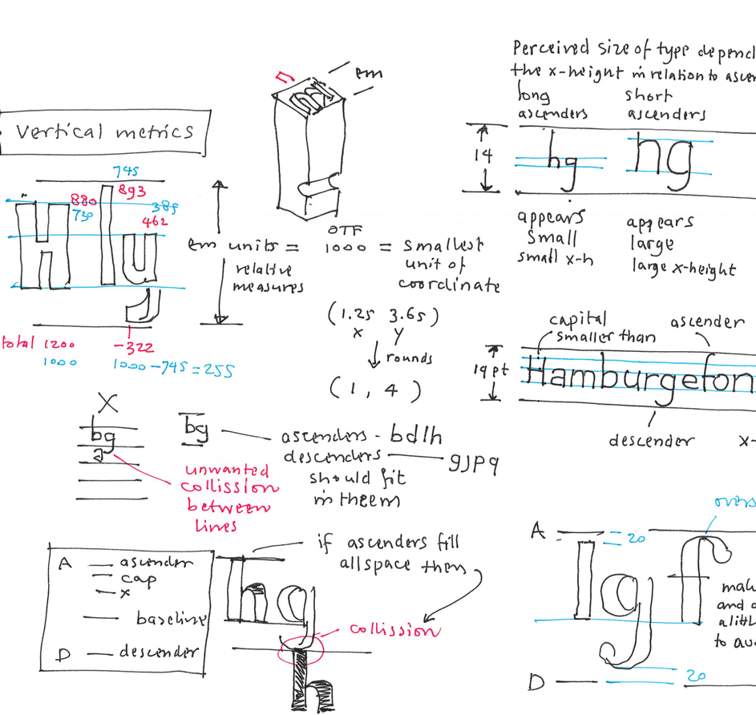

<!-- DE1 -->
~~~
section = content.newSection()
box = section.newMain()
~~~
<a name="DE1"/>
## Teaching Design: online exercises, feedback & evaluation (DE1)

### Methods and examples to get remote students engaged in design projects

#### Start January 4th 2021 • 2 weeks • $345

~~~
box = box.newInfo()
~~~

The world has suddenly changed. Teaching in class rooms is no longer possible. As experienced as you are, educating designers, new skills are required for online teaching. 

This workshop shares our experience of teaching online with DesignDesign.Space workshops for over 4 years now. And also, we love to show how we organized the latest online conference [TypeLab 2020](https://2020.typographics.com/typelab/), in collaboration with [Type Cooper](http://coopertype.org) and [Typographics](https://2020.typographics.com).

#### Example exercises

* Learn to write exercises that can be done through digital media;
* Develop methods for feedback, evaluation and validation of student work;
* An introduction on simulation games, that can be played by students in an online environment.

This workshop is followed up by [Teaching simulations and design games](#DE2).

<a href="https://www.eventbrite.com/e/teaching-design-online-exercises-feedback-evaluation-de1-tickets-130162620903" target="external">Subscribe here</a>

~~~
box = section.newCropped()
~~~

