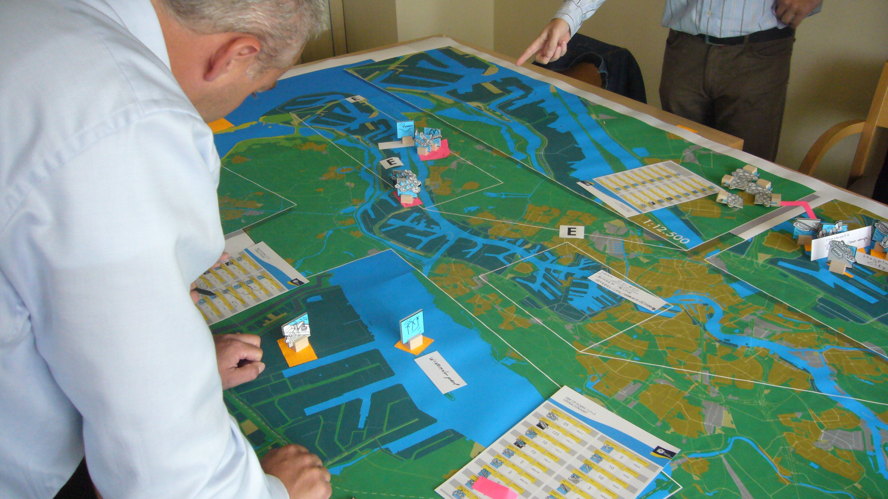

<!-- DE2 -->

~~~
section = content.newSection()
box = section.newMain()
~~~
<a name="DE2"/>
## Teaching simulations and design games (DE2)

### How to get your students into testing their designs? How to let them design simulations that answer their design questions?

#### Start May 24th 2021 • 2 weeks • $345

~~~
box = box.newInfo()
~~~

The world has suddenly changed. Teaching in class rooms is no longer possible. As experienced as you are, educating designers, the new skills are required for online teaching. 

This workshop shares our experience of teaching online with DesignDesign.Space workshops for 4 years now. And also, we love to show how we organized the latest TypeLab.

#### Example exercises

* Learn the basics about game theory;
* Exercises the design of simulations that help in the design process of students;
* Make templates that can be applied in design education.

This workshop is following up on [Teaching Design: online exercises, feedback & evaluation](#DE1).

<a href="https://www.eventbrite.com/d/online/designdesign/?q=designdesign" target="external">Subscribe here</a>

~~~
box = section.newCropped()
~~~

