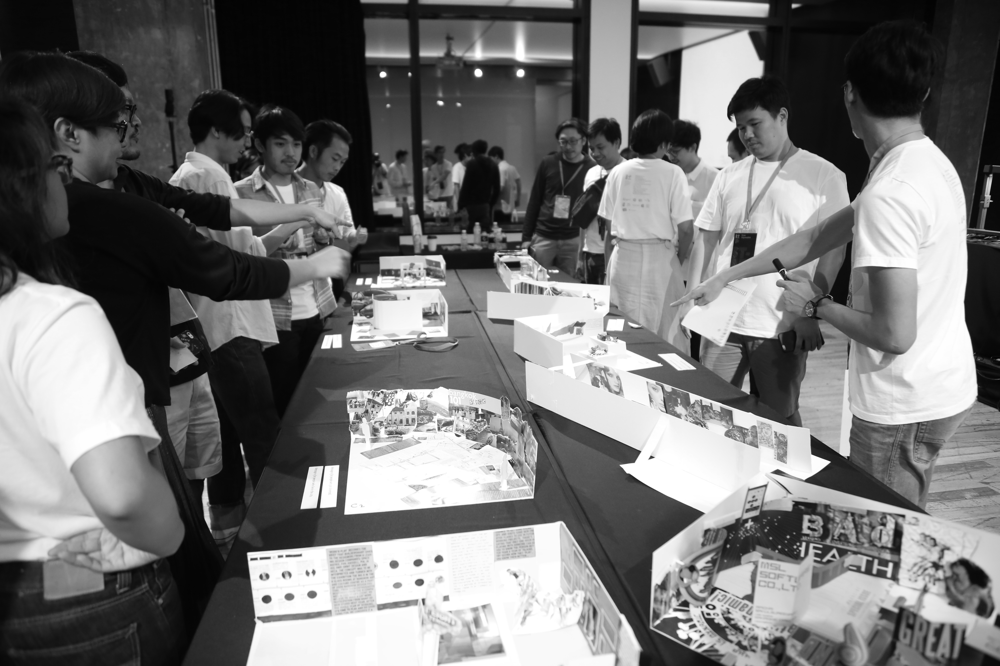

<!-- DG1 -->

~~~
section = content.newSection()
box = section.newMain()
~~~
<a name="DG1"/>
## == Free workshop == Design Game Pentathlon 5 Rounds (DG1)

### In 5 rounds designers prove their skill in all round design practice.

#### Start December 29-30th 2020 • 2 days • Free • Limited subscriptions

#### Start March 09-10th 2021 • 2 days • Free • Limited subscriptions

~~~
box = box.newInfo()
~~~
The Design Game has 5 rounds, starting at a specific time on December 29th 2020. Each round has a different design assignment, ranging from respectively the design of a logo, a typographic page, a poster, a (corporate) identity and finally an exhibition.

There is a strict and limited time frame available for each round, ranging from 1 hour at the start to 3 hours in the finale. Details about each assignment are given just before each round starts.

So, by definition, the finalists will show their skills as if in a sport “Pentathlon” match, expecting assignments for which it is unlikely that they specialized in all. Challenge your luck and speed.

After each round, the results are presented on Instagram, where the number of likes and the judgment of a professional jury will decide who passes to the next round.

The game needs at least 16 participants to take place, with a maximum of 32.

## Free DesignDesign.Space workshops to win.

* First prize: two free workshops (value $690) by <a href="https://designdesign.space" target="external">DesignDesign.Space</a>
* Second prize: one free workshop (value $345) by <a href="https://designdesign.space" target="external">DesignDesign.Space</a>
* Third prize: a day of feedback on one of your design projects (value $180) by <a href="https://designdesign.space" target="external">DesignDesign.Space</a>

The winning workshops count for the DesignDesign.Space rule that any 4th workshop that you do is free of charge.

For more information contact <a href="mailto:info@designdesign.space?subject=More information about Free Design Game Pentathlon in 5 Rounds DG1">info@designdesign.space</a>

Find related workshops and more on <a href="https://designdesign.space" target="external">DesignDesign.Space</a>

~~~
box = section.newCropped()
~~~

