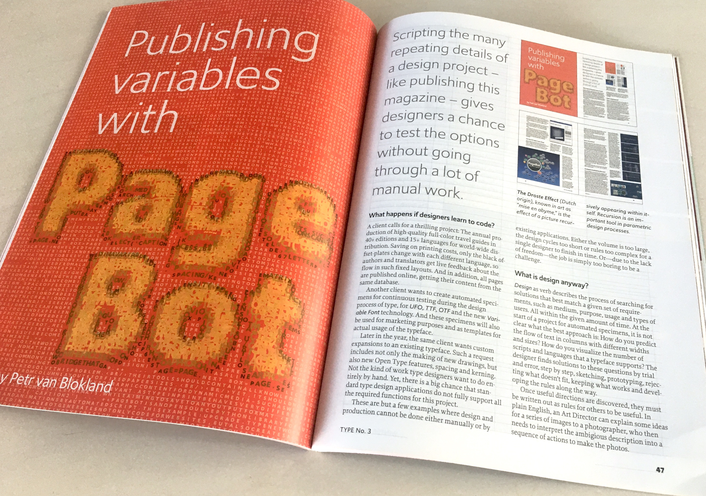

<!-- GD2 -->

~~~
section = content.newSection()
box = section.newMain()
~~~
<a name="GD2"/>
## Coding advanced typography & layouts for print and web (GD2)

### Parametric design with PageBot for print and web

#### Start April 12th 2021 • 2 weeks • €290

~~~
box = box.newInfo()
~~~

This workshop does focus on coding the [Basics of typography, grids and layout](basics-of-typography-grid-and-layout) workshop results. Automate the production of documents for print and convert them into websites. A good understanding of coding in Python is recommended.

#### Example exercises

* Experiment with the Element classes in [PageBot](https://github.com/PageBot/PageBot/blob/master/README.md);
* Convert the results of earliers workshops into working code;
* Design and write the code for new types of page elements, such as the proofing of Variable Fonts and live info-graphics that depend on web-data;
* Generate the functionality of your code as automated generative manuals for print and web.
* Investigate methods to connect this knowledge with your daily design practice.

The use of <a href="http://drawbot.com" target="external">DrawBot</a> in this workshop requires a MacOS computer.

Completion of workshops [Basic coding in Python #1](#PY1) and [Basic coding in Python #1](#PY2) and [Basics of typography, grids and layout](#GD1) is recommended, but not required.

<a href="https://docs.google.com/forms/d/1vLKGROUx03Sm3QGWEwuP1f7Uo1v4qQCmG1FlaxOT88A" target="external">Subscribe here</a>

~~~
box = section.newCropped()
~~~

