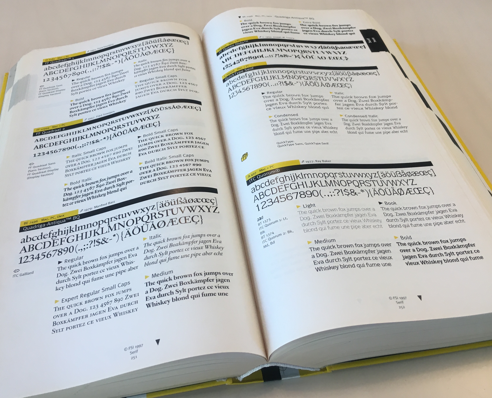

<!-- GD3 -->

~~~
section = content.newSection()
box = section.newMain()
~~~
<a name="GD3"/>
## Selecting typefaces (GD3)

### Learn to recognize and use the characteristics that make typefaces the right choice for a certain task. For graphic designers.

#### Start May 24th 2021 • 2 weeks • $345

~~~
box = box.newInfo()
~~~

What seems to be an infinite amount of availabe typefaces, once examined on their features and implementation, the choice may be rather limited. What are those criteria to select a typeface, besides if you like their style and atmosphere?

#### Example exercises

* Learn to categorize the typefaces that are available on your computer.
* Open the fonts to find their hidden treasures and problems;
* Write simple code to produce specimens that test the various characteristics of those typefaces.

The use of <a href="http://drawbot.com" target="external">DrawBot</a> in this workshop requires a MacOS computer. Participating in the workshop does not assume prior knowledge about coding and typography.

Find related workshops and more on <a href="https://designdesign.space" target="external">DesignDesign.Space</a>

For more information contact <a href="mailto:info@designdesign.space?subject=Selecting typefaces GD3">info@designdesign.space</a>

<a href="https://www.eventbrite.com/d/online/designdesign/?q=designdesign" target="external">Subscribe here</a>

~~~
box = section.newCropped()
~~~

