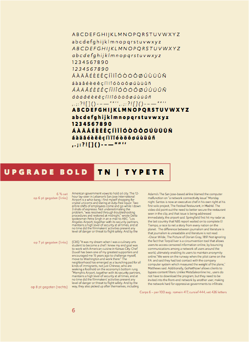

<!-- GD4 -->

~~~
section = content.newSection()
box = section.newMain()
~~~
<a name="GD4"/>
## Coding type specimens (GD4)

### Write code to generate type specimens for web and print, using a selection of typefaces.

#### Start June 7th 2021 • 2 weeks • $345

~~~
box = box.newInfo()
~~~

Design type specimen pages to show the characteristics of a given typeface. What is the glyph set? Which OpenType features are included? What is the quality of spacing and kerning? How does the typeface behave is various sizes and with changing color background? 

* The workshop addresses the sketching of specimen layouts.
* Converting those sketches into parameters and algorithms.
* Writing code that generates type specimen documents for web (HTML/CSS) and print (PDF). 

The use of <a href="http://drawbot.com" target="external">DrawBot</a> in this workshop requires a MacOS computer.

Completion of workshop [Basic coding in Python #1](#TY1) is recommended but not required.

~~~
box = section.newCropped()
~~~

