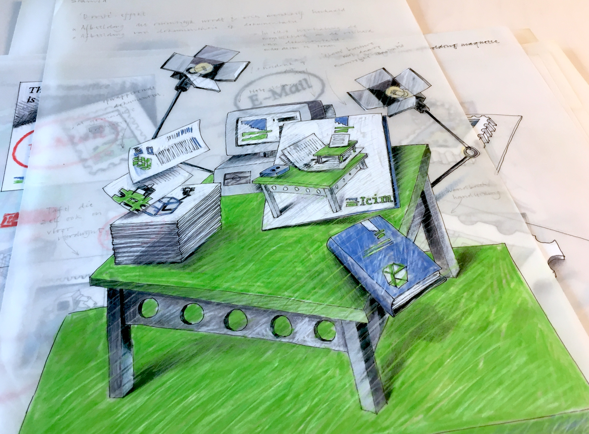

<!-- IG1 -->

~~~
section = content.newSection()
box = section.newMain()
~~~
<a name="IG1"/>
## Design and code info-graphics (IG1)

### Sketch and design info-graphics, while automating the variations from external data.

#### Start June 21th 2021 • 2 weeks • $345

~~~
box = box.newInfo()
~~~

Reading data from an external source, such as a spreadsheet or database, how can you design info-graphics to make that information accessable? The workshop addresses the whole path: from sketching the basic layout, analysing the data, making the design parametric and coding the design into a working tool.

#### Example exercises

* Write code that generates a calendar;
* Design the layout and write code that generate various types of graphs from a given dataset;
* Use icons, type or illustrations to visualize data;
* Research the design and coding of maps and platform for info-graphics.

The use of <a href="http://drawbot.com" target="external">DrawBot</a> in this workshop requires a MacOS computer.

Completion of workshop [Basic coding in Python #1](#TY1) is recommended but not required.

<a href="https://www.eventbrite.com/d/online/designdesign/?q=designdesign" target="external">Subscribe here</a>

~~~
box = section.newCropped()
~~~

