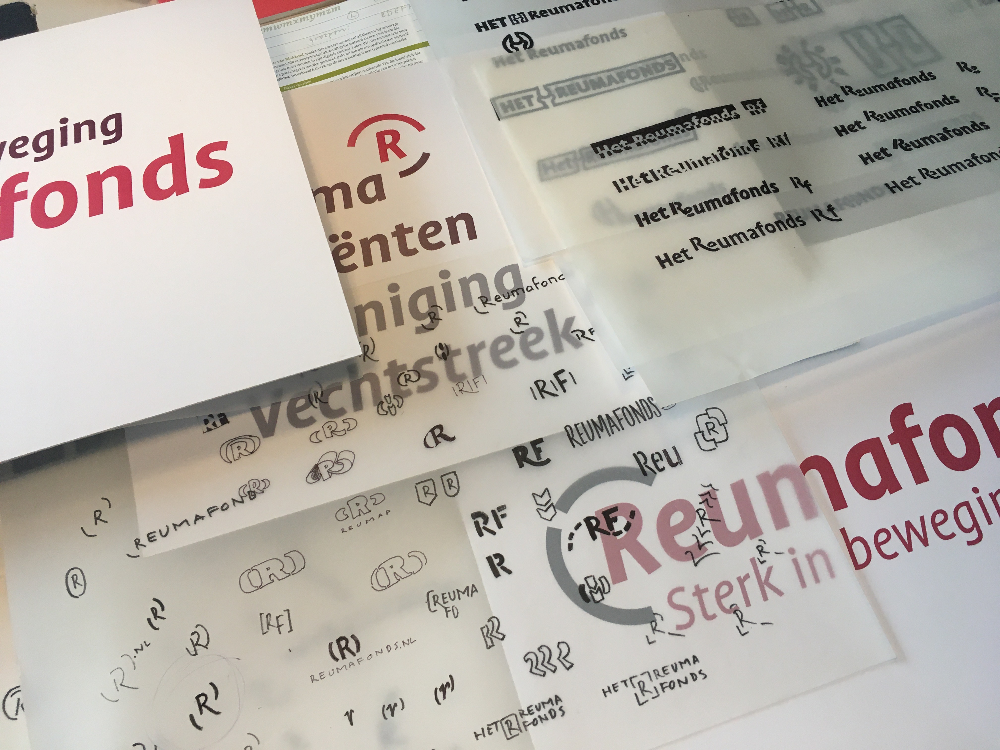

<!-- LO1 -->

~~~
section = content.newSection()
box = section.newMain()
~~~
<a name="LO1"/>
## Basics of logo design (LO1)

### Learn the essentials of branding, visual grammar and logo oriented type design.

#### Start Februari 1st 2021 • 2 weeks • $345

~~~
box = box.newInfo()
~~~

The design of visual identities is often confused with the drawing a logo. What more is needed to create a visual grammar that people will recognize? What are the parameters that lead to remembering a name or a brand? 

This workshop shows different types of processes to design a logo. Match the list of requirements with the intended function. Various methods for sketching, design, testing and feedback are topic of the two weeks. Also it is part of the exercises to see how  different techniques and medium influence the shape and meaning of logos.

#### Example exercises

* Learn about sketching techniques, in combination with methods of feedback. How to test different versions?
* Practice some essentials of type design;
* Study the effects of size and resolution on logos;
* How to extract the visual grammar of a logo, to be applied separately in publications and manuals.

<a href="https://www.eventbrite.com/d/online/designdesign/?q=designdesign" target="external">Subscribe here</a>

~~~
box = section.newCropped()
~~~

