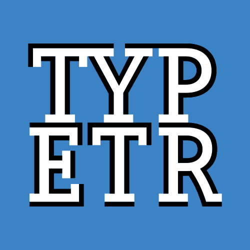

<!-- LO2 -->

~~~
section = content.newSection()
box = section.newMain()
~~~
<a name="LO2"/>
## Coding advanced logo variations (LO2)

### Learn to design or extract algorithms to vary logos in time and space. 

#### Start March 15rd 2021 • 2 weeks • €290

~~~
box = box.newInfo()
~~~

In modern media, logos no longer need to be static. But in traditional logo design that often is the starting points. This workshop emphasizes on designing or extracting parameters to make a given logo vary in time (e.g. making an animation) or to vary the shape depending on circumstances. Examining the different parameters in an existing logo, also is a good trsource for creating Variable Fonts.

#### Example exercises

* Select an existing logo (or take one that you designed yourself). What other varations can be made and which parameters do the morphing?
* Make an inventory of the parameters given by different media: what is possible in an interactive platform? What are the limitations and challenges for print? 
* Write code that export the various of the logo as specimen pages in PDF and animations as GIF.

The use of <a href="http://drawbot.com" target="external">DrawBot</a> in this workshop requires a MacOS computer.

Completion of workshop [Basic coding in Python #1](#TY1) is recommended but not required.

TYPETR logo animation by Just van Rossum

<a href="https://docs.google.com/forms/d/1vLKGROUx03Sm3QGWEwuP1f7Uo1v4qQCmG1FlaxOT88A" target="external">Subscribe here</a>

~~~
box = section.newCropped()
~~~

