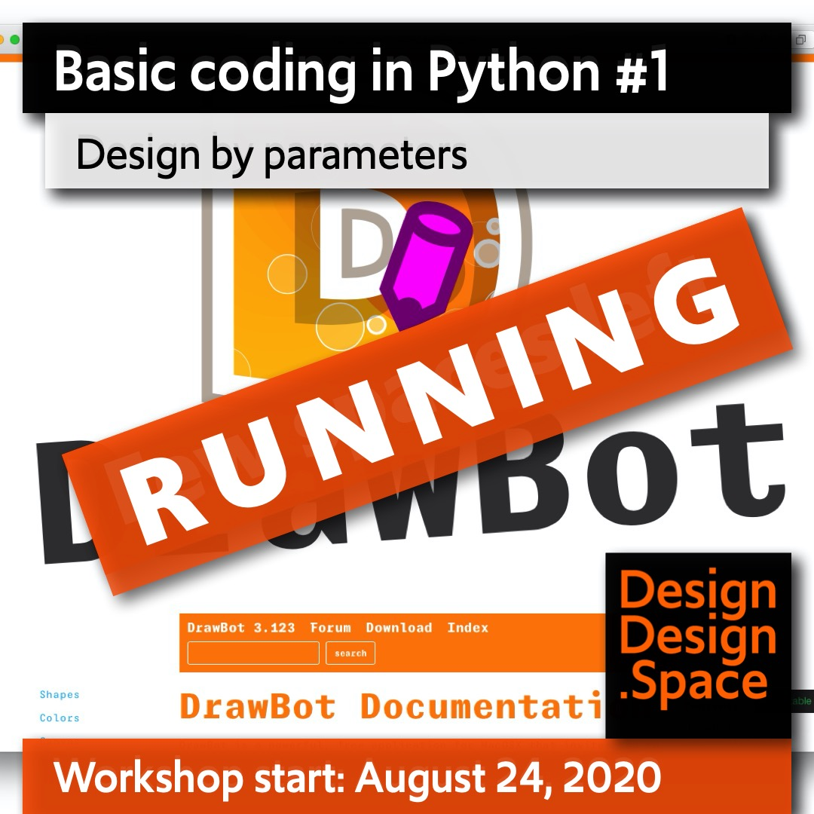

<!-- PY1 -->

~~~
section = content.newSection()
box = section.newMain()
~~~
<a name="PY1"/>
## Basic coding in Python #1 (PY1)

### Design by parameters

<!--#### Start November 16th 2020 • 2 weeks • $345-->

#### Start February 15th 2021 • 2 weeks • $345

<a href="https://www.eventbrite.com/d/online/designdesign/?q=designdesign" target="external">Subscribe here</a>

~~~
box = box.newInfo()
~~~

Take one of your designs and try to find the rules that are behind the composition. Learn to express that information in Python code. Then discover how the program can generate alternative versions of your original design, by the use of color themes, different page sizes and other parameters.

The workshop assumes no prior knowledge of programming. Existing Open Source libraries are used, such as DrawBot and PageBotNano. Exercises take you step by step through the process of coding your graphic design.

#### Example exercises 

* Select a publication and analyze the (typographic) proportions that it contains. 
* Find out how these measures relate to each other.
* Sketch the relations between the extracted values, e.g. what are the possibilities for various page sizes?
* Learn the basics of generating pages by code.
* Automate the generation of equivalent color themes and alternative layouts.

The use of <a href="http://drawbot.com" target="external">DrawBot</a> in this workshop requires a MacOS computer.

This workshop is followed up by [Basic coding in Python #2](#PY2).

~~~
box = section.newCropped()
#box = section.newSide()

~~~

<!--

-->
