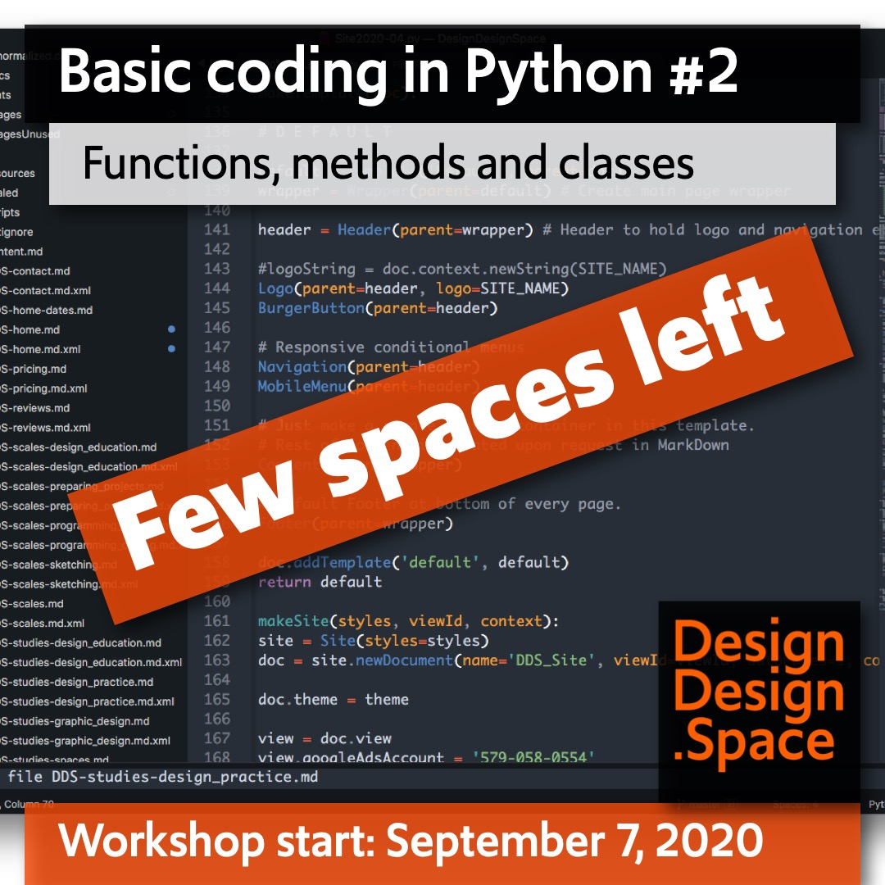

<!-- PY2 -->

~~~
section = content.newSection()
box = section.newMain()
~~~
<a name="PY2"/>
## Basic coding in Python #2 (PY2)

### Functions, methods and classes

<!--
#### Start November 30th 2020 • 2 weeks • $345
-->

#### Start March 1st 2021 • 2 weeks • $345

~~~
#box = box.newInfo() # No popup-arrow for running and upcoming workshops
~~~

After finishing [Basic coding in Python #1](#PY1), you have made a program that is doing one specific task. Great as that may be, it is hard to reuse that code for other projects. How nice would it be, to create a **“library”** with knowledge, that can be called for similar designs, without writing everything from scratch again?

The focus of this workshop is in making code more sustainable, using **functions, methods and classes**. Existing Open Source libraries are used, such as **DrawBot** and **PageBotNano**. Exercises take you step by step through the process of coding your graphic design. Instead of manually building a metaforical car, it may be more profitable to build a factory for cars. 

#### Example exercises

* Make a selection of different publications and analyze the variety of (typographic) proportions that they share;
* Sketch the relations between the extracted values and write them as coded rules;
* Store these rules as a library of Python classes;
* Learn to use this library in future design projects.

The use of <a href="http://drawbot.com" target="external">DrawBot</a> in this workshop requires a MacOS computer.

Completion of workshop [Basic coding in Python #1](#TY1) is recommended.

<a href="https://www.eventbrite.com/d/online/designdesign/?q=designdesign" target="external">Subscribe here</a>

~~~
box = section.newCropped()
#box = section.newSide() # Full visible image, not as cropped background

~~~

<!--

## <a href="https://www.eventbrite.com/d/online/designdesign/?q=designdesign" style="color:#F54C0A" target="external">Subscribe here</a>

-->

