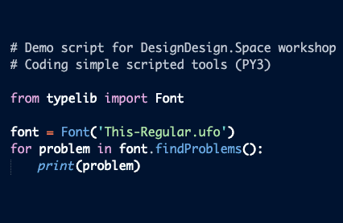

~~~
section = content.newSection()
box = section.newMain()
~~~
<a name="PY3"/>
## Coding simple scripted tools (PY3)

### Automate repeating tasks in the design process

#### Start January 4th 2021 • 2 weeks • €290

#### Start March 29th 2021 • 2 weeks • €290

~~~
box = box.newInfo()
~~~

After finishing [Basic coding in Python #1](#PY1) (or some other experience with Python), you are equipped with the basic coding skills to automate tasks that sometimes make a design process boring and lengthy.

The workshop is focused on very short scripts, only a couple of lines long, that automate repeating tasks in the design process. The result is a set of template tools that can later be used in real life projects.

You can start with a selection from the following exercises, but it is also possible to code your own ideas.

#### Type related example exercises

* Make a script that generates accented glyhphs
* Check unicode-name relations
* Make a script that checks a font for mistakes in spacing and kerning;
* Make a script that generates TTF and OTF fonts, after doing some automated operations on the outlines.

#### Other example exercises

* Make a script that runs through folders with images and applies Photoshop-like filters on each of them;
* Make a script that draws graphs based on information from a spreadsheet. Save the pages in PDF documents, using your own layout;
* Make a script that generates a simple website, based on content in a Markdown file.

The use of <a href="http://drawbot.com" target="external">DrawBot</a> in this workshop requires a MacOS computer.

Completion of workshops [Basic coding in Python #1](#PY1) and [Basic coding in Python #1](#PY2) is recommended but not required.

<a href="https://docs.google.com/forms/d/1vLKGROUx03Sm3QGWEwuP1f7Uo1v4qQCmG1FlaxOT88A" target="external">Subscribe here</a>

~~~
box = section.newCropped()
~~~

