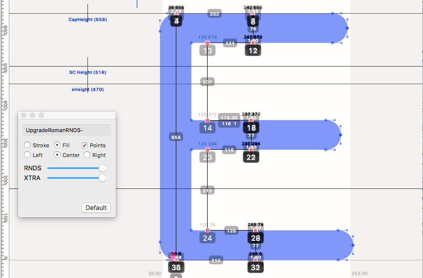

<!-- PY4 -->

~~~
section = content.newSection()
box = section.newMain()
~~~
<a name="PY4"/>
## Coding tools with a user interface (PY4)

### Make your scripted tools more user-friendly

<!--#### ==NOW RUNNING== Start November 11th 2020 • 2 weeks • $345-->

#### Start January 18th 2021 • 2 weeks • $345

#### Start April 12th 2021 • 2 weeks • $345

~~~
#box = box.newInfo()
~~~

The focus of this workshop is on how to program user interaction. Extract the various options into menus, popups and checkboxes.

You can select several from the following exercises. And it is also possible to bring your own ideas.

#### Example exercises

* Make an interface that allows users to choose from the available image filters, before it runs through the entire set of image files.
* Make an interface that helps to choose from templates of graphs;
* Make an interface that shows the available color themes, before generating a website;
* Make an interface to show the various testing schemes on a font.
* Make tools that work inside RoboFont and GlyphsApp

The use of <a href="http://drawbot.com" target="external">DrawBot</a> in this workshop requires a MacOS computer.

Completion of workshops [Basic coding in Python #1 (PY1)](#PY1) and [Basic coding in Python #2 (PY2)](#PY2) and [Coding simple scripted tools (PY3)](#PY3) is recommended.

<a href="https://www.eventbrite.com/d/online/designdesign/?q=designdesign" target="external">Subscribe here</a>

~~~
box = section.newCropped()
~~~

