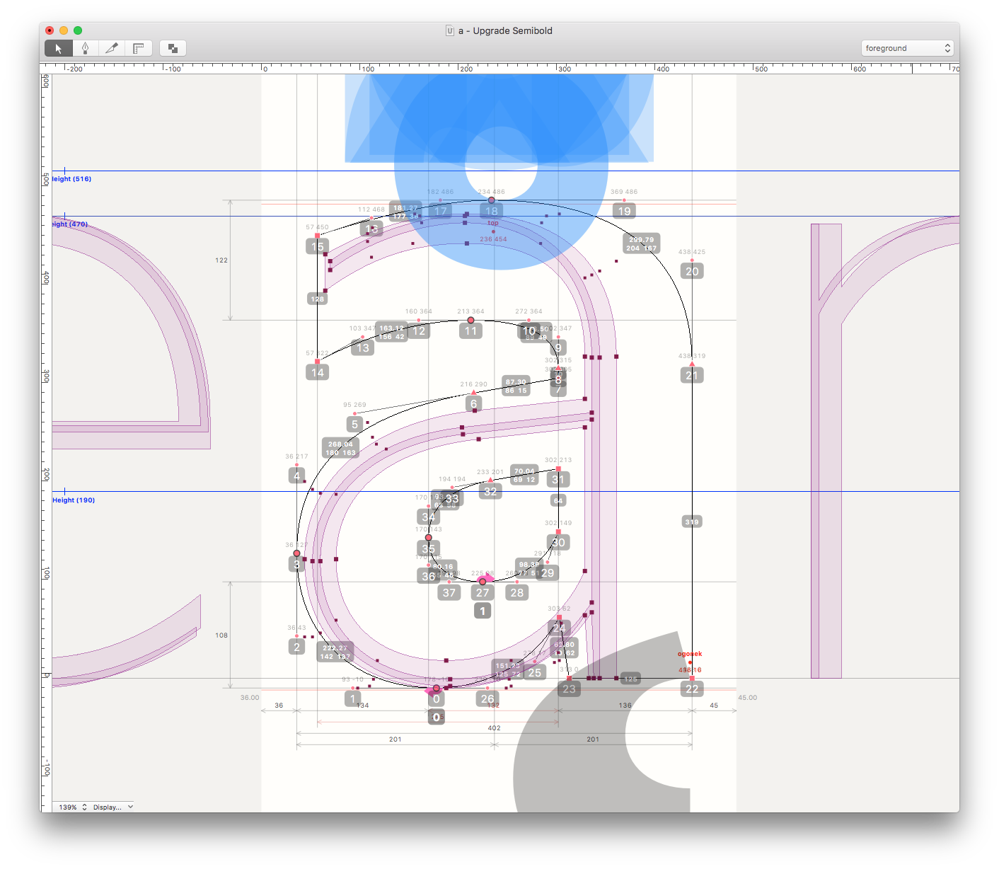

<!-- PY5 -->

~~~
section = content.newSection()
box = section.newMain()
~~~
<a name="PY5"/>
## Scripting for RoboFont (PY5)

### Methods, scripts and templates

#### Start March 15th 2021 • 2 weeks • $345

~~~
box = box.newInfo()
~~~

This workshop offers two weeks of writing scripts that support your type design process. Many time consuming tasks can be automated. Even a script of 10 lines, that costs 2 days to script is profitable if it saves 2 weeks of repeatative work.

#### Example exercises

* Learn to use the supplied example scripts;
* Analyse your current way of working. Which parts of that could be automated?
* Write some scripts for those tasks by adapting the example scripts;
* Learn to generalize code to be useful for future projects.

Completion of workshops [Basic coding in Python #1](#coding-in-python1), [Basic coding in Python #1](#coding-in-python2) and [Coding simple scripted tools](#simple-scripted-tools) is recommended.

<a href="https://www.eventbrite.com/d/online/designdesign/?q=designdesign" target="external">Subscribe here</a>

~~~
box = section.newCropped()
~~~

