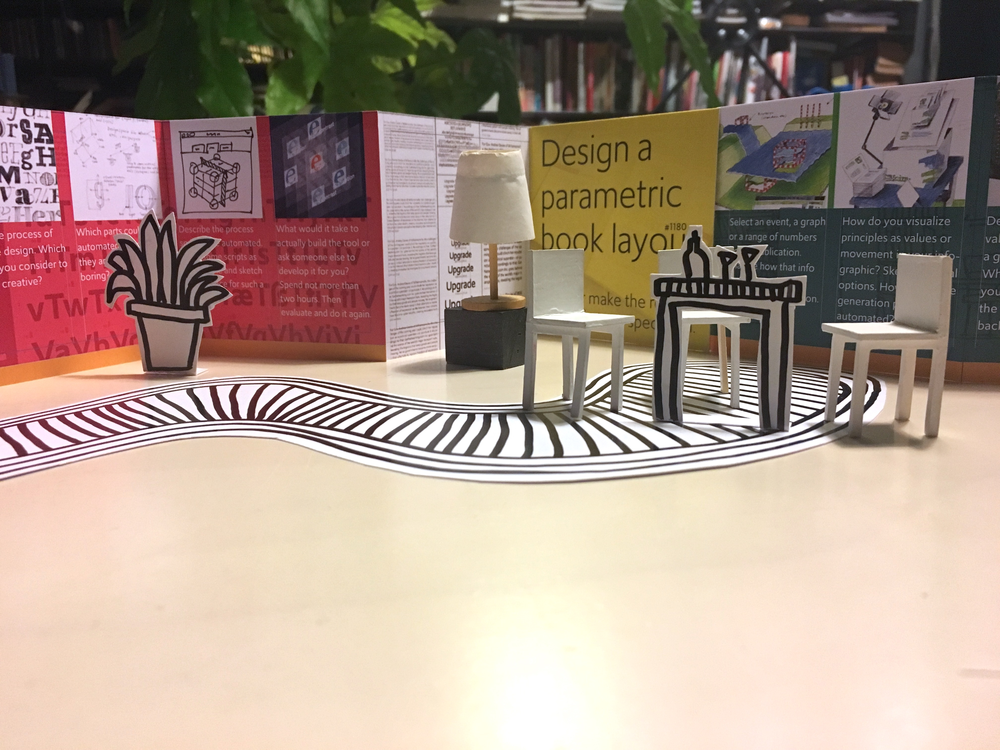

<!-- SD1 -->

~~~
section = content.newSection()
box = section.newMain()
~~~
<a name="SD1"/>
## Basic exhibition design (SD1)

### Learn the basic skills to visualise your ideas in 3D

#### Start July 5th 2021 • 2 weeks • $345

~~~
box = box.newInfo()
~~~

Sketch content and layout of a 3D exhibition space. Use the principle of rapid prototyping to build models of the space in 1:20 scale. Visualize the result as movie and use the feedback to improve the next version. Make several iterations.

The workshop gives insight in various sketching techniques, using pen on paper as well as digital tools.

#### Example exercises

* Select an existing info-graphic and design an exihibition space that visualizes the same information;
* Select a topic from the news and visualize the information in a 3D space;
* Use the scale model as final product, publishing a walk-through online.

<a href="https://www.eventbrite.com/d/online/designdesign/?q=designdesign" target="external">Subscribe here</a>

~~~
box = section.newCropped()
~~~

