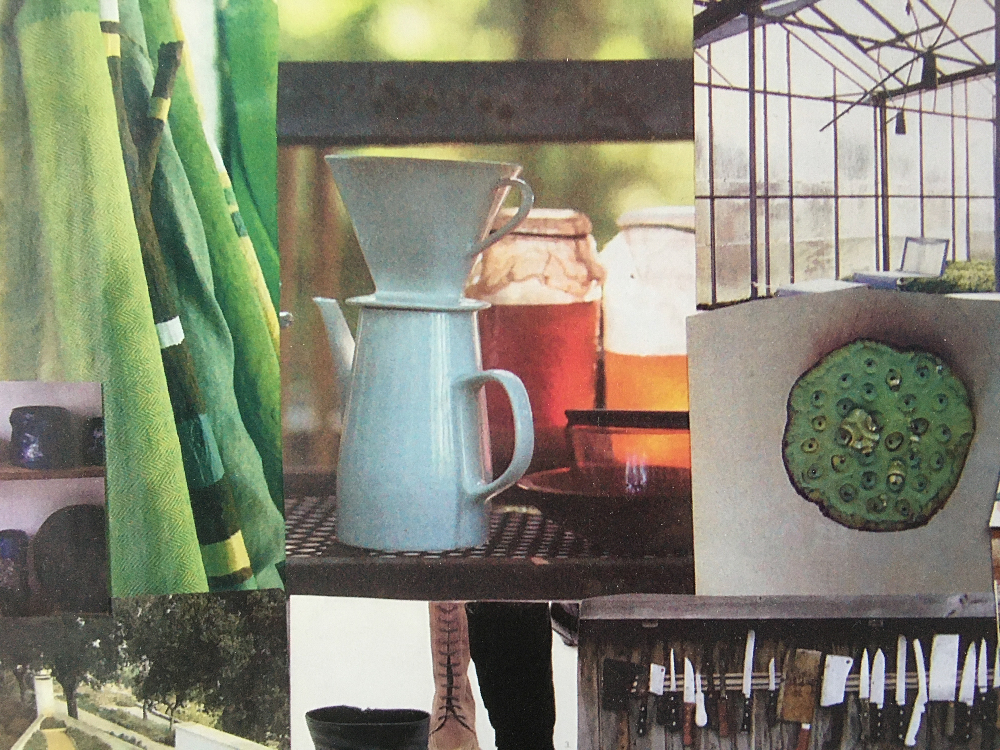

<!-- ST1 -->

~~~
section = content.newSection()
box = section.newMain()
~~~
<a name="ST1"/>
## Running a studio #1 (ST1)

### Experience the making of moodboards and presentations

#### Start November 30th 2020 • 2 weeks • $345

~~~
box = box.newInfo()
~~~

Adding the process of sketching, presentation techniques help to get ideas come across. Convince yourself and others about the values of your design. Making moodboards and presentations is just another form of rapid prototyping.

The workshop gives an overview of making a presentation, using materials, 3D and digital tools.

#### Example exercises

* Choose a topic or select one of your former projects. Visualize the design decisions in 3 moodboards.
* Sketch presentations in a small scale. What do you want to show in such a storyboard?
* Present an existing design project in no more than 5 slides. Pay attention to consistency of layout, typegraphy and the use of color.
* Can you present what makes your design so unique?

<a href="https://www.eventbrite.com/e/running-a-studio-1-moodboards-presentations-st1-tickets-130140089511" target="external">Subscribe here</a>

~~~
box = section.newCropped()
~~~

