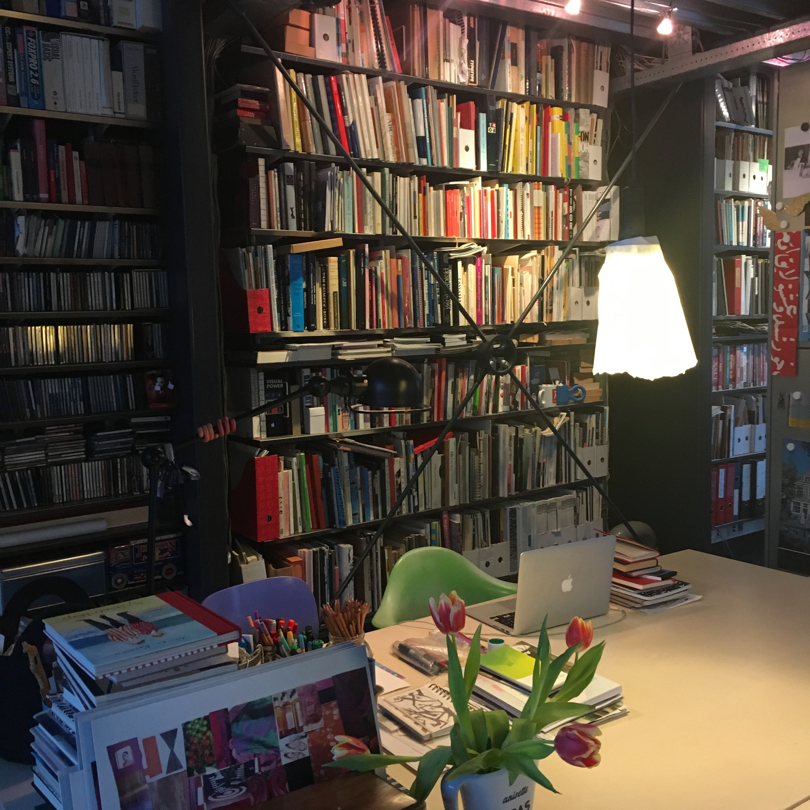

<!-- ST2 -->

~~~
section = content.newSection()
box = section.newMain()
~~~
<a name="ST2"/>
## Running a studio #2 (ST2)

### The making of quotes, briefings, plannings and requirement lists

#### Start December 14th 2020 • 2 weeks • $345

~~~
box = box.newInfo()
~~~

Doing administration work is often seen as a boring by-product of running a studio. Planning projects is vital, but is often ignored. Learn to look at these processes as if they were regular design jobs. Doing them can be fun. And they can even become one of your products. 

The workshop shows methods to design the process of administration, as if it was an interesting graphic design project.

#### Example exercises

* Design templates for quotes and invoices, using spreadsheet applications and Google Docs.
* Learn to distinguish between the “go” and “no-go” requirements of a design;
* Sketch info-graphics that show the iterations of a design process. Visualise the planning for your customer;
* Automate the generation of progress reports.

<a href="https://www.eventbrite.com/e/running-a-studio-2-requirements-quotes-plannings-st2-tickets-130141818683" target="external">Subscribe here</a>

~~~
box = section.newCropped()
~~~

