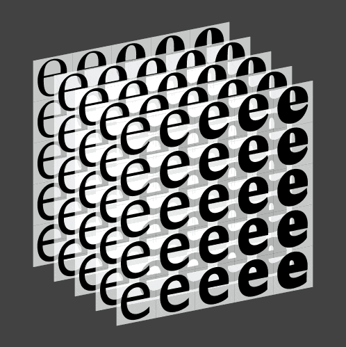

<!-- TY2 -->

~~~
section = content.newSection()
box = section.newMain()
~~~
<a name="TY2"/>
## Contrast principles of type design (TY2)

### For type designers: understanding the principles of contrast by writing. Experiment with weight and width variations.

#### Start January 1st 2021 • 2 weeks • $345

~~~
box = box.newInfo()
~~~

#### Example exercises

* Write alphabets with a broad nib pencil to experience the construction of **“translation”** contrast;
* Write with sharp pencils to experience the construction of **“expansion”** contrast;
* Learn the behaviour of glyph shapes, varying weight and width 
* Study variations by <a href="http://www.typecooker.com" target="external">Type Cooker</a>;
* Learn the basics about capitals, roman, italic, spacing and kerning.
* Digitize your writings into outlines, using your favourite type editor;

<a href="https://www.eventbrite.com/d/online/designdesign/?q=designdesign" target="external">Subscribe here</a>

~~~
box = section.newCropped()
~~~

