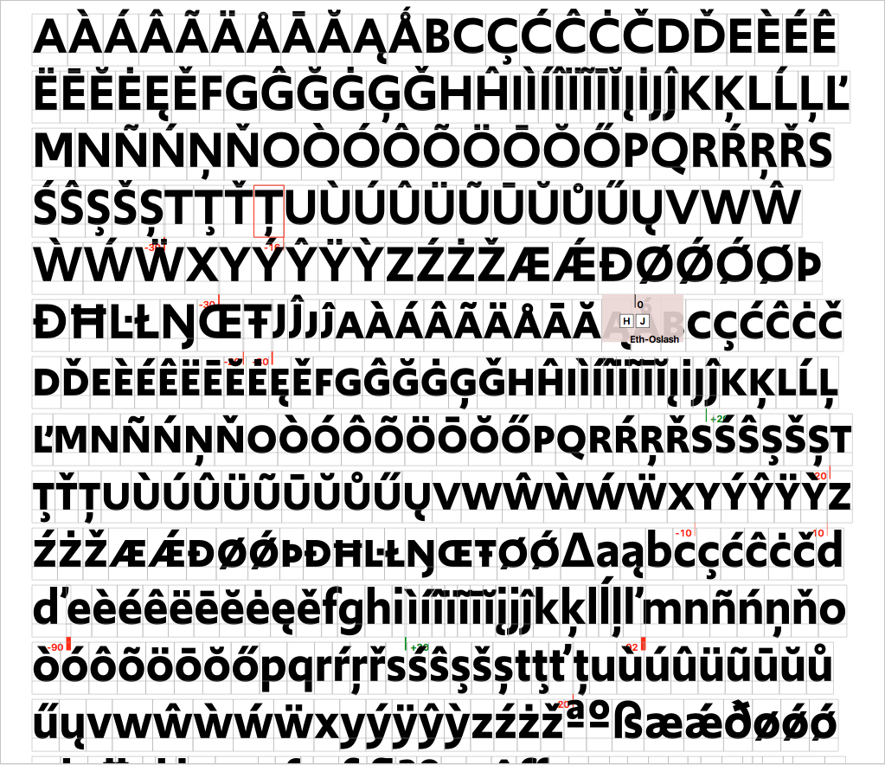

<!-- TY5 -->

~~~
section = content.newSection()
box = section.newMain()
~~~
<a name="TY5"/>
## Coaching Type Projects (TY5)

### Designing the process of feedback on your type projects

#### Start December 14st 2020 • 2 weeks • $345

~~~
box = box.newInfo()
~~~

Design projects can be take a long time to finish. And since they are based on your individual ideas, it can be hard to get other people involved. Did you make the right decisions back in time? How can you find the way back from deep rabbit holes without the help from others. 

This workshop shows methods to share your views with colleagues, without loosing the control of your project.

* Select one of your type designs that is being developed. Or take one of your favourite existing typefaces.
* We ask questions, you do the work, getting valuable feedback and directions.
* Develop some proofing tools, using Python and DrawBot.
* Addressing topics, such as process, methods, variable design spaces, features and tools.
* Getting ideas how to automate time-consuming parts of your project.

Can you apply these methods to your other type projects?

This workshop is a companion of [Sketching, feedback and planning in type design](#TY4)

The workshop assumes no experience with programming in Python. An Apple computer is required to run the DrawBot application. 
<a href="https://www.eventbrite.com/e/coaching-type-projects-ty5-designing-the-process-of-your-type-projects-tickets-130097462011" target="external">Subscribe here</a>

~~~
box = section.newCropped()
~~~

