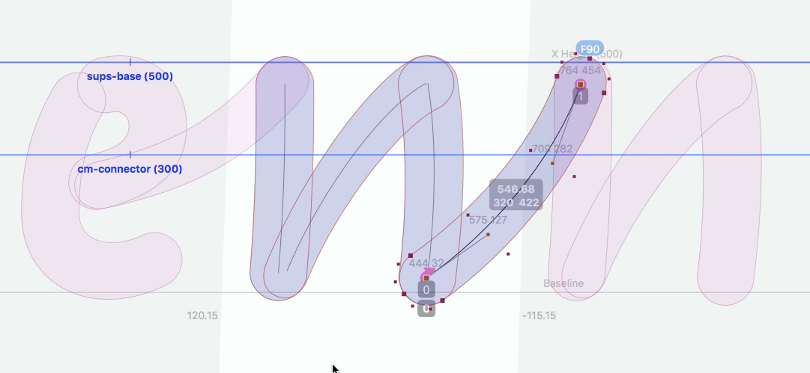

<!-- TY8 -->

~~~
section = content.newSection()
box = section.newMain()
~~~
<a name="TY8"/>
## Design a script (TY8)

### The workshop is a building kit to make a working script typeface. No prior knowledge of coding is required.

#### Start July 5th 2021 • 2 weeks • €290

~~~
box = box.newInfo()
~~~

This worksshop is set as a complete building kit. Compare it to a box that includes all materials to build an RC model plane, raw materials for wings and fuselage, as well as the complete electronics and motors are included. 

Starting with your handwriting (or another handwritten scripts), design the individual glyphs, including all connection. 

We will address writing OT-feature code to make the glyph substitutions for the connectors and the semi-random selection of alternates. 

The use of <a href="http://drawbot.com" target="external">DrawBot</a> in this workshop requires a MacOS computer.
It is assumed that you have a legal working version of one of the two font editors.

The workshop doest not require prior knowledge or experience with programming.

~~~
box = section.newCropped()
~~~

