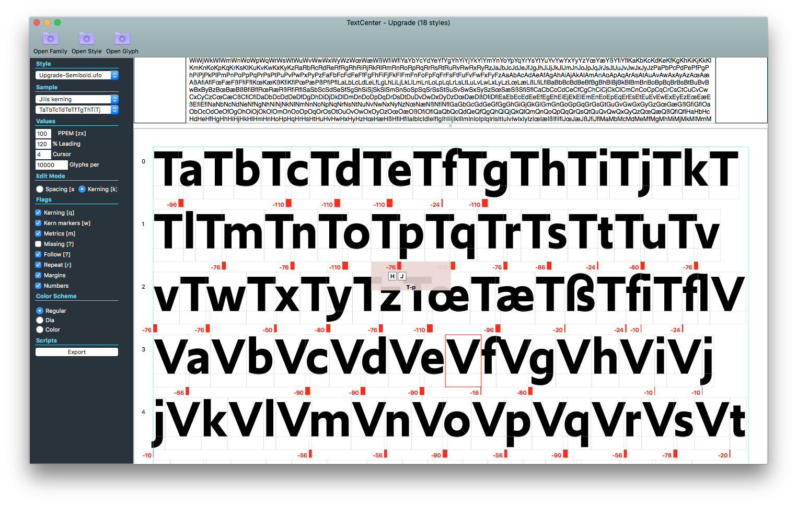

<!-- TY9 -->

~~~
section = content.newSection()
box = section.newMain()
~~~
<a name="TY9"/>
## Coding your spacing/kerning tool (TY9)

### The workshop is a building kit to make your own tools. No prior knowledge of coding is required.

#### Start July 19th 2021 • 2 weeks • $345

~~~
box = box.newInfo()
~~~

This worksshop is set as a complete building kit. Compare it to a box that includes all materials to build an RC model plane, raw materials for wings and fuselage, as well as the complete electronics and motors are included. 

Build a spacing/kerning aid tool that lives inside your favourite editor (RoboFont or GlyphsApp), that allows to visualize and alter spacing and kerning at the same time that you draw the glyphs. 

The advantage of (guided) building the tool yourself is that you understand how it works. Additions and changes in a later stage can be made by you, instead of the need to wait for updates. 

The use of <a href="http://drawbot.com" target="external">DrawBot</a> in this workshop requires a MacOS computer.
It is assumed that you have a legal working version of one of the two font editors.

The workshop doest not require prior knowledge or experience with programming.

~~~
box = section.newCropped()
~~~

-->

